# Manual Técnico — Whispers in Letters

> **Proyecto:** Adaptación a videojuego del libro *El Mundo de Sofía*
> **Motor:** Unity (3D, third-person)
> **Motor narrativo:** Ink (Inkle Studios)
> **Input:** Unity Input System

---

## Índice General

| Capítulo | Contenido |
|----------|-----------|
| [**1**](%23capitulo-1-arquitectura-general) | Arquitectura General — Managers, dependencias, ciclo de vida del juego |
| [**2**](%23capitulo-2-sistema-narrativo) | Sistema Narrativo — Ink, StoryManager, diálogo, retratos, imágenes, prólogo |
| [**3**](%23capitulo-3-sistema-de-interaccion) | Sistema de Interacción — PlayerInteraction, InteractableObject, Advanced, triggers |
| [**4**](%23capitulo-4-escenas-y-niveles) | Escenas y Niveles — LevelManager, SpawnPoint, transiciones, prólogo entre escenas |
| [**5**](%23capitulo-5-sistema-de-ui) | Sistema de UI — Menú, carrusel, ajustes, HUD |
| [**6**](%23capitulo-6-sistema-de-persistencia) | Sistema de Persistencia — SaveSystem, GameStateSO, PlayerPrefs |
| [**7**](%23capitulo-7-guia-de-creacion-de-contenido) | Guía de Creación de Contenido — Pipelines, checklists, riesgos (consolidado aquí) |
| [**8**](%23capitulo-8-convenciones-tecnicas-y-reglas-arquitectonicas) | Convenciones Técnicas — Código, Ink, escenas, buenas prácticas, deuda técnica |

> **Documentación externa:** [`docs/README.md`](docs/README.md) — tabla de sistemas, roadmap, referencias rápidas.
> **Contexto del proyecto:** [`CONTEXT.md`](CONTEXT.md) — visión general, historia, personajes.

---

## Capítulo 1: Arquitectura General

El proyecto sigue un patrón **Singleton-based centralizado con ScriptableObjects como datos**. Un puñado de managers persistentes (`DontDestroyOnLoad`) viven en el prefab raíz `Game Manager.prefab` y orquestan todos los subsistemas. La comunicación entre sistemas ocurre mediante referencias directas a instancias singleton, eventos C# nativos, y funciones externas vinculadas desde Ink.

```mermaid
graph TB
    subgraph Persistentes["Managers Persistentes (DontDestroyOnLoad)"]
        GM[GameManager]
        LM[LevelManager]
        SM[StoryManager]
        AM[AudioManager]
        PM[PrologueManager]
    end

    subgraph Estado["Estado"]
        GSO[GameStateSO<br/>ScriptableObject]
        SS[SaveSystem<br/>static]
    end

    subgraph Escena["Por Escena (scene-scoped)"]
        PLM[PlayerMovement]
        PIN[PlayerInteraction]
        PLMGR[PlayerManager]
        DUC[DialogueUIController]
        DTP[DialogueTagProcessor]
        IObj[InteractableObject]
        AObj[AdvancedInteractableObject]
        STT[SceneTransitionTrigger]
        GSM[GameSummaryManager]
        otros[...]
    end

    subgraph Menu["Menú"]
        MI[MenuInicio]
        CN[CarruselNiveles]
        UIA[UIAjustes]
        BS[BotonSalirMenu]
        TC[TutorialCarrusel]
    end

    GM --> GSO
    GM --> SS
    GM --> LM
    GM --> SM
    GM --> AM
    SM --> DUC
    DUC --> DTP
    PIN --> IObj
    PIN --> AObj
    PIN --> STT
    PM --> SM
    PM --> GM
    GSM --> SM
    LM --> GM
    LM --> PLMGR

    linkStyle default stroke:#666;stroke-width:1px
```

### Razón de ser de la arquitectura

El patrón de managers singleton persistentes se eligió porque:

- **Persistencia natural:** Los managers no se destruyen al cambiar de escena, lo que evita tener que recargar estado constantemente.
- **Acceso global:** Cualquier script en cualquier escena puede acceder al estado del juego o disparar narrativa sin necesidad de referencias enlazadas en cada escena.
- **Simplicidad:** Para un equipo pequeño sin necesidad de tests unitarios extensivos, este patrón es rápido de implementar y depurar.

La desventaja es el **acoplamiento excesivo** (ver §5).

---

## 1. Sistemas Principales

### 1.1 GameManager — Núcleo del sistema

`Assets/Scripts/Core/GameManager.cs`

**Responsabilidad:** Orquestar todos los subsistemas. Es el único punto de entrada para:

- Lectura/escritura del estado global (`GameStateSO`)
- Guardado/carga en disco (delegado a `SaveSystem`)
- Exposición de API de flags y variables narrativas para Ink
- Visibilidad del HUD según la escena

**Por qué existe:** Necesitábamos un punto central que coordinara el guardado, el estado y la comunicación entre Ink y el motor de juego. Sin él, cada sistema tendría que gestionar su propia persistencia y el estado sería incoherente entre escenas.

**API pública:**
| Método | Propósito |
|--------|-----------|
| `RequestLoadLevel(baseSceneName)` | Carga menú de niveles, reanuda partida existente o inicia nueva |
| `SaveGame()` | Serializa `GameStateSO` a `GameSaveData` → `SaveSystem.Save()` |
| `SetStoryFlag(flagName, bool)` | Marca/desmarca un flag narrativo |
| `GetStoryFlag(flagName)` | Consulta un flag |
| `SetStoryVariable(key, value)` | Guarda variable narrativa |
| `GetStoryVariable(key)` | Lee variable narrativa |
| `IncrementStoryVariable(key, amount)` | Incrementa variable numérica |

### 1.2 LevelManager — Transición de escenas

`Assets/Scripts/Menu/LevelManager.cs`

Gestiona el cambio entre escenas con efecto de fade, auto-save y reubicación del jugador. Separa la lógica de transición de `GameManager` y centraliza el efecto visual.

> La documentación completa del LevelManager, el flujo de transición y el sistema de SpawnPoints está en el [Capítulo 4: Escenas y Niveles](#capítulo-4-escenas-y-niveles).

### 1.3 StoryManager — Integración con Ink

`Assets/Scripts/Narrative/Narrative Logic/StoryManager.cs`

Puente entre el motor narrativo Ink y Unity. Inicializa el `Ink.Runtime.Story` desde el JSON compilado, vincula funciones externas (`GetFlag`, `GetVar`) que Ink llama para leer el estado del juego, y gestiona el ciclo de vida del diálogo. Expone el evento `OnDialogueStateChanged` para que otros sistemas reaccionen al estado del diálogo.

> La documentación completa del StoryManager (inicialización, API, manejo de knots, enrutamiento y fallbacks) está en el [Capítulo 2: Sistema Narrativo](#capítulo-2-sistema-narrativo).

### 1.4 AudioManager — Sistema de audio

`Assets/Scripts/Audio/AudioManager.cs`

**Responsabilidad:** Gestionar 4 canales de audio (Música, SFX, UI, Ambiente) con control de volumen independiente y persistencia vía PlayerPrefs.

**Por qué existe:** El audio necesita persistir entre escenas y sesiones, pero su estado (volúmenes) es independiente del progreso narrativo. Usar PlayerPrefs separa esta responsabilidad de `GameStateSO`.

**Fórmula de volumen:**
```
Volumen final = eventVolume × sourceBaseVolume × categoryVolume × masterVolume
```

### 1.5 PrologueManager — Prólogo jugable

`Assets/Scripts/Core/PrologueManager.cs`

**Responsabilidad:** Orquestar el flujo del prólogo a través de tres escenas (Parque → Arcade/Biblioteca → Parque final). Detecta cambios de escena y dispara los diálogos de entrada apropiados según flags.

**Por qué existe:** El prólogo es una secuencia guiada pero jugable. Necesitábamos un manager que:
- Detecte en qué escena está el jugador
- Revise qué flags del prólogo están activos
- Dispare el knot de Ink correcto para cada momento
- Marque el prólogo como completado cuando termina

**Flags que gestiona:**
| Flag | Propósito |
|------|-----------|
| `prologue_arcade_visited` | Ya entró al Arcade |
| `prologue_arcade_item_collected` | Recogió el objeto del Arcade |
| `prologue_library_visited` | Ya entró a la Biblioteca |
| `prologue_library_item_collected` | Recogió el objeto de la Biblioteca |
| `prologue_completed` | Prólogo completado (seteado por Ink) |
| `prologue_final_seen` | Diálogo final visto — desactiva permanentemente el manager |

### 1.6 GameStateSO — Estado persistente

`Assets/Scripts/Player data/GameStateSO.cs`

**Tipo:** `ScriptableObject` (creable desde `CreateAssetMenu > Core/Game State`)

**Responsabilidad:** Almacenar todo el estado mutable del juego en tiempo de ejecución:
- Escena actual y anterior
- Posición del jugador
- Flags narrativos (`List<string>`)
- Variables narrativas (`List<StoryVariable>` clave-valor)

**Por qué existe (y por qué ScriptableObject):** Usar un SO permite que el estado sea accesible desde el Inspector para debugging, y que cualquier script pueda referenciarlo sin necesidad de un singleton. Sin embargo, en la práctica se accede únicamente a través de `GameManager`, lo que hace que el SO sea un implementation detail.

### 1.7 SaveSystem — Persistencia en disco

`Assets/Scripts/Core/SaveSystem.cs`

**Tipo:** Clase estática

**Responsabilidad:** Único punto de entrada para leer/escribir `save.json` en disco (o `PlayerPrefs` en WebGL).

**Por qué existe:** Aislar la serialización en un servicio estático permite:
- Cambiar el formato de serialización sin afectar al resto del sistema
- Soportar múltiples plataformas (Standalone → archivo, WebGL → PlayerPrefs)
- Centralizar la lógica de errores de I/O

**Regla de arquitectura:** Solo `GameManager` lo invoca. Ningún otro sistema debe llamar a `SaveSystem` directamente.

### 1.8 PlayerInteraction — Detección de interacción

`Assets/Scripts/Player data/PlayerInteraction.cs`

**Responsabilidad:** Detectar objetos `IInteractable` mediante triggers y disparar su método `Interact()`. Si hay un diálogo activo, avanza la narrativa en lugar de interactuar.

**Por qué existe:** Necesitábamos una capa que separara la detección física (triggers) de la lógica de interacción. Esto permite que cualquier objeto implemente `IInteractable` y funcione automáticamente.

**Eventos:**
| Evento | Tipo | Disparo |
|--------|------|---------|
| `OnInteractableChanged` | `Action<IInteractable>` | Al entrar/salir de un trigger de interactuable |

**Comportamiento:**
- Si `StoryManager.IsDialogueActive` → llama `AdvanceStory()` (avanza el diálogo)
- Si no → rota al jugador hacia el objeto y llama `Interact()`

### 1.9 DialogueUIController — UI de diálogo

`Assets/Scripts/Narrative/Narrative Logic/DialogueUIController.cs`

Controla la interfaz del sistema de diálogo: texto typewriter, botones de opciones, retratos animados, voces por personaje, efectos de sonido e imágenes. Trabaja en conjunto con `DialogueTagProcessor` para reaccionar a los tags de Ink.

> La implementación detallada, eventos y configuración están documentados en el [Capítulo 2: Sistema Narrativo](#capítulo-2-sistema-narrativo).

### 1.10 DialogueTagProcessor — Procesador de tags de Ink

`Assets/Scripts/Narrative/Narrative Logic/DialogueTagProcessor.cs`

Procesa los tags de Ink (`#sprite:`, `#setflag:`, `#sonido:`, `#scene:`, etc.) y los convierte en eventos que otros sistemas consumen. Es el mecanismo por el cual la narrativa controla el motor de juego.

> La tabla completa de tags y su procesamiento detallado está documentada en el [Capítulo 2: Sistema Narrativo](#capítulo-2-sistema-narrativo).

### 1.11 Sistema de Interacción

Sistema en capas que conecta la detección física (`PlayerInteraction` via triggers) con objetos que implementan `IInteractable`. Cada interactable se apoya en `ScriptableObjects` para datos y en `StoryManager` para la narrativa.

> La arquitectura completa, implementaciones, ciclo de vida, prefabs, checklist y buenas prácticas están documentadas en el [Capítulo 3: Sistema de Interacción](#capítulo-3-sistema-de-interacción).

### 1.12 Sistema de Menú

Clases del menú principal (ver [Capítulo 5: Sistema de UI](#capitulo-5-sistema-de-ui) para documentación completa).

| Clase | Responsabilidad |
|-------|----------------|
| `MenuInicio` | Navegación del menú principal (Jugar, Créditos, Ajustes, Niveles, Salir) |
| `CarruselNiveles` | Carrusel de selección de nivel |
| `UIAjustes` | Panel de configuración |
| `BotonSalirMenu` | Botón "Volver al menú principal" |
| `TutorialCarrusel` | Tutorial interactivo |

### 1.13 Sistema de Resumen Final

`GameSummaryManager` + `GameSummaryUI`. Se activa al detectar el flag `Final_Del_Dia`.

> Flujo completo y arquitectura documentados en el [Capítulo 5: Sistema de UI](#capitulo-5-sistema-de-ui).

---

## 2. Comunicación entre Sistemas

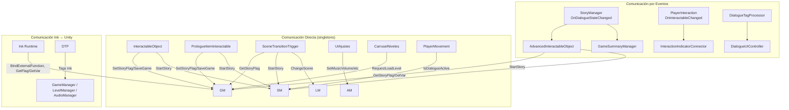
```mermaid
graph TB
    subgraph Eventos["Comunicación por Eventos"]
        SM_Event[StoryManager<br/>OnDialogueStateChanged] --> GSM[GameSummaryManager]
        SM_Event --> AObj[AdvancedInteractableObject]
        PIN_Event[PlayerInteraction<br/>OnInteractableChanged] --> IIC[InteractionIndicatorConnector]
        DTP_Event[DialogueTagProcessor] --> DUC[DialogueUIController]
    end

    subgraph Directo["Comunicación Directa (singletons)"]
        IObj[InteractableObject] -->|StartStory| SM
        AObj -->|StartStory| SM
        PI[PrologueItemInteractable] -->|StartStory| SM
        STT[SceneTransitionTrigger] -->|ChangeScene| LM
        STT -->|StartStory| SM
        IObj -->|SetStoryFlag/SaveGame| GM
        AObj -->|GetStoryFlag/GetVar| GM
        PI -->|SetStoryFlag/SaveGame| GM
        STT -->|GetStoryFlag| GM
        UIA[UIAjustes] -->|SetMusicVolume/etc| AM
        CN[CarruselNiveles] -->|RequestLoadLevel| GM
        PLM[PlayerMovement] -->|IsDialogueActive| SM
    end

    subgraph Ink["Comunicación Ink ↔ Unity"]
        InkEngine[Ink Runtime] -->|"BindExternalFunction, GetFlag/GetVar"| GM
        DTP -->|Tags Ink| InkComandos[GameManager / LevelManager / AudioManager]
    end
```

### Patrones de comunicación identificados

1. **Eventos C# nativos** — Usados exclusivamente dentro del subsistema de diálogo (`DialogueTagProcessor` → `DialogueUIController`) y para notificar cambios de estado (`StoryManager.OnDialogueStateChanged`, `PlayerInteraction.OnInteractableChanged`).

2. **Referencias directas a singleton** — El patrón dominante. Casi todos los sistemas acceden a `GameManager.Instance`, `StoryManager.Instance`, `LevelManager.Instance`, o `AudioManager.Instance` directamente.

3. **Funciones externas de Ink** — `StoryManager` vincula `GetFlag` y `GetVar` al iniciar, permitiendo que la narrativa lea el estado del juego.

4. **Tags Ink como comandos** — El archivo Ink envía comandos al motor mediante tags (`#scene:`, `#setflag:`, `#sonido:`, etc.) que `DialogueTagProcessor` interpreta y redirige.

---

## 3. Flujo de Ejecución

### 3.1 Inicialización del juego

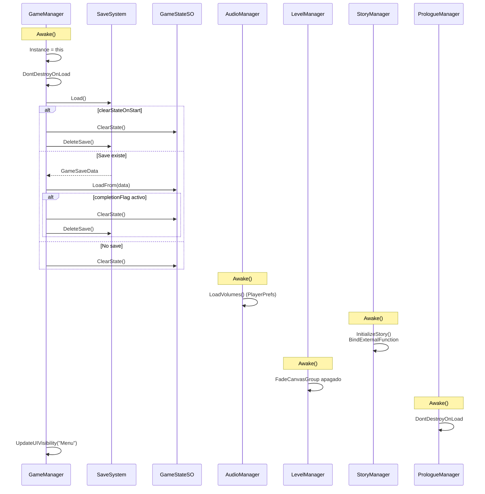
```mermaid
sequenceDiagram
    participant GM as GameManager
    participant SS as SaveSystem
    participant GSO as GameStateSO
    participant AM as AudioManager
    participant LM as LevelManager
    participant SM as StoryManager
    participant PM as PrologueManager

    Note over GM: Awake()
    GM->>GM: Instance = this
    GM->>GM: DontDestroyOnLoad
    GM->>SS: Load()
    alt clearStateOnStart
        GM->>GSO: ClearState()
        GM->>SS: DeleteSave()
    else Save existe
        SS-->>GM: GameSaveData
        GM->>GSO: LoadFrom(data)
        alt completionFlag activo
            GM->>GSO: ClearState()
            GM->>SS: DeleteSave()
        end
    else No save
        GM->>GSO: ClearState()
    end

    Note over AM: Awake()
    AM->>AM: LoadVolumes() (PlayerPrefs)

    Note over SM: Awake()
    SM->>SM: InitializeStory()<br/>BindExternalFunction

    Note over LM: Awake()
    LM->>LM: FadeCanvasGroup apagado

    Note over PM: Awake()
    PM->>PM: DontDestroyOnLoad

    GM->>GM: UpdateUIVisibility("Menu")
```

### 3.2 Flujo gameplay → Narrativa → UI

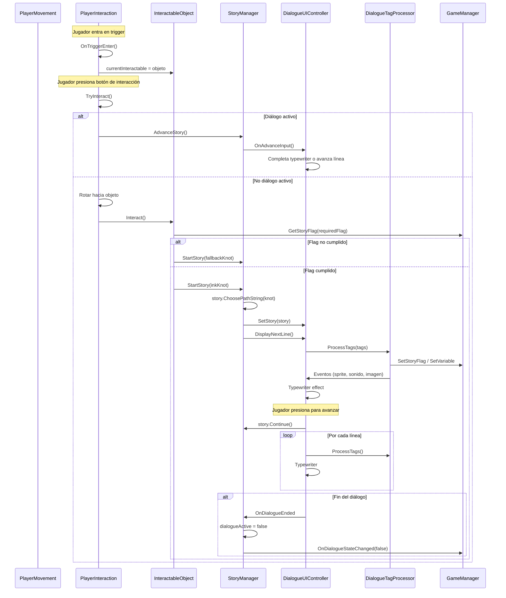
```mermaid
sequenceDiagram
    participant Player as PlayerMovement
    participant PIN as PlayerInteraction
    participant IO as InteractableObject
    participant SM as StoryManager
    participant DUC as DialogueUIController
    participant DTP as DialogueTagProcessor
    participant GM as GameManager

    Note over PIN: Jugador entra en trigger
    PIN->>PIN: OnTriggerEnter()
    PIN->>IO: currentInteractable = objeto

    Note over PIN: Jugador presiona botón de interacción
    PIN->>PIN: TryInteract()
    alt Diálogo activo
        PIN->>SM: AdvanceStory()
        SM->>DUC: OnAdvanceInput()
        DUC->>DUC: Completa typewriter o avanza línea
    else No diálogo activo
        PIN->>PIN: Rotar hacia objeto
        PIN->>IO: Interact()
        IO->>GM: GetStoryFlag(requiredFlag)
        alt Flag no cumplido
            IO->>SM: StartStory(fallbackKnot)
        else Flag cumplido
            IO->>SM: StartStory(inkKnot)
            SM->>SM: story.ChoosePathString(knot)
            SM->>DUC: SetStory(story)
            SM->>DUC: DisplayNextLine()
            DUC->>DTP: ProcessTags(tags)
            DTP->>GM: SetStoryFlag / SetVariable
            DTP->>DUC: Eventos (sprite, sonido, imagen)
            DUC->>DUC: Typewriter effect
            Note over DUC: Jugador presiona para avanzar
            DUC->>SM: story.Continue()
            loop Por cada línea
                DUC->>DTP: ProcessTags()
                DUC->>DUC: Typewriter
            end
            alt Fin del diálogo
                DUC->>SM: OnDialogueEnded
                SM->>SM: dialogueActive = false
                SM->>GM: OnDialogueStateChanged(false)
            end
        end
    end
```

### 3.3 Transición entre escenas

El flujo completo de transición entre escenas (desde que el jugador toca un trigger hasta que la nueva escena está lista) está documentado en el [Capítulo 4: Escenas y Niveles](#capítulo-4-escenas-y-niveles), sección de transiciones.
---

## 4. Managers Persistentes

Todos los managers persistentes se instancian desde el prefab `Assets/Prefabs/Game Manager.prefab` y usan `DontDestroyOnLoad`.

| Manager | Escena de origen | Se destruye en | Dependencias |
|---------|-----------------|----------------|--------------|
| `GameManager` | Menu (primera escena) | Nunca | `GameStateSO`, `SaveSystem` |
| `LevelManager` | Game Manager.prefab | Nunca | `GameManager` |
| `StoryManager` | Game Manager.prefab | Nunca | `inkJSON`, `DialogueUIController` |
| `AudioManager` | Game Manager.prefab | Nunca | 4 `AudioSource`, `PlayerPrefs` |
| `PrologueManager` | Game Manager.prefab | Nunca | `GameManager`, `StoryManager` |

### ¿Por qué están todos en el mismo prefab?

Por simplicidad: al ser todos `DontDestroyOnLoad`, se cargan una sola vez en la primera escena y persisten para siempre. Tenerlos en un solo prefab facilita su configuración inicial y garantiza que todos estén presentes desde el inicio.

**Observación técnica:** Esto significa que **todos los managers viven en un solo GameObject** o en sus hijos dentro del mismo prefab. No hay una separación física entre ellos. Si uno falla en `Awake`, potencialmente puede afectar a los demás. Una arquitectura más modular podría separarlos en prefabs independientes que se auto-inicialicen.

---

## 5. Dependencias y Acoplamiento

### 5.1 Mapa de dependencias directas

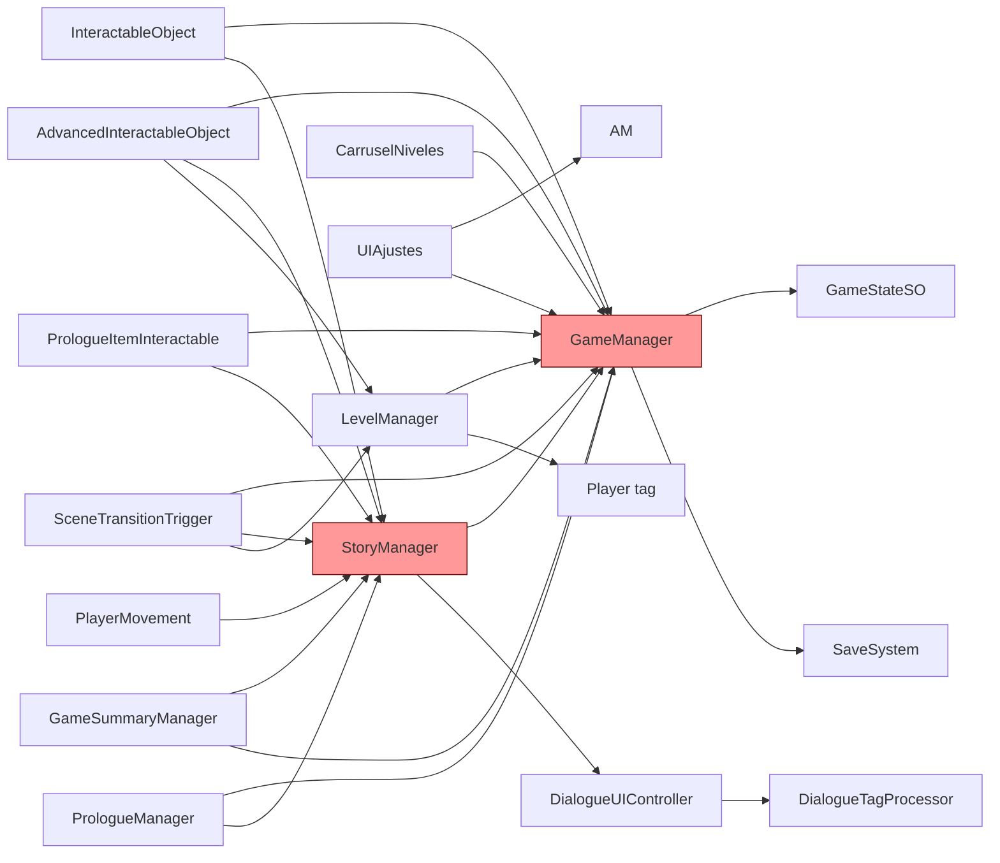
```mermaid
graph LR
    GM[GameManager] --> GSO[GameStateSO]
    GM --> SS[SaveSystem]
    LM[LevelManager] --> GM
    LM --> PL[Player tag]
    SM[StoryManager] --> GM
    SM --> DUC[DialogueUIController]
    DUC --> DTP[DialogueTagProcessor]
    IObj[InteractableObject] --> GM
    IObj --> SM
    AObj[AdvancedInteractableObject] --> GM
    AObj --> SM
    AObj --> LM
    PI[PrologueItemInteractable] --> GM
    PI --> SM
    STT[SceneTransitionTrigger] --> GM
    STT --> SM
    STT --> LM
    PLM[PlayerMovement] --> SM
    GSM[GameSummaryManager] --> SM
    GSM --> GM
    CN[CarruselNiveles] --> GM
    UIA[UIAjustes] --> AM
    UIA --> GM
    PM[PrologueManager] --> GM
    PM --> SM

    %% Resaltar acoplamiento fuerte
    style SM fill:#f99,stroke:#600
    style GM fill:#f99,stroke:#600
```

### 5.2 Observaciones técnicas

####  **GameManager como Hub Central (God Object incipiente)**

`GameManager` es referenciado por **13 clases diferentes**. Aunque su API está bien delimitada, la cantidad de dependencias es alta. Cualquier cambio en `GameManager` (firma de métodos, inicialización) afecta a casi todo el proyecto.

####  **StoryManager como segundo Hub Narrativo**

`StoryManager` es referenciado por **10 clases**. Su evento `OnDialogueStateChanged` tiene 3 suscriptores, y muchos sistemas acceden directamente a `StoryManager.Instance.IsDialogueActive`, `StoryManager.Instance.StartStory()`, etc.


#### **PlayerMovement acoplado a StoryManager**

```csharp
// PlayerMovement.cs (inferido):
if (StoryManager.Instance != null && StoryManager.Instance.IsDialogueActive) {
    // bloquear movimiento
}
```

## 6. Persistencia

### 6.1 Datos de progreso

```
GameManager.Awake()
    └── SaveSystem.Load()
        └── GameStateSO.LoadFrom(data)

GameManager.SaveGame()
    └── GameStateSO → GameSaveData (POCO)
        └── SaveSystem.Save(data)
            └── Application.persistentDataPath/save.json
            └── (WebGL: PlayerPrefs)
```

### 6.2 Preferencias de audio

```
AudioManager.Awake()
    └── PlayerPrefs.GetFloat("MusicVolume", defaultValue)

AudioManager.SetMusicVolume(v)
    └── PlayerPrefs.SetFloat("MusicVolume", v)
    └── PlayerPrefs.Save()
```

### 6.3 Desbloqueo de finales (carrusel)

```
GameSummaryManager.ShowGameSummary()
    └── PlayerPrefs.SetInt(PlayerPrefsKeys.EndingKey(philosopherKey), 1)
    └── CarruselNiveles lee PlayerPrefs para mostrar estrellas
```

---

## 7. Ciclo de Vida de los Sistemas

### 7.1 Por orden de inicialización

```
1. GameManager.Awake()         ← Carga estado, configura flags
2. AudioManager.Awake()        ← Carga volúmenes
3. StoryManager.Awake()        ← Inicializa Story de Ink
4. LevelManager.Awake()        ← Configura fade canvas
5. PrologueManager.Awake()     ← Se registra para sceneLoaded
6. SceneManager.sceneLoaded    ← Se dispara para TODOS
   ├── GameManager.OnSceneLoaded()     ← Actualiza visibilidad HUD
   ├── StoryManager.OnSceneLoaded()    ← RefreshUIReferences()
   ├── LevelManager.OnSceneLoaded()    ← Reset de fade si no hay transición
   └── PrologueManager.OnSceneLoaded() ← Evalúa flujo del prólogo
```

### 7.2 Por evento `OnDialogueStateChanged`

```
StoryManager.StartStory(knot)       ← OnDialogueStateChanged(true)
    └── GameSummaryManager recibe (no hace nada si true)
    └── AdvancedInteractableObject recibe (no hace nada si true)

StoryManager.EndStory()             ← OnDialogueStateChanged(false)
    ├── GameSummaryManager: evalua si mostrar resumen
    └── AdvancedInteractableObject: evalua si desaparecer con fade
```

---

## 8. Datos Importantes

### 8.1 ScriptableObjects

| Asset | Propósito | Creado desde menú |
|-------|-----------|-------------------|
| `GameStateSO` | Estado global del juego | `Core/Game State` |
| `AudioEvent` | Clip de audio con configuración | `Audio/Audio Event` |
| `InteractableData` | Configuración de interactuable básico | `Narrative/Interactable` |
| `AdvancedInteractableData` | Configuración de interactuable condicional | `Narrative/Advanced Interactable` |

> Los ScriptableObjects exclusivamente narrativos (`NarrativeImageDatabase`, `CharacterPortraitData`, `PhilosopherCardDatabase`, `CollectableDuckDatabase`) se documentan en el [Capítulo 2: Sistema Narrativo](#capítulo-2-sistema-narrativo).

### 8.3 Eventos clave

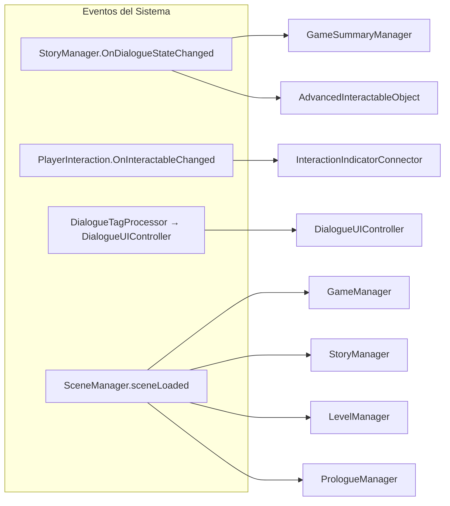
```mermaid
graph LR
    subgraph Eventos_Sistema["Eventos del Sistema"]
        SDE[StoryManager.OnDialogueStateChanged]
        PIC[PlayerInteraction.OnInteractableChanged]
        DTE["DialogueTagProcessor → DialogueUIController"]
        SLE[SceneManager.sceneLoaded]
    end

    SDE --> GSM[GameSummaryManager]
    SDE --> AObj[AdvancedInteractableObject]
    PIC --> IIC[InteractionIndicatorConnector]
    DTE --> DUC[DialogueUIController]
    SLE --> GM[GameManager]
    SLE --> SM[StoryManager]
    SLE --> LM[LevelManager]
    SLE --> PM[PrologueManager]
```

---

## 9. Diagrama de Dependencias de Archivos

```
Assets/Scripts/
├── Core/
│   ├── GameManager.cs         ← Dependencias: GameStateSO, SaveSystem, LevelManager
│   ├── SaveSystem.cs          ← Sin dependencias del proyecto (solo UnityEngine)
│   ├── GameSaveData.cs        ← POCO, sin dependencias
│   ├── PlayerPrefsKeys.cs     ← Constantes, sin dependencias
│   ├── GameSummaryManager.cs  ← Dependencias: StoryManager, PhilosopherCardDatabase, CollectableDuckDatabase
│   ├── GameSummaryUI.cs       ← Sin dependencias de managers
│   └── PrologueManager.cs     ← Dependencias: GameManager, StoryManager
│
├── Player data/
│   ├── GameStateSO.cs         ← Sin dependencias (ScriptableObject)
│   ├── PlayerManager.cs       ← Dependencias: GameStateSO
│   ├── PlayerMovement.cs      ← Dependencias: StoryManager (IsDialogueActive)
│   ├── PlayerInteraction.cs   ← Dependencias: StoryManager, IInteractable, PlayerControls
│   └── SpawnPoint.cs          ← Sin dependencias
│
├── Audio/
│   ├── AudioManager.cs        ← Dependencias: PlayerPrefs
│   ├── AudioEvent.cs          ← Sin dependencias (ScriptableObject)
│   └── SceneMusicStarter.cs   ← Dependencias: AudioManager
│
├── Menu/
│   ├── LevelManager.cs        ← Dependencias: GameManager, SpawnPoint
│   ├── UIAjustes.cs           ← Dependencias: AudioManager, GameManager
│   ├── MenuInicio.cs          ← Dependencias: GameManager
│   ├── MenuBotones.cs         ← Sin dependencias
│   ├── CarruselNiveles.cs     ← Dependencias: GameManager, PlayerPrefs
│   ├── TutorialCarrusel.cs    ← Sin dependencias de managers
│   └── BotonSalirMenu.cs      ← Dependencias: GameManager, LevelManager, UIAjustes
│
├── Narrative/
│   ├── Narrative Logic/
│   │   ├── StoryManager.cs            ← Dependencias: GameManager, DialogueUIController, inkJSON
│   │   ├── DialogueUIController.cs     ← Dependencias: StoryManager, DialogueTagProcessor
│   │   ├── DialogueTagProcessor.cs     ← Dependencias: GameManager, LevelManager
│   │   ├── CardPanelController.cs      ← Dependencias: StoryManager
│   │   ├── PhilosopherCardDatabase.cs  ← Sin dependencias (ScriptableObject)
│   │   ├── FinalReflectionInteractable.cs ← Dependencias: GameManager, StoryManager
│   │   └── FinalRoomManager.cs         ← Dependencias: PhilosopherCardDatabase
│   │
│   └── Interactions/
│       ├── Logic/
│       │   ├── IInteractable.cs              ← Interfaz, sin dependencias
│       │   ├── InteractableData.cs            ← ScriptableObject
│       │   ├── AdvancedInteractableData.cs    ← ScriptableObject, depende GameManager
│       │   ├── InteractableTable.cs           ← Dependencias: CardPanelController
│       │   ├── InteractUI.cs                  ← Sin dependencias
│       │   ├── InteractionIndicator.cs        ← Sin dependencias
│       │   ├── InteractionIndicatorConnector.cs ← Dependencias: PlayerInteraction
│       │   ├── PlayerControls.cs              ← Generado por Input System
│       │   ├── PulseAnimation.cs              ← Sin dependencias
│       │   ├── PrologueItemInteractable.cs    ← Dependencias: GameManager, StoryManager
│       │   └── SceneTransitionTrigger.cs      ← Dependencias: GameManager, StoryManager, LevelManager
│       │
│       └── SO/
│           ├── SO Logic/
│           │   ├── InteractableObject.cs          ← Dependencias: GameManager, StoryManager, InteractableData
│           │   ├── CollectableDuckDatabase.cs      ← ScriptableObject
│           │   ├── NarrativeImageDatabase.cs       ← ScriptableObject
│           │   └── CharacterPortraitData.cs        ← ScriptableObject
│           │
│           └── Joseph/
│               └── AdvancedInteractableObject.cs   ← Dependencias: GameManager, StoryManager, LevelManager
│
└── (otros)
    └── ...
```

---

## 10. Conclusión (Arquitectura General)

La arquitectura actual cumple su propósito para un proyecto de este tamaño: es funcional, depurable y fue desarrollada rápidamente. Los patrones singleton y el acoplamiento directo son sacrificios aceptables para un equipo pequeño, pero representan deuda técnica que dificultaría escalar el proyecto.

Se podrían hacer mejoras secundarias que tendrían un gran impacto en el proyecto a futuro tales como, sin embargo, por el momento no son necesarias:

1. **Introducir un bus de eventos desacoplado** (ScriptableObject-based event channels) para reducir el acoplamiento a `GameManager` y `StoryManager`.
2. **Eliminar la duplicación de lógica de spawn** entre `LevelManager` y `PlayerManager`.
3. **Reemplazar `GameObject.Find()` por un sistema de referencias por escena** (Scene-specific ScriptableObject o un componente `SceneReferences`).
4. **Migrar las consultas directas a singleton** (como `StoryManager.Instance.IsDialogueActive` en `PlayerMovement`) a suscripciones a eventos.

> **Fin del Capítulo 1 — Continúa en el Capítulo 2: Sistema Narrativo**

---

## Capítulo 2: Sistema Narrativo

### Glosario

| Término | Definición |
|---------|-----------|
| **Knot** | Bloque de contenido en Ink, comienza con `=== nombre ===`. Punto de entrada a una sección narrativa. |
| **Stitch** | Sub-bloque dentro de un knot, comienza con `= nombre =`. No se usa en este proyecto. |
| **Divert** | `-> destino`. Transición a otro knot. También `-> END` para terminar. |
| **Tag** | `#tag:valor`. Metadato en una línea que el motor de juego procesa para acciones. |
| **Bind** | Vinculación de función C# a una función Ink (`story.BindExternalFunction`). |
| **External Function** | `EXTERNAL GetFlag(name)`. Función definida en C# pero llamable desde Ink. |
| **Choice** | Opción del jugador. En Ink: `+[Texto]`. En C#: instancia de `Ink.Runtime.Choice`. |
| **Gated Choice** | Menú de opciones restringido porque no se ha realizado una actividad previa. |
| **Conditional Divert** | `{ - GetVar("ruta") == "valor": -> knot }`. Bifurcación basada en variable. |
| **Handle Knot** | Patrón: `=== HandleX === { ... }`. Punto de enrutamiento que decide el siguiente knot según variables. |
| **Externally-bound function** | Ver **Bind**. |
| **Run-time Story** | Instancia de `Ink.Runtime.Story` que mantiene el estado narrativo en memoria. |
| **Typewriter** | Efecto visual de escribir letra por letra implementado en `DialogueUIController`. |

---

### 2.1 Visión General

El sistema narrativo de *Whispers in Letters* está construido sobre **Ink** (Inkle Studios), un motor de narrativa interactiva basado en texto. La integración con Unity sigue una arquitectura de 4 capas:

```mermaid
graph TB
    subgraph Capa_1["Capa 1: Narrativa (Ink)"]
        A[Historia.ink] --> B[Archivos .ink incluidos]
        B --> C[Historia.json compilado]
    end

    subgraph Capa_2["Capa 2: Motor Narrativo (Unity)"]
        C --> D[StoryManager]
        D --> E[story = new Story(json)]
        D --> F[BindExternalFunction]
    end

    subgraph Capa_3["Capa 3: Presentación (UI)"]
        D --> G[DialogueUIController]
        G --> H[Typewriter, Choices, Portraits]
        G --> I[DialogueTagProcessor]
        I --> J[GameManager / LevelManager / AudioManager]
    end

    subgraph Capa_4["Capa 4: Trigger Narrativo (Gameplay)"]
        K[InteractableObject] --> D
        L[AdvancedInteractableObject] --> D
        M[PrologueItemInteractable] --> D
        N[SceneTransitionTrigger] --> D
        O[FinalReflectionInteractable] --> D
    end
```

### 2.2 Estructura de la Historia en Ink

#### Archivos

| Archivo | Líneas | Knots | Propósito |
|---------|--------|-------|-----------|
| `Historia.ink` | 262 | ~20 | Punto de entrada, INCLUDEs, prólogo social, reflexiones, selector de finales |
| `Prologo.ink` | 84 | 9 | Prólogo jugable (buscar objetos en Parque → Arcade/Biblioteca → Parque final) |
| `Objects.ink` | 310 | ~45 | Interacciones con objetos del mundo, NPCs, patos coleccionables, actividades |
| `Joseph_Arcade.ink` | 307 | ~15 | Ruta narrativa inicial del Arcade|
| `Joseph_Arcade_Camino2.ink` | 157 | ~8 | Segunda ruta del Arcade |
| `Joseph_Bibloteca.ink` | 303 | ~15 | Ruta narrativa inicial de la Biblioteca |
| `Joseph_Bibloteca_Camino2.ink` | 174 | ~8 | Segunda ruta de la Biblioteca |
| `Epilogos.ink` | 75 | 8 | Cartas de los 4 filósofos (aceptación + reproche) |

#### Punto de entrada único

`Historia.ink` es el único archivo root. Todos los demás se incluyen mediante `INCLUDE`:

```ink
INCLUDE Joseph_Bibloteca.ink
INCLUDE Epilogos.ink
INCLUDE Joseph_Arcade.ink
INCLUDE Joseph_Arcade_Camino2.ink
INCLUDE Objects.ink
INCLUDE Joseph_Bibloteca_Camino2.ink
INCLUDE Prologo.ink
```

#### Funciones externas

```ink
EXTERNAL GetFlag(flagName)
EXTERNAL GetVar(varName)

// Fallbacks para el editor Inky (no se usan en runtime):
=== function GetFlag(flagName) ===
~ return false
=== function GetVar(varName) ===
~ return ""
```

### 2.3 Anatomía de un Knot

#### Knot simple (diálogo lineal + END)

```ink
=== lampara ===
#sprite:sophia_euforic
Si me acuerdo de esto, aun me duele la cabeza
-> END
```

#### Knot con opciones (decisión del jugador)

```ink
=== Joseph1_Prologo_Reencuentro ===
#setflag:Joseph1_Prologo_Reencuentro

¿Seguro que tienes tiempo para escuchar mis dramas?

  +[No Escuchar a Joseph]
   #sprite:sophia_euforic
   No tengo tiempo, pero espero que te vaya bien
   #sprite:joseph_sad
   No hay problema, nos vemos
   ->END

  +[Si Escuchar a Joseph]
  #setvar:ruta:aprobacion
   #sprite:sophia_happy
   Para los amigos siempre hay tiempo, cuéntame que te tiene tan preocupado
   ->Joseph2_Prologo
```

#### Knot con bifurcación condicional (divert)

```ink
=== HandleDesicion1_Arcade ===
{
- GetVar("ruta") == "motivacion": -> Camino_1_Joseph_Arcade
- GetVar("ruta") == "desmotivarlo": -> Camino_2_Joseph_Arcade
- GetVar("ruta") == "desicion_Arcade_1":
    {
        - GetFlag("Activ_Arcade_1") == true: -> Desicion1_Arcade
        - else: -> Desicion1_Arcade_Gated
    }
}
```

Este es el patrón más usado para rutas narrativas: un knot "HandleX" evalúa el valor de una variable de ruta para redirigir al knot correspondiente.

#### Knot con gating por actividad

```ink
=== Desicion1_Arcade_Gated ===
#sprite:sophia_thinking
Aún no estoy lista para decidir. Debería explorar un poco más antes.
+[llevarlo a la universidad]
#setvar:ruta:desmotivarlo
#sprite:sophia_sad
Que le hice a Joseph debo sacarlo
-> Camino_2_Joseph_Arcade
+[Decidir luego]
#setvar:ruta:desicion_Arcade_1
#sprite:sophia_thinking
Daré una vuelta y luego sigo hablando con Joseph
-> END
```

Cuando el jugador no ha realizado la actividad necesaria (ej: recoger un objeto), se muestra una versión reducida del menú de decisiones.

### 2.4 Sistema de Tags de Ink

Los tags son el mecanismo principal para que la narrativa controle el motor de juego. Se procesan en `DialogueTagProcessor.ProcessTags()`.

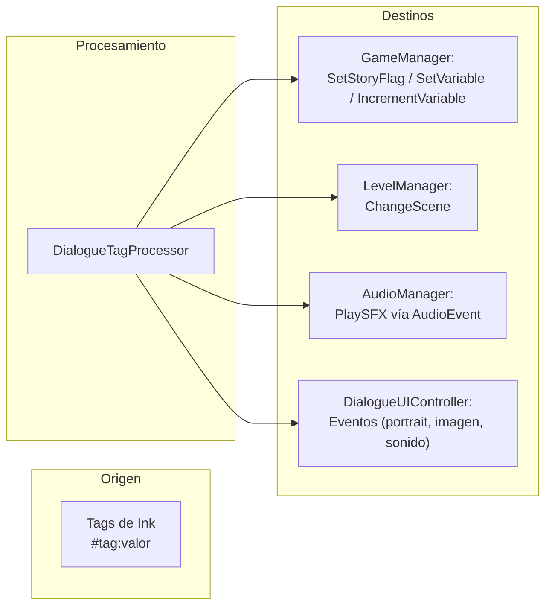
```mermaid
graph LR
    subgraph Origen["Origen"]
        Tags["Tags de Ink<br/>#tag:valor"]
    end

    subgraph Procesamiento["Procesamiento"]
        DTP[DialogueTagProcessor]
    end

    subgraph Destinos["Destinos"]
        DTP --> GM["GameManager:<br/>SetStoryFlag / SetVariable / IncrementVariable"]
        DTP --> LM["LevelManager:<br/>ChangeScene"]
        DTP --> AM["AudioManager:<br/>PlaySFX vía AudioEvent"]
        DTP --> DUC["DialogueUIController:<br/>Eventos (portrait, imagen, sonido)"]
    end
```

#### Tabla completa de tags

| Tag | Sintaxis | Acción | Clase destino |
|-----|----------|--------|---------------|
| `#sprite:` | `#sprite:sophia_happy` | Cambia animación del retrato + identifica personaje que habla | `DialogueTagProcessor` → evento → `DialogueUIController` |
| `#setflag:` | `#setflag:conocio_sophia` | Activa un flag en GameState (persistente) | `DialogueTagProcessor` → `GameManager.SetStoryFlag()` |
| `#deleteflag:` | `#deleteflag:exploracion` | Desactiva un flag en GameState | `DialogueTagProcessor` → `GameManager.SetStoryFlag(false)` |
| `#setvar:` | `#setvar:ruta:Epilogo1` | Asigna una variable narrativa | `DialogueTagProcessor` → `GameManager.SetStoryVariable()` |
| `#incrementvar:` | `#incrementvar:contador:1` | Incrementa una variable numérica | `DialogueTagProcessor` → `GameManager.IncrementStoryVariable()` |
| `#sonido:` | `#sonido:joseph_suspiro` | Reproduce un efecto de sonido | `DialogueTagProcessor` → evento → `DialogueUIController.HandleSoundRequested()` |
| `#scene:` | `#scene:Biblioteca` | Cambia de escena | `DialogueTagProcessor` → `LevelManager.ChangeScene()` |
| `#fade_out` | `#fade_out` | Programa fade a negro al terminar el diálogo | `DialogueTagProcessor.PendingFadeOut` → `DialogueUIController` al `EndStory` |
| `#small_image:` | `#small_image:img1,img2` | Muestra imágenes pequeñas (máx 3) | `DialogueTagProcessor` → evento → `DialogueUIController` |
| `#big_image:` | `#big_image:Control_Arcade` | Muestra imagen grande | `DialogueTagProcessor` → evento → `DialogueUIController` |
| `#keep_image` | `#keep_image` | Evita limpiar imágenes en la siguiente línea | `DialogueTagProcessor.HasKeepImageTag()` |

### 2.5 Mapa Narrativo Completo (Árbol de Decisión)

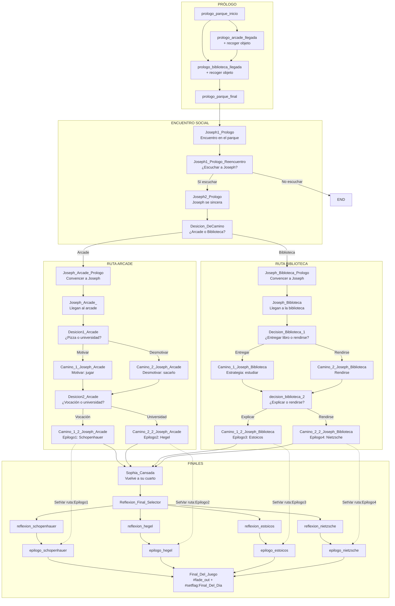
```mermaid
graph TB
    subgraph Prologo["PRÓLOGO"]
        P_Inicio[prologo_parque_inicio]
        P_Arcade[prologo_arcade_llegada<br/>+ recoger objeto]
        P_Biblio[prologo_biblioteca_llegada<br/>+ recoger objeto]
        P_Final[prologo_parque_final]
    end

    subgraph Social["ENCUENTRO SOCIAL"]
        J1[Joseph1_Prologo<br/>Encuentro en el parque]
        J1_R[Joseph1_Prologo_Reencuentro<br/>¿Escuchar a Joseph?]
        J2[Joseph2_Prologo<br/>Joseph se sincera]
        DC[Desicion_DeCamino<br/>¿Arcade o Biblioteca?]
    end

    subgraph Arcade["RUTA ARCADE"]
        JA_P[Joseph_Arcade_Prologo<br/>Convencer a Joseph]
        JA_1[Joseph_Arcade_<br/>Llegan al arcade]
        D1_Arc[Desicion1_Arcade<br/>¿Pizza o universidad?]
        C1_A[Camino_1_Joseph_Arcade<br/>Motivar: jugar]
        C1_A2[Camino_1_2_Joseph_Arcade<br/>Epilogo1: Schopenhauer]
        D2_Arc[Desicion2_Arcade<br/>¿Vocación o universidad?]
        C2_A[Camino_2_Joseph_Arcade<br/>Desmotivar: sacarlo]
        C2_A2[Camino_2_2_Joseph_Arcade<br/>Epilogo2: Hegel]
    end

    subgraph Biblioteca["RUTA BIBLIOTECA"]
        JB_P[Joseph_Bibloteca_Prologo<br/>Convencer a Joseph]
        JB_1[Joseph_Bibloteca<br/>Llegan a la biblioteca]
        D1_Bib[Decision_Biblioteca_1<br/>¿Entregar libro o rendirse?]
        C1_B[Camino_1_Joseph_Biblioteca<br/>Estrategia: estudiar]
        C1_B2[Camino_1_2_Joseph_Biblioteca<br/>Epilogo3: Estoicos]
        D2_Bib[decision_biblioteca_2<br/>¿Explicar o rendirse?]
        C2_B[Camino_2_Joseph_Biblioteca<br/>Rendirse]
        C2_B2[Camino_2_2_Joseph_Biblioteca<br/>Epilogo4: Nietzsche]
    end

    subgraph Finales["FINALES"]
        SC[Sophia_Cansada<br/>Vuelve a su cuarto]
        RF[Reflexion_Final_Selector]
        R_S[reflexion_schopenhauer]
        R_H[reflexion_hegel]
        R_E[reflexion_estoicos]
        R_N[reflexion_nietzsche]
        E_S[epilogo_schopenhauer]
        E_H[epilogo_hegel]
        E_ES[epilogo_estoicos]
        E_N[epilogo_nietzsche]
        FDJ["Final_Del_Juego<br/>#fade_out + #setflag:Final_Del_Dia"]
    end

    P_Inicio --> P_Arcade
    P_Inicio --> P_Biblio
    P_Arcade --> P_Biblio
    P_Biblio --> P_Final
    P_Final --> J1

    J1 --> J1_R
    J1_R -->|No escuchar| END
    J1_R -->|Sí escuchar| J2
    J2 --> DC

    DC -->|Arcade| JA_P
    DC -->|Biblioteca| JB_P

    JA_P --> JA_1
    JA_1 --> D1_Arc
    D1_Arc -->|Motivar| C1_A
    D1_Arc -->|Desmotivar| C2_A
    C1_A --> D2_Arc
    C2_A --> D2_Arc
    D2_Arc -->|Vocación| C1_A2
    D2_Arc -->|Universidad| C2_A2
    C1_A2 --> SC
    C2_A2 --> SC

    JB_P --> JB_1
    JB_1 --> D1_Bib
    D1_Bib -->|Entregar| C1_B
    D1_Bib -->|Rendirse| C2_B
    C1_B --> D2_Bib
    C2_B --> D2_Bib
    D2_Bib -->|Explicar| C1_B2
    D2_Bib -->|Rendirse| C2_B2
    C1_B2 --> SC
    C2_B2 --> SC

    SC --> RF
    RF --> R_S
    RF --> R_H
    RF --> R_E
    RF --> R_N
    R_S --> E_S
    R_H --> E_H
    R_E --> E_ES
    R_N --> E_N
    E_S --> FDJ
    E_H --> FDJ
    E_ES --> FDJ
    E_N --> FDJ

    C1_A2 -.->|SetVar ruta:Epilogo1| E_S
    C2_A2 -.->|SetVar ruta:Epilogo2| E_H
    C1_B2 -.->|SetVar ruta:Epilogo3| E_ES
    C2_B2 -.->|SetVar ruta:Epilogo4| E_N
```

### 2.6 Ciclo de Vida de un Diálogo

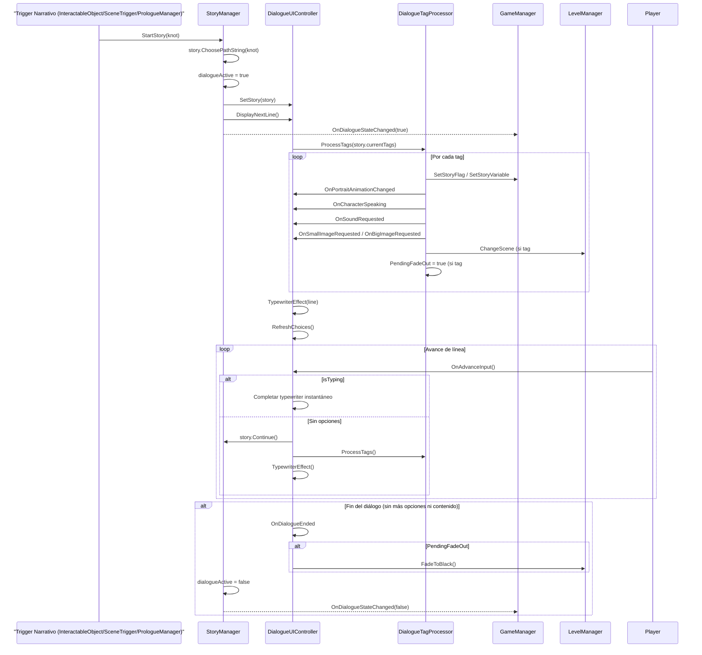
```mermaid
sequenceDiagram
    participant Trigger as "Trigger Narrativo (InteractableObject/SceneTrigger/PrologueManager)"
    participant SM as StoryManager
    participant DUC as DialogueUIController
    participant DTP as DialogueTagProcessor
    participant GM as GameManager
    participant LM as LevelManager

    Trigger->>SM: StartStory(knot)
    SM->>SM: story.ChoosePathString(knot)
    SM->>SM: dialogueActive = true
    SM->>DUC: SetStory(story)
    SM->>DUC: DisplayNextLine()
    SM-->>GM: OnDialogueStateChanged(true)

    DUC->>DTP: ProcessTags(story.currentTags)

    loop Por cada tag
        DTP->>GM: SetStoryFlag / SetStoryVariable
        DTP->>DUC: OnPortraitAnimationChanged
        DTP->>DUC: OnCharacterSpeaking
        DTP->>DUC: OnSoundRequested
        DTP->>DUC: OnSmallImageRequested / OnBigImageRequested
        DTP->>LM: ChangeScene (si tag #scene)
        DTP->>DTP: PendingFadeOut = true (si tag #fade_out)
    end

    DUC->>DUC: TypewriterEffect(line)
    DUC->>DUC: RefreshChoices()

    loop Avance de línea
        Player->>DUC: OnAdvanceInput()
        alt isTyping
            DUC->>DUC: Completar typewriter instantáneo
        else Sin opciones
            DUC->>SM: story.Continue()
            DUC->>DTP: ProcessTags()
            DUC->>DUC: TypewriterEffect()
        end
    end

    alt Fin del diálogo (sin más opciones ni contenido)
        DUC->>DUC: OnDialogueEnded
        alt PendingFadeOut
            DUC->>LM: FadeToBlack()
        end
        SM->>SM: dialogueActive = false
        SM-->>GM: OnDialogueStateChanged(false)
    end
```

### 2.7 Comunicación Gameplay ↔ Narrativa

La comunicación es **bidireccional**:

#### Gameplay → Narrativa (Unity → Ink)

```mermaid
graph LR
    subgraph Unity_a_Ink["Unity → Ink"]
        A[InteractableObject.Interact()] -->|StartStory(knot)| B[StoryManager]
        C[SceneTransitionTrigger] -->|StartStory(confirmationKnot)| B
        D[PrologueManager] -->|StartStory(knot)| B
        E[FinalReflectionInteractable] -->|StartStory(knot)| B
        B --> F[Ink Story]
        F --> G[JSON ink compilado]
    end
```

El gameplay dispara narrativa llamando `StoryManager.Instance.StartStory("nombre_knot")`. La decisión de qué knot llamar la toma el script C# basándose en condiciones de GameState.

#### Narrativa → Gameplay (Ink → Unity)

```mermaid
graph LR
    subgraph Ink_a_Unity["Ink → Unity"]
        InkEngine[Ink Runtime] -->|GetFlag(flagName)| ExtFunc[BindExternalFunction]
        InkEngine -->|GetVar(varName)| ExtFunc
        ExtFunc --> GM[GameManager]
        GM --> GSO[GameStateSO]
        InkEngine -->|Tags| DTP[DialogueTagProcessor]
        DTP -->|setflag / deleteflag| GM
        DTP -->|setvar / incrementvar| GM
        DTP -->|scene| LM[LevelManager]
        DTP -->|"sonido"| DUC["DialogueUIController → AudioEvent"]
        DTP -->|sprite, small_image, big_image| DUC
        DTP -->|fade_out| DUC
    end
```

**Lectura:** Ink lee el estado del juego mediante `GetFlag()` y `GetVar()`, que son funciones C# vinculadas externamente.

**Escritura:** Ink modifica el estado mediante tags processados por `DialogueTagProcessor`.

**Control de flujo:** Ink puede cambiar de escena (`#scene:`), reproducir sonidos (`#sonido:`), y controlar la UI (`#sprite:`, `#small_image:`, `#fade_out`).

### 2.8 Persistencia Narrativa

#### Qué se persiste

| Dato | Tipo | Persistencia | Propósito |
|------|------|-------------|-----------|
| `unlockedFlags` | `List<string>` | `save.json` vía GameStateSO | Decisiones narrativas, objetos recogidos, eventos ocurridos |
| `storyVariables` | `List<StoryVariable>` | `save.json` vía GameStateSO | Variables de ruta (ruta actual, epílogo, contadores) |
| `currentSceneName` | `string` | `save.json` | Última escena jugada (para continuar) |
| `previousSceneName` | `string` | `save.json` | Escena anterior (para SpawnPoint) |
| Finales desbloqueados | `int` (0/1) | `PlayerPrefs` vía GameSummaryManager | Estrellas en el carrusel de niveles |

#### Qué NO se persiste (y por qué)

| Estado | Motivo |
|--------|--------|
| Posición exacta del jugador | Se reconstruye desde SpawnPoint según `previousSceneName` |
| Estado de objetos de escena | Cada objeto evalúa su visibilidad en `Start()` según flags |
| Progreso del prólogo | Se evalúa desde flags (`prologue_arcade_visited`, etc.) |

#### Flujo de persistencia narrativa

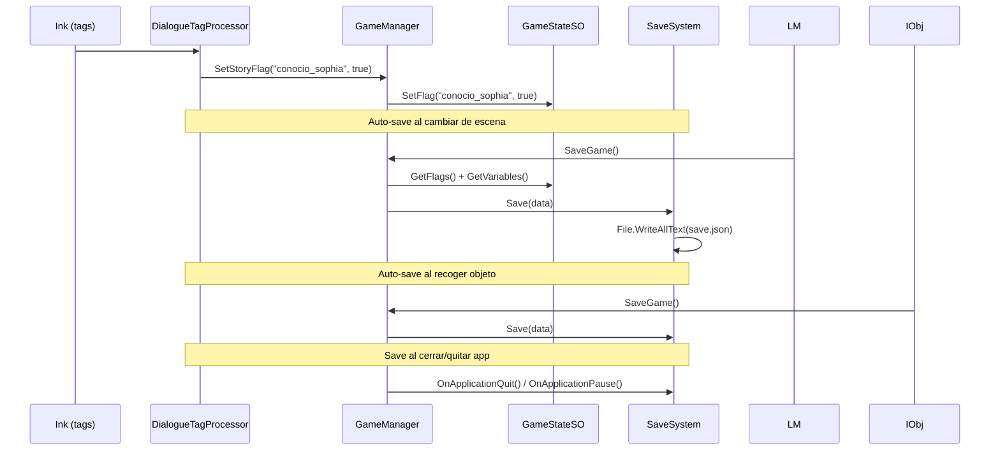
```mermaid
sequenceDiagram
    participant Ink as Ink (tags)
    participant DTP as DialogueTagProcessor
    participant GM as GameManager
    participant GSO as GameStateSO
    participant SS as SaveSystem

    Ink->>DTP: #setflag:conocio_sophia
    DTP->>GM: SetStoryFlag("conocio_sophia", true)
    GM->>GSO: SetFlag("conocio_sophia", true)

    Note over DTP,SS: Auto-save al cambiar de escena
    LM->>GM: SaveGame()
    GM->>GSO: GetFlags() + GetVariables()
    GM->>SS: Save(data)
    SS->>SS: File.WriteAllText(save.json)

    Note over DTP,SS: Auto-save al recoger objeto
    IObj->>GM: SaveGame()
    GM->>SS: Save(data)

    Note over DTP,SS: Save al cerrar/quitar app
    GM->>SS: OnApplicationQuit() / OnApplicationPause()
```

### 2.9 Variables Narrativas Críticas

| Variable | Se setea en | Valores posibles | Propósito |
|----------|-------------|------------------|-----------|
| `ruta` | Múltiples knots | `desicion_Decamino`, `arcade`, `biblioteca`, `motivacion`, `desmotivarlo`, `vocacion`, `universidad`, `Oportunidad`, `sacarlo`, `disciplina`, `rendirse_2`, `ultimo_esfuerzo`, `rendicion_final`, `Epilogo1-4` | Variable principal de ruta. Controla todas las bifurcaciones |
| `proxima_reflexion` | FinalRoomManager (C#) | `reflexion_schopenhauer`, `reflexion_hegel`, `reflexion_estoicos`, `reflexion_nietzsche` | Determina qué reflexión final se muestra |
| `carta_aceptacion_ruta` | FinalRoomManager (C#) | Depende del filósofo | Usada por GameSummaryManager para mostrar el final correcto |

### 2.10 Triggers Narrativos (Cómo se inicia un diálogo)

Existen 5 mecanismos para disparar narrativa:

#### 1. InteractableObject (genérico)

```csharp
public void Interact() {
    if (data.isCollectable) { Collect(); return; }
    StoryManager.Instance.StartStory(data.inkKnot);
}
```

**Configuración en Inspector:**
- `data` → `InteractableData` SO (contiene `inkKnot`)
- `requiredFlag` → flag opcional que debe estar activo para interactuar
- `fallbackKnot` → knot alternativo si no se cumple `requiredFlag`

#### 2. AdvancedInteractableObject (condicional)

```csharp
public void Interact() {
    string knot = data.GetValidKnot(); // Evalúa condiciones en orden
    StoryManager.Instance.StartStory(knot);
}
```

**Configuración en Inspector:**
- `data` → `AdvancedInteractableData` SO (lista de `InteractionEntry` con condiciones)
- Cada entrada se evalúa en orden; la primera que cumple sus condiciones envía su knot
- Soporta `visibilityConditions` (el objeto se oculta si no se cumplen)
- Soporta `disappearAfterDialogue` (desaparece con fade al terminar el diálogo)

#### 3. PrologueItemInteractable (prólogo)

```csharp
public void Interact() {
    StoryManager.Instance.StartStory(data.inkKnotOnInteract);
    GameManager.Instance.SetStoryFlag(flagToSetOnCollect, true);
    GameManager.Instance.SaveGame();
    gameObject.SetActive(false);
}
```

**Específico del prólogo:** al recoger un objeto, dispara su knot, marca flag, guarda y desaparece.

#### 4. SceneTransitionTrigger (puertas)

```csharp
// Al entrar al trigger
if (confirmationKnot existe) {
    StoryManager.Instance.StartStory(confirmationKnot);
    // Ink debe usar #scene: para cambiar de escena
} else {
    LevelManager.Instance.ChangeScene(destinationSceneName);
}
```

**Dos modos:**
- **Directo:** No hay `confirmationKnot` → cambia de escena inmediatamente
- **Con confirmación:** Hay `confirmationKnot` → dispara diálogo de confirmación, y el script de Ink usa `#scene:` para completar la transición

#### 5. PrologueManager (automático al cargar escena)

```csharp
private void OnSceneLoaded(Scene scene, LoadSceneMode mode) {
    if (!IsPrologueActive) return;
    StartCoroutine(HandleSceneRoutine(scene.name));
    // Evalúa flags y dispara el knot correspondiente
}
```

**Automático:** Se ejecuta en cada cambio de escena mientras el prólogo esté activo. No requiere interacción del jugador.

### 2.11 Pipeline para nuevo contenido narrativo

> Esta sección ha sido consolidada en el [Capítulo 7: Guía de Creación de Contenido](#capitulo-7-guia-de-creacion-de-contenido).
>
> - **Cómo crear un knot** → [§7.4 Crear interacción narrativa](#-74-como-crear-una-nueva-interaccion-narrativa)
> - **Cómo conectar gameplay con narrativa** → [§7.4.3 Conectar diálogo con gameplay](#-743-como-conectar-un-dialogo-con-logica-de-gameplay)
> - **Cómo probar contenido** → [§7.9 Conectar gameplay y narrativa](#-79-como-conectar-gameplay-y-narrativa)
> - **Errores comunes** → [§7.9.4 Errores comunes de conexión](#-794-errores-comunes-de-conexion)

### 2.12 Assets del Sistema Narrativo

> Los ScriptableObjects narrativos, interactuables y referencias del prefab están documentados en la [Referencia Rápida del Capítulo 7](#-712-referencia-rapida-de-archivos) y en la tabla de sistemas del [README de documentación](docs/README.md).

| Asset | Ruta | Tipo | Propósito |
|-------|------|------|-----------|
| `Estado.asset` | `Assets/Scripts/Core/` | `GameStateSO` | Estado global del juego (runtime) |
| `Images.asset` | `Assets/Scripts/Narrative/Images/` | `NarrativeImageDatabase` | Mapea IDs de imagen → Sprite |
| `Portrait Data Base.asset` | `Assets/Scripts/Narrative/Portraits/` | `CharacterPortraitData` | Mapea IDs de sprite → Animation State |
| `Cartas.asset` | `Assets/Scripts/Narrative/Portraits/Filosofos/` | `PhilosopherCardDatabase` | Datos de cartas de filósofos |
| `Patos DB.asset` | `Assets/Prefabs/Patos/` | `CollectableDuckDatabase` | Datos de patos coleccionables |

### 2.13 Riesgos Comunes y Errores Frecuentes

> Los riesgos de contenido narrativo se han consolidado en el [Capítulo 7](#capitulo-7-guia-de-creacion-de-contenido):
> - [§7.4.3 Validaciones de interacción narrativa](#-743-como-conectar-un-dialogo-con-logica-de-gameplay)
> - [§7.11 Riesgos Frecuentes](#-711-riesgos-frecuentes)
>
> Los riesgos de persistencia y comunicación entre sistemas están en los capítulos respectivos.

### 2.14 Checklist de Validación

> La checklist de validación narrativa se ha consolidado en la [Checklist General del Capítulo 7](#-710-checklist-general-de-creacion-de-contenido), que unifica todos los criterios de validación del proyecto (pre-creación, implementación, persistencia, integración y pruebas).

---

## Capítulo 3: Sistema de Interacción

### 3.1 Visión General

El sistema de interacción conecta la entrada del jugador con los objetos del mundo y la narrativa. Sigue una arquitectura en 4 capas:

```mermaid
graph TB
    subgraph Capa_1["Capa 1: Detección Física"]
        TR[Collider Trigger] --> PIN[PlayerInteraction]
        PIN --> |OnInteractableChanged| IIC[InteractionIndicatorConnector]
        IIC --> IND[InteractionIndicator<br/>World-Space Billboard]
    end

    subgraph Capa_2["Capa 2: Interfaz"]
        PIN --> IInteractable[IInteractable interface]
        IInteractable --> |Interact\(\)| IMPL[Implementaciones]
    end

    subgraph Capa_3["Capa 3: Implementación"]
        IMPL --> IObj[InteractableObject<br/>SO-driven]
        IMPL --> AObj[AdvancedInteractableObject<br/>Condicional]
        IMPL --> PI[PrologueItemInteractable<br/>Prólogo]
        IMPL --> IT[InteractableTable<br/>Cartas]
        IMPL --> FRI[FinalReflectionInteractable<br/>Reflexión]
    end

    subgraph Capa_4["Capa 4: Datos y Narrativa"]
        IObj --> ID[InteractableData SO]
        AObj --> AID[AdvancedInteractableData SO]
        IObj --> SM[StoryManager]
        AObj --> SM
        PI --> SM
        FRI --> SM
        IT --> CPC[CardPanelController]
    end
```

**14 archivos** conforman el sistema (`Assets/Scripts/Narrative/Interactions/` + `PlayerInteraction.cs`), más 2 ScriptableObjects de datos y componentes auxiliares de UI.

### 3.2 IInteractable — La interfaz raíz

`Assets/Scripts/Narrative/Interactions/Logic/IInteractable.cs`

Es el contrato que todo objeto interactivo debe cumplir:

```csharp
public interface IInteractable
{
    void Interact();
    string GetInteractionName();
}
```

Cualquier MonoBehaviour que implemente esta interfaz es detectable por `PlayerInteraction` al entrar en su trigger.

### 3.3 PlayerInteraction — Núcleo de detección

`Assets/Scripts/Player data/PlayerInteraction.cs`

**Singleton** en el prefab `Player.prefab`. Gestiona:
- Detección de `IInteractable` via `OnTriggerEnter` / `OnTriggerExit`
- Enlace del input `Interact` (Tecla E / Gamepad South) mediante `PlayerControls`
- Reenvío a `Interact()` o a `StoryManager.AdvanceStory()` si hay diálogo activo

```csharp
void TryInteract()
{
    if (StoryManager.Instance != null && StoryManager.Instance.IsDialogueActive)
    {
        StoryManager.Instance.AdvanceStory();
        return;
    }

    if (currentInteractable != null)
    {
        // Rotar jugador hacia el objeto
        currentInteractable.Interact();
    }
}
```

**Evento público:**
| Evento | Tipo | Disparo |
|--------|------|---------|
| `OnInteractableChanged` | `Action<IInteractable>` | Al entrar/salir de trigger de un interactuable |

**Detección por trigger:**
```csharp
void OnTriggerEnter(Collider other) {
    IInteractable interactable = other.GetComponentInParent<IInteractable>();
    if (interactable != null) {
        currentInteractable = interactable;
        OnInteractableChanged?.Invoke(currentInteractable);
    }
}

void OnTriggerExit(Collider other) {
    if (interactable != null && interactable == currentInteractable) {
        currentInteractable = null;
        OnInteractableChanged?.Invoke(null);
    }
}
```

### 3.4 InteractableObject — Objeto genérico

`Assets/Scripts/Narrative/Interactions/SO/SO Logic/InteractableObject.cs`

Implementa `IInteractable`. Usa `InteractableData` SO como fuente de datos. Soporta dos modos:

#### Modo Narrativo (`isCollectable = false`)
- Al interactuar, llama `StoryManager.Instance.StartStory(data.inkKnot)`
- Si `requiredFlag` está seteado y no se cumple, usa `fallbackKnot`

#### Modo Coleccionable (`isCollectable = true`)
- Al cargar escena: si `flagToSetOnCollect` ya existe, se desactiva (ya recogido)
- Si `requiredFlag` no se cumple, desactiva el `PulseAnimation` hijo
- Al recoger: dispara Ink, setea flag, incrementa variable, guarda, reproduce sonido, se desactiva

**Componentes requeridos en el GameObject:**
- `Collider` con `IsTrigger = true`
- `InteractableObject` script
- `InteractableData` SO en `data`
- Opcional: `PulseAnimation` en hijo para emisión pulsante
- Opcional: `autoTriggerOnEnter` para activación automática al acercarse

### 3.5 AdvancedInteractableObject — Objeto condicional

`Assets/Scripts/Narrative/Interactions/SO/Joseph/AdvancedInteractableObject.cs`

Implementa `IInteractable`. Usa `AdvancedInteractableData` SO que contiene una lista de `InteractionEntry` (cada una con condiciones AND).

```csharp
public void Interact() {
    string knot = data.GetValidKnot(); // Evalúa condiciones en orden
    StoryManager.Instance.StartStory(knot);
}
```

**Características adicionales:**
- **Visibility Conditions** (`List<InteractionCondition>`): si fallan al `Start()`, el objeto se oculta
- **Disappear After Dialogue**: se suscribe a `OnDialogueStateChanged`. Al terminar el diálogo, si la condición de desaparición se cumple, ejecuta fade-out → desactiva objeto → fade-in
- **NPC Rotation**: al interactuar, rota el NPC hacia el jugador

**Componentes requeridos:**
- `Collider` con `IsTrigger = true`
- `AdvancedInteractableObject` script
- `AdvancedInteractableData` SO en `data`
- Opcional: lista de `visibilityConditions`
- Opcional: `disappearAfterDialogue` + `disappearCondition`

### 3.6 PrologueItemInteractable — Objeto de prólogo

`Assets/Scripts/Narrative/Interactions/Logic/PrologueItemInteractable.cs`

Implementa `IInteractable`. Exclusivo del prólogo jugable. Es autocontenido (no requiere SO).

```csharp
public void Interact() {
    if (alreadyCollected) return;
    StoryManager.Instance.StartStory(inkKnotOnInteract);
    GameManager.Instance.SetStoryFlag(flagToSetOnCollect, true);
    GameManager.Instance.SaveGame();
    if (collectSound != null) collectSound.PlaySFX();
    gameObject.SetActive(false);
}
```

**Comportamiento:**
- En `Start()`: si el prólogo está completado o el objeto ya se recogió, se desactiva
- Al recoger: dispara knot, marca flag, guarda checkpoint, reproduce sonido, se desactiva
- Tiene su propio sistema de pulso por emisión (anterior a la extracción de `PulseAnimation`)

**Componentes requeridos:**
- `Collider` con `IsTrigger = true`
- `PrologueItemInteractable` script
- `inkKnotOnInteract`, `flagToSetOnCollect` configurados

### 3.7 SceneTransitionTrigger — Transición de escenas

`Assets/Scripts/Narrative/Interactions/Logic/SceneTransitionTrigger.cs`

**NO implementa** `IInteractable`. Usa `OnTriggerEnter` directamente. Gestiona cambio entre escenas.

```csharp
void OnTriggerEnter(Collider other) {
    if (!other.CompareTag(playerTag) || isTransitioning) return;

    if (!string.IsNullOrEmpty(requiredFlag)
        && !GameManager.Instance.GetStoryFlag(requiredFlag)) {
        StoryManager.Instance.StartStory(fallbackKnot);
        StartCoroutine(NaturalPushBackRoutine());
        return;
    }

    // Evaluar condiciones adicionales (pila)
    foreach (var condition in conditions) {
        if (!GameManager.Instance.GetStoryFlag(condition.requiredFlag)) {
            StoryManager.Instance.StartStory(condition.fallbackKnot);
            StartCoroutine(NaturalPushBackRoutine());
            return;
        }
    }

    if (!string.IsNullOrEmpty(confirmationKnot)) {
        StoryManager.Instance.StartStory(confirmationKnot);
        // Ink debe usar #scene:destino para cambiar de escena
    } else {
        LevelManager.Instance.ChangeScene(destinationSceneName);
    }
}
```

**Tres modos:**
1. **Directo** — Cambia de escena inmediatamente al tocar el trigger
2. **Con flag requerido** — Si el flag no existe, muestra diálogo de denegación + push back
3. **Con confirmación** — Dispara un knot de Ink; el script Ink usa `#scene:` para la transición

**Soporta pila de condiciones:** `List<TransitionCondition>` evaluadas en orden; la primera que falle detiene la transición.

**Componentes requeridos:**
- `Collider` con `IsTrigger = true`
- `SceneTransitionTrigger` script
- `destinationSceneName` configurado
- Opcional: `requiredFlag`, `fallbackKnot`, `confirmationKnot`, `conditions`

### 3.8 InteractableTable y FinalReflectionInteractable (Epílogo)

#### InteractableTable
`Assets/Scripts/Narrative/Interactions/Logic/InteractableTable.cs`

Implementa `IInteractable`. Dos modos:
- **Acceptance**: abre `CardPanelController.OpenSingle()` — muestra una carta de filósofo
- **Reproach**: abre `CardPanelController.OpenMulti()` — muestra lista con navegación

#### FinalReflectionInteractable
`Assets/Scripts/Narrative/Narrative Logic/FinalReflectionInteractable.cs`

Implementa `IInteractable`. Lógica de 4 etapas:
1. Si falta `Final_Alcanzado` → knot de habitación cerrada
2. Si falta `Carta_Aceptacion_Leida` → knot de carta sin leer
3. Busca en `PhilosopherCardDatabase` la carta según `carta_aceptacion_ruta` → obtiene `reflectionKnot`
4. Setea `proxima_reflexion` en GameState y reproduce `confirmationKnot`

### 3.9 Feedback Visual y UI

#### InteractionIndicator (World-Space Billboard)
`Assets/Scripts/Narrative/Interactions/Logic/InteractionIndicator.cs`

Muestra un icono sobre el objeto interactuable:
- Se desparentea del jugador en `Awake()` para posición absoluta
- Fuerza al Canvas a `RenderMode.WorldSpace`
- En `LateUpdate()`: posiciona el icono en `targetTransform.position + worldOffset` y rota hacia la cámara
- Safety: si el objeto se desactiva (ej: al recoger), oculta el icono automáticamente

**API:** `SetInteractable(IInteractable)` — recibe el interactable objetivo o null para ocultar

#### InteractionIndicatorConnector (Bridge)
`Assets/Scripts/Narrative/Interactions/Logic/InteractionIndicatorConnector.cs`

Puente entre `PlayerInteraction.OnInteractableChanged` e `InteractionIndicator.SetInteractable()`.

```csharp
void Start() {
    playerInteraction.OnInteractableChanged += HandleInteractableChanged;
}

void HandleInteractableChanged(IInteractable interactable) {
    indicator.SetInteractable(interactable);
}
```

#### PulseAnimation (Emission Pulse)
`Assets/Scripts/Narrative/Interactions/Logic/PulseAnimation.cs`

Componente reutilizable extraído de `PrologueItemInteractable`. Aplica un pulso de emisión a cualquier `Renderer`.

**Configuración en Inspector:**
| Parámetro | Descripción |
|-----------|-------------|
| `emissionColor` | Color HDR de la emisión |
| `pulseSpeed` | Velocidad de pulsación |
| `maxIntensity` | Intensidad máxima |
| `pulseDuration` | Segundos de pulso activo |
| `pauseDuration` | Segundos de pausa entre ciclos |

**API pública:**
- `SetPulseEnabled(bool)` — habilita/deshabilita el efecto
- `IsPulseEnabled` — consulta el estado

#### InteractUI (Legacy)
`Assets/Scripts/Narrative/Interactions/Logic/InteractUI.cs`

Toggle simple de un GameObject `iconoInteractuar`. Versión anterior/simplificada del feedback visual.

### 3.10 ScriptableObjects de Datos

#### InteractableData
`Assets/Scripts/Narrative/Interactions/Logic/InteractableData.cs`

Creado desde `Create > Narrative > Interactable`.

| Campo | Tipo | Propósito |
|-------|------|-----------|
| `interactionName` | string | Nombre visible en logs y UI |
| `inkKnot` | string | Knot a ejecutar al interactuar |
| `isCollectable` | bool | Modo coleccionable |
| `flagToSetOnCollect` | string | Flag a activar al recoger |
| `variableToIncrementOnCollect` | string | Variable a incrementar (opcional) |
| `incrementAmount` | int | Cantidad a incrementar |

#### AdvancedInteractableData
`Assets/Scripts/Narrative/Interactions/Logic/AdvancedInteractableData.cs`

Creado desde `Create > Narrative > Advanced Interactable`.

Contiene una lista de `InteractionEntry`, cada una con:
- `description` — nombre descriptivo para el Inspector
- `inkKnot` — knot a ejecutar si las condiciones se cumplen
- `conditions` — lista de `InteractionCondition` (AND lógica)

**InteractionCondition** soporta tres tipos:
| Tipo | Evalúa |
|------|--------|
| `Ninguna` | Siempre verdadero |
| `RequerirFlag` | `GameManager.Instance.GetStoryFlag(flagName)` |
| `RequerirVariable` | `GameManager.Instance.GetStoryVariable(variableKey) == requiredValue` |

**Algoritmo `GetValidKnot()`:**
```csharp
public string GetValidKnot() {
    foreach (var entry in interactions) {
        if (entry.CheckConditions()) return entry.inkKnot;
    }
    return string.Empty;
}
```

#### Inventario de Assets (~65 SOs)

| Ubicación | Cantidad | Tipo |
|-----------|----------|------|
| `SO/Joseph/` | 3 | AdvancedInteractableData |
| `SO/NPCs/` | 4 | InteractableData |
| `SO/Escenarios/Arcade/` | 10 | InteractableData |
| `SO/Escenarios/Biblioteca/` | 9 | InteractableData |
| `SO/Escenarios/Cuarto/` | 4 | InteractableData |
| `SO/Escenarios/Parque/` | 11 | InteractableData |
| `SO/` (raíz) | 2 | InteractableData (Cama, Entrada Cuarto) |

### 3.11 Prefabs Base

| Prefab | Componentes de Interacción |
|--------|---------------------------|
| `Player.prefab` | `PlayerInteraction`, `InteractUI` |
| `Cambio de escena.prefab` | `SceneTransitionTrigger` |
| `IDEL JOSEPHIdle.prefab` | `AdvancedInteractableObject` |
| `JOSEPH.prefab` | `AdvancedInteractableObject` |
| `Gamepad_Classic.prefab` | `InteractableObject` |

### 3.12 Flujo Completo de Interacción

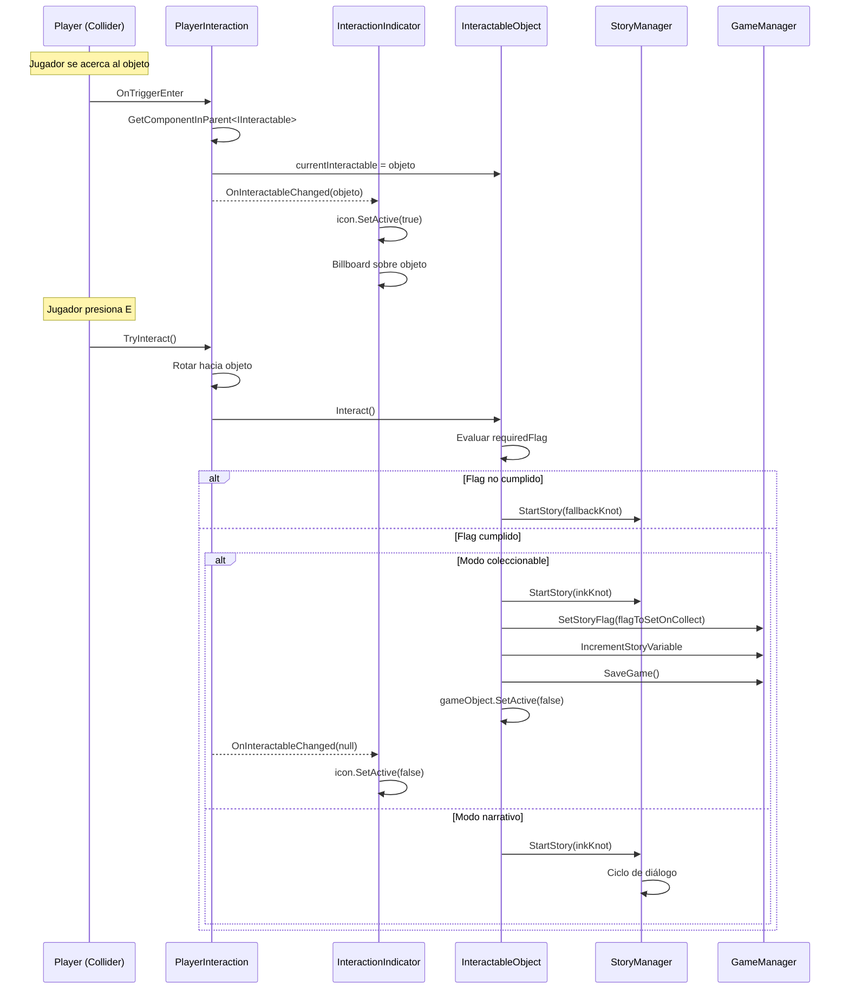
```mermaid
sequenceDiagram
    participant Player as Player (Collider)
    participant PIN as PlayerInteraction
    participant IND as InteractionIndicator
    participant IObj as InteractableObject
    participant SM as StoryManager
    participant GM as GameManager

    Note over Player: Jugador se acerca al objeto
    Player->>PIN: OnTriggerEnter
    PIN->>PIN: GetComponentInParent<IInteractable>
    PIN->>IObj: currentInteractable = objeto
    PIN-->>IND: OnInteractableChanged(objeto)
    IND->>IND: icon.SetActive(true)
    IND->>IND: Billboard sobre objeto

    Note over Player: Jugador presiona E
    Player->>PIN: TryInteract()
    PIN->>PIN: Rotar hacia objeto
    PIN->>IObj: Interact()
    IObj->>IObj: Evaluar requiredFlag
    alt Flag no cumplido
        IObj->>SM: StartStory(fallbackKnot)
    else Flag cumplido
        alt Modo coleccionable
            IObj->>SM: StartStory(inkKnot)
            IObj->>GM: SetStoryFlag(flagToSetOnCollect)
            IObj->>GM: IncrementStoryVariable
            IObj->>GM: SaveGame()
            IObj->>IObj: gameObject.SetActive(false)
            PIN-->>IND: OnInteractableChanged(null)
            IND->>IND: icon.SetActive(false)
        else Modo narrativo
            IObj->>SM: StartStory(inkKnot)
            SM->>SM: Ciclo de diálogo
        end
    end
```

### 3.13 Dependencias

Todos los interactables dependen de:

| Dependencia | Propósito |
|-------------|-----------|
| `GameManager.Instance` | `GetStoryFlag()`, `SetStoryFlag()`, `GetStoryVariable()`, `IncrementStoryVariable()`, `SaveGame()` |
| `StoryManager.Instance` | `StartStory()`, `AdvanceStory()`, `IsDialogueActive`, `OnDialogueStateChanged` |
| `LevelManager.Instance` | `ChangeScene()`, `FadeToBlackRoutine()`, `FadeToClear()` (solo SceneTransitionTrigger y AdvancedInteractableObject) |

### 3.14 Pipeline para nuevo contenido interactivo

> La guía paso a paso para crear interactuables se ha consolidado en:
> - **[§7.6 Crear interactuable condicional](#-76-guia-como-crear-un-interactuable-condicional)** — incluye objeto narrativo simple, condicional, y reutilización de prefabs
> - **[§7.6.1 Referencias de conexión](#-761-referencias-de-conexion-al-sistema-narrativo)** — cómo conectar cada tipo de interactuable al sistema narrativo

### 3.15 Checklist de Creación Segura

> La checklist de validación de interactuables se ha consolidado en la **[Checklist General del Capítulo 7](#-710-checklist-general-de-creacion-de-contenido)**, que unifica criterios de objetos, condiciones, coleccionables, persistencia y transiciones.

### 3.16 Buenas Prácticas

> Las buenas prácticas de interacción se han consolidado en el [Capítulo 8](#capitulo-8-convenciones-tecnicas-y-reglas-arquitectonicas), sección [§8.5 Buenas prácticas transversales](#-85-buenas-practicas-transversales).

### 3.17 Riesgos Frecuentes

> Los riesgos específicos de interacción se han consolidado en el [Capítulo 7](#capitulo-7-guia-de-creacion-de-contenido), sección [§7.11 Riesgos Frecuentes](#-711-riesgos-frecuentes), que unifica todos los riesgos del proyecto por categoría.

---

## Capítulo 4: Escenas y Niveles

### 4.1 Visión General

El proyecto tiene **5 escenas** registradas en Build Settings.

| Indice | Escena | Proposito |
|--------|--------|-----------|
| 0 | `Menu.unity` | Menu principal, carrusel de niveles, ajustes, creditos |
| 1 | `Arcade.unity` | Ruta Arcade (Schopenhauer / Hegel) |
| 2 | `Biblioteca.unity` | Ruta Biblioteca (Estoicos / Nietzsche) |
| 3 | `Cuarto.unity` | Cuarto de Sofia (reflexion final, epilogo) |
| 4 | `Parque.unity` | Zona inicial (prologo, encuentro social) |

**Flujo narrativo entre escenas:**

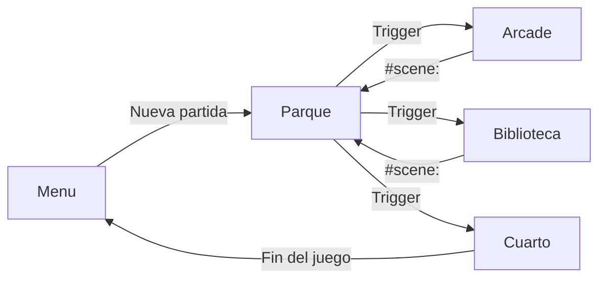
```mermaid
graph LR
    M[Menu] -->|Nueva partida| P[Parque]
    P -->|Trigger| A[Arcade]
    P -->|Trigger| B[Biblioteca]
    A -->|#scene:| P
    B -->|#scene:| P
    P -->|Trigger| C[Cuarto]
    C -->|Fin del juego| M
```

### 4.2 LevelManager — Motor de transiciones

`Assets/Scripts/Menu/LevelManager.cs`

Singleton persistente (`DontDestroyOnLoad`) en `Game Manager.prefab`. Unico punto de entrada para cambios de escena.

**API publica:**

| Metodo | Proposito |
|--------|-----------|
| `ChangeScene(sceneName)` | Inicia transicion completa (fade + carga + spawn) |
| `FadeToBlack()` | Fundido a negro (inmediato, sin carga) |
| `FadeToClear()` | Fundido a claro (inmediato) |
| `FadeToBlackRoutine()` | Corrutina de fade out (para uso externo) |
| `FadeToClearRoutine()` | Corrutina de fade in (para uso externo) |

**Flujo completo de `ChangeScene()`:**

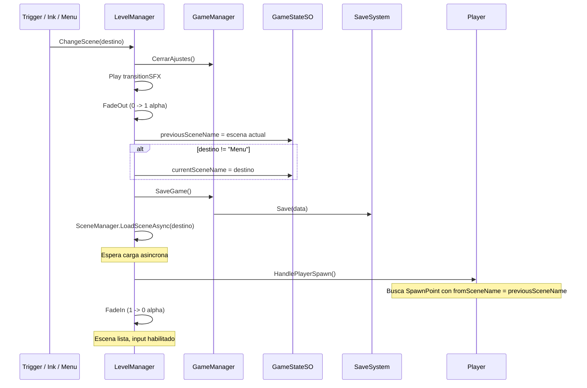
```mermaid
sequenceDiagram
    participant Caller as Trigger / Ink / Menu
    participant LM as LevelManager
    participant GM as GameManager
    participant GSO as GameStateSO
    participant SS as SaveSystem
    participant PL as Player

    Caller->>LM: ChangeScene(destino)
    LM->>GM: CerrarAjustes()
    LM->>LM: Play transitionSFX
    LM->>LM: FadeOut (0 -> 1 alpha)
    LM->>GSO: previousSceneName = escena actual
    alt destino != "Menu"
        LM->>GSO: currentSceneName = destino
    end
    LM->>GM: SaveGame()
    GM->>SS: Save(data)
    LM->>LM: SceneManager.LoadSceneAsync(destino)
    Note over LM: Espera carga asincrona
    LM->>PL: HandlePlayerSpawn()
    Note over PL: Busca SpawnPoint con fromSceneName = previousSceneName
    LM->>LM: FadeIn (1 -> 0 alpha)
    Note over LM: Escena lista, input habilitado
```

### 4.3 Sistema de SpawnPoints

`Assets/Scripts/Player data/SpawnPoint.cs`

Cada escena contiene uno o mas `SpawnPoint` que determinan donde aparece el jugador al llegar. Cada punto tiene un `fromSceneName` que indica desde que escena de procedencia aplica.

```csharp
public class SpawnPoint : MonoBehaviour
{
    public string fromSceneName;
    // ...
}
```

**Logica de reubicacion en `PlayerManager.HandlePlayerSpawn()`:**

1. Lee `previousSceneName` del `GameStateSO`
2. Busca todos los `SpawnPoint` en la escena
3. Encuentra el que coincide (case-insensitive)
4. Teleporta al jugador ahi (desactiva CharacterController temporalmente)

```csharp
void HandlePlayerSpawn() {
    string fromScene = GameManager.Instance.GetPreviousSceneName();
    GameObject player = GameObject.FindGameObjectWithTag("Player");
    SpawnPoint[] points = FindObjectsOfType<SpawnPoint>();

    foreach (var sp in points) {
        if (sp.fromSceneName.Equals(fromScene, StringComparison.OrdinalIgnoreCase)) {
            CharacterController cc = player.GetComponent<CharacterController>();
            cc.enabled = false;
            player.transform.position = sp.transform.position;
            player.transform.rotation = sp.transform.rotation;
            cc.enabled = true;
            break;
        }
    }
}
```

**Convencion de nombres:** `fromSceneName` debe coincidir con el nombre de la escena origen (ej: `"Parque"`, `"Arcade"`, `"Biblioteca"`).

### 4.4 Fuentes de Transicion

| Origen | Mecanismo | Escenas destino |
|--------|-----------|-----------------|
| `CarruselNiveles` (Menu) | `GameManager.RequestLoadLevel("Parque")` | Parque (o escena guardada) |
| `SceneTransitionTrigger` (trigger en escena) | `LevelManager.ChangeScene(destino)` | Cualquiera |
| `BotonSalirMenu` (boton en juego) | `LevelManager.ChangeScene("Menu")` | Menu |
| `DialogueTagProcessor` (tag `#scene:nombre`) | `LevelManager.ChangeScene(tagValue)` | Cualquiera |
| `GameSummaryUI` (pantalla final) | `LevelManager.ChangeScene("Menu")` | Menu |

### 4.5 Ciclo de Vida al Cargar una Escena

Cuando una escena termina de cargar, Unity dispara `SceneManager.sceneLoaded`. Multiple sistemas lo escuchan:

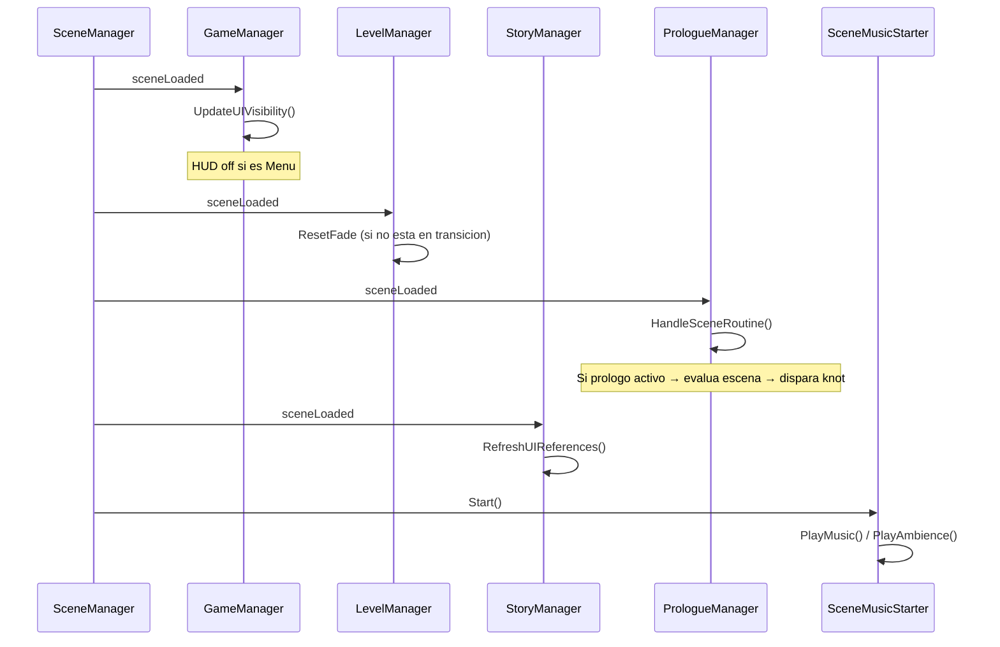
```mermaid
sequenceDiagram
    participant Unity as SceneManager
    participant GM as GameManager
    participant LM as LevelManager
    participant SM as StoryManager
    participant PM as PrologueManager
    participant MUS as SceneMusicStarter

    Unity->>GM: sceneLoaded
    GM->>GM: UpdateUIVisibility()
    Note over GM: HUD off si es Menu

    Unity->>LM: sceneLoaded
    LM->>LM: ResetFade (si no esta en transicion)

    Unity->>PM: sceneLoaded
    PM->>PM: HandleSceneRoutine()
    Note over PM: Si prologo activo → evalua escena → dispara knot

    Unity->>SM: sceneLoaded
    SM->>SM: RefreshUIReferences()

    Unity->>MUS: Start()
    MUS->>MUS: PlayMusic() / PlayAmbience()
```

### 4.6 Flujo del Prologo entre Escenas

`Assets/Scripts/Core/PrologueManager.cs`

El prologo orquesta una secuencia guiada pero jugable a traves de 3 escenas:

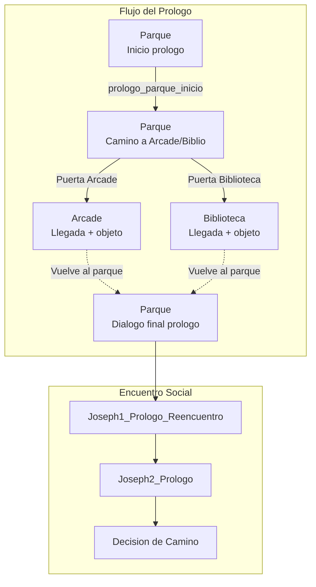
```mermaid
graph TB
    subgraph Prologo["Flujo del Prologo"]
        PE[Parque<br/>Inicio prologo]
        PA[Parque<br/>Camino a Arcade/Biblio]
        A[Arcade<br/>Llegada + objeto]
        B[Biblioteca<br/>Llegada + objeto]
        PF[Parque<br/>Dialogo final prologo]
    end

    PE -->|prologo_parque_inicio| PA
    PA -->|Puerta Arcade| A
    PA -->|Puerta Biblioteca| B
    A -.->|Vuelve al parque| PF
    B -.->|Vuelve al parque| PF

    subgraph Encuentro["Encuentro Social"]
        J1[Joseph1_Prologo_Reencuentro]
        J2[Joseph2_Prologo]
        DC[Decision de Camino]
    end

    PF --> J1 --> J2 --> DC
```

**Flags del prologo:**

| Flag | Momento en que se setea |
|------|------------------------|
| `prologue_arcade_visited` | Al llegar al Arcade (prologo) |
| `prologue_arcade_item_collected` | Al recoger el objeto del Arcade |
| `prologue_library_visited` | Al llegar a la Biblioteca |
| `prologue_library_item_collected` | Al recoger el objeto de la Biblioteca |
| `prologue_completed` | Seteado por Ink al terminar dialogo final |
| `prologue_final_seen` | Al completar el prologo |

### 4.7 Flujo Menu → Juego

`GameManager.RequestLoadLevel(baseSceneName)` decide si continuar partida o empezar nueva:

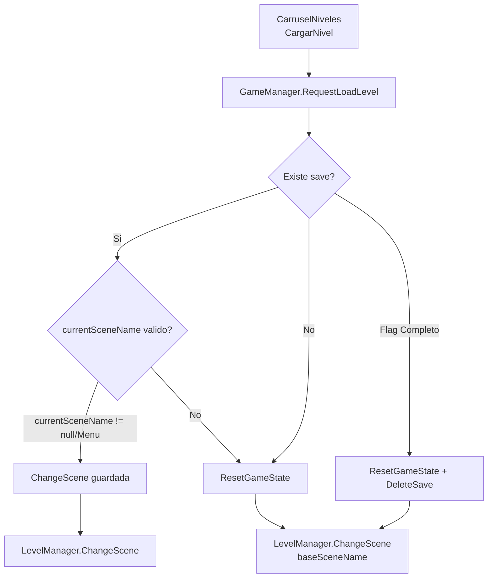
```mermaid
graph TD
    CJ[CarruselNiveles<br/>CargarNivel]
    CJ --> GM[GameManager.RequestLoadLevel]

    GM --> Save{Existe save?}
    Save -->|Si| Check{currentSceneName valido?}
    Save -->|No| New1[ResetGameState]
    Save -->|Flag Completo| New2[ResetGameState + DeleteSave]

    Check -->|currentSceneName != null/Menu| Continue[ChangeScene guardada]
    Check -->|No| New1

    Continue --> LM_C[LevelManager.ChangeScene]
    New1 --> LM_N[LevelManager.ChangeScene<br/>baseSceneName]
    New2 --> LM_N
```

### 4.8 Dependencias entre Escenas

Cada escena depende de los managers persistentes del `Game Manager.prefab`. Ninguna escena puede ejecutarse sin ellos.

**Componentes requeridos por escena:**

| Escena | Managers necesarios | Componentes de escena |
|--------|---------------------|----------------------|
| `Menu` | GameManager, AudioManager | MenuInicio, CarruselNiveles, UIAjustes |
| `Parque` | Todos | Player, SceneTransitionTrigger (xN), SceneMusicStarter, SpawnPoint (xN), Interactables, PrologueItems |
| `Arcade` | Todos | Player, SceneTransitionTrigger, SceneMusicStarter, SpawnPoint (x2), AdvancedInteractableObject (Joseph), Interactables (~10) |
| `Biblioteca` | Todos | Player, SceneTransitionTrigger, SceneMusicStarter, SpawnPoint (x2), AdvancedInteractableObject (Joseph), Interactables (~9) |
| `Cuarto` | Todos | Player, SceneMusicStarter, SpawnPoint, InteractableTable (x2), FinalReflectionInteractable, CardPanelController |


### 4.9 SceneTransitionTrigger en Profundidad

`Assets/Scripts/Narrative/Interactions/Logic/SceneTransitionTrigger.cs`

Ya documentado en el [Capitulo 3](#capitulo-3-sistema-de-interaccion) (seccion 3.7). Aqui se detalla su integracion con el sistema de escenas:

**Tres modos de operacion:**

1. **Directo** — `confirmationKnot` vacio y condiciones cumplidas → `LevelManager.ChangeScene(destinationSceneName)`
2. **Con flag requerido** — Evalua `requiredFlag` + lista de `TransitionCondition` en secuencia. La primera que falle reproduce su `fallbackKnot` y ejecuta `NaturalPushBackRoutine()`
3. **Con confirmacion** — `confirmationKnot` asignado → dispara dialogo de Ink. El script Ink debe incluir el tag `#scene:NombreEscena` para completar la transicion

**Transicion desde Ink:**

```ink
=== mi_knot_confirmacion ===
Esta seguro que quiere entrar a la biblioteca?
+ [Si, vamos]
  #scene:Biblioteca
+ [Mejor no]
  -> END
```

### 4.10 SceneMusicStarter — Audio por Escena

`Assets/Scripts/Audio/SceneMusicStarter.cs`

Cada escena debe tener un GameObject con este componente para reproducir musica y ambiente.

```csharp
public class SceneMusicStarter : MonoBehaviour
{
    public AudioEvent sceneMusic;
    public AudioEvent sceneAmbience;
    public bool playOnStart = true;

    void Start() {
        if (playOnStart) {
            PlayMusic();
            PlayAmbience();
        }
    }

    public void PlayMusic() { ... }
    public void PlayAmbience() { ... }
    public void StopAll() { ... }
}
```

### 4.11 Pipeline para Crear un Nuevo Nivel

> La guía completa para crear niveles, configurar transiciones y conectar narrativa se ha consolidado en:
> - **[§7.5 Guía: Crear un nuevo nivel](#-75-guia-paso-a-paso-como-crear-un-nuevo-nivel)** — creación, registro, configuración de escena
> - **[§7.5.2 Configurar transiciones](#-752-configurar-transiciones-entre-niveles)** — transiciones con y sin diálogo
> - **[§7.5.3 Conectar narrativa y niveles](#-753-como-conectar-narrativa-con-niveles)** — transición desde Ink, condicional por narrativa

### 4.12 Checklist de Validacion de Escena

> La checklist de validación de escenas se ha consolidado en la **[Checklist General del Capítulo 7](#-710-checklist-general-de-creacion-de-contenido)**, que unifica criterios de escena, transiciones, narrativa, prólogo y casos borde.

### 4.13 Riesgos Frecuentes

> Los riesgos específicos de escenas y niveles se han consolidado en el [Capítulo 7](#capitulo-7-guia-de-creacion-de-contenido), sección [§7.11 Riesgos Frecuentes](#-711-riesgos-frecuentes).

---

## Capitulo 5: Sistema de UI

### 5.1 Vision General

El sistema de UI se divide en 3 subsistemas independientes:

- **Menu UI** — Menu principal, carrusel de niveles, ajustes, tutorial
- **Dialogue UI** — Panel de dialogo, cartas de filosofos (documentado en [Capitulo 2](#capitulo-2-sistema-narrativo))
- **Interaction UI** — Indicador de interaccion, icono de interactuar (documentado en [Capitulo 3](#capitulo-3-sistema-de-interaccion))

No existe un UIManager centralizado. Cada subsistema gestiona su propia logica. El `GameManager` orquesta la visibilidad del HUD segun la escena.

```mermaid
graph TB
    subgraph MenuUI["Menu UI (Menu.unity)"]
        MI[MenuInicio]
        CN[CarruselNiveles]
        UA[UIAjustes]
        BS[BotonSalirMenu]
        TC[TutorialCarrusel]
        MB[MenuBotones]
    end

    subgraph GameUI["Game UI (en escenas de juego)"]
        HUD[GameManager.hudObjects]
        GS[GameSummaryUI]
        DUC[DialogueUIController<br/>Capitulo 2]
        IND[InteractionIndicator<br/>Capitulo 3]
    end

    subgraph Shared["Compartido"]
        AM[AudioManager]
        LM[LevelManager<br/>CanvasGroup fade]
        GM[GameManager<br/>UpdateUIVisibility]
    end

    MI -->|Jugar| CN
    CN -->|RequestLoadLevel| GM
    BS -->|IrAlMenuPrincipal| LM
    UA -->|Sliders| AM
    GS -->|Continue| LM
```

### 5.2 Arquitectura de Canvases

El proyecto utiliza multiples Canvases independientes, cada uno con su propio proposito:

| Canvas | Render Mode | Orden | Proposito |
|--------|-------------|-------|-----------|
| Menu Canvas | ScreenSpace Overlay | 0 | Paneles del menu principal |
| Settings Canvas | ScreenSpace Overlay | 1 | Panel de ajustes (volumen, controles) |
| Dialogue Canvas | ScreenSpace Overlay | 2 | Dialogos, opciones, retratos |
| Card Canvas | ScreenSpace Overlay | 3 | Cartas de filosofos |
| Interaction Canvas | WorldSpace | N/A | Indicador de interaccion (billboard) |
| Fade Canvas | ScreenSpace Overlay | 10 | Fundido a negro (LevelManager) |
| Summary Canvas | ScreenSpace Overlay | 4 | Resumen final |

### 5.3 GameManager y Visibilidad del HUD

`Assets/Scripts/Core/GameManager.cs`

El `GameManager` controla que objetos de UI estan visibles segun la escena actual:

```csharp
[SerializeField] private GameObject[] hudObjects;  // UI visible solo en juego
public UIAjustes uiAjustes;                         // Panel de ajustes

void UpdateUIVisibility() {
    bool isGameScene = gameState.currentSceneName != "Menu";
    foreach (var obj in hudObjects) {
        obj.SetActive(isGameScene);
    }
}
```

La tecla **Q** abre/cierra el panel de ajustes durante el juego. `Time.timeScale` se pausa al abrir ajustes.

### 5.4 Menu Principal — Flujo de Navegacion

`Assets/Scripts/Menu/MenuInicio.cs`

```mermaid
graph TD
    MP[Menu Principal] -->|Jugar| CN[CarruselNiveles]
    MP -->|Creditos| CR[Panel Creditos]
    MP -->|Ajustes| AJ[Panel Ajustes]
    MP -->|Niveles| CN
    MP -->|Salir| QT[Application.Quit]

    CN -->|Seleccionar nivel| LD[GameManager.RequestLoadLevel]
    CN -->|Volver| MP

    AJ -->|Cerrar| MP
    CR -->|Cerrar| MP

    subgraph InGame["Durante el Juego"]
        IG[HUD Juego] -->|Q| IGAJ[Panel Ajustes]
        IGAJ -->|Escape o Cerrar| IG
        IG -->|Boton Salir Menu| BS[BotonSalirMenu.IrAlMenuPrincipal]
        BS -->|Save + ChangeScene| MN[Menu]
    end
```

**Metodos de MenuInicio:**

| Metodo | Accion |
|--------|--------|
| `Jugar()` | Click sound → frame de espera → activa panel de niveles |
| `MostrarCreditos()` | Muestra panel de creditos |
| `MostrarAjustes()` | Muestra panel de ajustes |
| `VolverMenu()` | Vuelve al panel principal |
| `Salir()` | `Application.Quit()` |

### 5.5 CarruselNiveles — Selector de Nivel

`Assets/Scripts/Menu/CarruselNiveles.cs`

Controla un carrusel de niveles con navegacion por teclado (A/D). Muestra hasta 4 estrellas por nivel, cada una representando un final desbloqueado.

```csharp
void Start() {
    nivelActual = 0;
    ActualizarCarrusel();
    ActualizarEstrellas();
}

void ActualizarEstrellas() {
    // Lee PlayerPrefs para cada filosofo
    for (int i = 0; i < estrellas.Length; i++) {
        bool desbloqueada = PlayerPrefs.GetInt(
            PlayerPrefsKeys.EndingKey(filosofos[i]), 0) == 1;
        estrellas[i].sprite = desbloqueada ? 
            estrellaObtenida : estrellaBloqueada;
    }
}

void CargarNivel() {
    if (nivelActual != 0) return;  // Solo nivel 1 (Parque) jugable
    GameManager.Instance.RequestLoadLevel("Parque");
}
```

**Estrellas por filosofo:**

| Indice | Filosofo | PlayerPrefs Key |
|--------|----------|----------------|
| 0 | Schopenhauer | `EndingUnlocked_Schopenhauer` |
| 1 | Hegel | `EndingUnlocked_Hegel` |
| 2 | Estoicos | `EndingUnlocked_Estoicos` |
| 3 | Nietzsche | `EndingUnlocked_Nietzsche` |

### 5.6 UIAjustes — Panel de Configuracion

`Assets/Scripts/Menu/UIAjustes.cs`

Panel de ajustes con 5 sliders de volumen. Se abre durante el juego (tecla Q) o desde el menu principal.

```csharp
public class UIAjustes : MonoBehaviour {
    public Slider musicaSlider, sfxSlider, uiSlider, ambientSlider, masterSlider;

    void Start() {
        musicaSlider.value = AudioManager.Instance.GetMusicVolume();
        sfxSlider.value = AudioManager.Instance.GetSFXVolume();
        // ... mismo para UI, Ambient, Master
    }

    public void SetMusicVolume(float value) {
        AudioManager.Instance.SetMusicVolume(value);
    }

    public void ToggleAjustes() {
        bool abierto = !panelAjustes.activeSelf;
        panelAjustes.SetActive(abierto);
        Time.timeScale = abierto ? 0f : 1f;
    }
}
```

**Binding de sliders:**

| Slider | Metodo AudioManager | PlayerPrefs Key |
|--------|---------------------|-----------------|
| Musica | `SetMusicVolume()` | `MusicVolume` |
| SFX | `SetSFXVolume()` | `SFXVolume` |
| UI | `SetUIVolume()` | `UIVolume` |
| Ambiente | `SetAmbientVolume()` | `AmbientVolume` |
| Master | `SetMasterVolume()` | `MasterVolume` |

### 5.7 BotonSalirMenu — Retorno al Menu

`Assets/Scripts/Menu/BotonSalirMenu.cs`

Boton presente durante el juego para volver al menu principal:

```csharp
public void IrAlMenuPrincipal() {
    GameManager.Instance.SaveGame();
    GameManager.Instance.uiAjustes.CerrarAjustes();
    Time.timeScale = 1f;
    LevelManager.Instance.ChangeScene("Menu");
}
```

El auto-save garantiza que el progreso se conserva al salir.

### 5.8 TutorialCarrusel — Tutorial de Juego

`Assets/Scripts/Menu/TutorialCarrusel.cs`

Carrusel de paneles tutoriales con navegacion Siguiente/Anterior.

```csharp
public class TutorialCarrusel : MonoBehaviour {
    public GameObject[] panels;
    private int currentPanel = 0;
    private static bool tutorialCompletado = false;  // Solo una vez por sesion

    public void Siguiente() {
        panels[currentPanel].SetActive(false);
        currentPanel = Mathf.Min(currentPanel + 1, panels.Length - 1);
        panels[currentPanel].SetActive(true);
    }

    public void CerrarTutorial() {
        gameObject.SetActive(false);  // Sin marcar completado
    }

    public void FinalizarTutorial() {
        gameObject.SetActive(false);
        tutorialCompletado = true;
    }
}
```

### 5.9 GameSummaryUI — Resumen Final

`Assets/Scripts/Core/GameSummaryUI.cs`

Pantalla que se muestra al completar el dia. Muestra el filosofo obtenido, la ruta elegida y el progreso de coleccionables.

```csharp
public class GameSummaryUI : MonoBehaviour {
    public TextMeshProUGUI endingNameText;
    public TextMeshProUGUI pathText;
    public TextMeshProUGUI duckProgressText;
    public RectTransform duckContainer;
    public GameObject duckIconPrefab;
    public Button continueButton;

    public void ShowSummary(EndingData data) {
        endingNameText.text = data.philosopherName;
        pathText.text = data.pathName;
        duckProgressText.text = $"{data.ducksCollected} / {data.totalDucks}";

        // Instanciar iconos de patos
        foreach (var duck in data.duckList) {
            var icon = Instantiate(duckIconPrefab, duckContainer);
            icon.GetComponent<Image>().sprite = duck.collected ? 
                duck.collectedSprite : duck.lockedSprite;
        }
    }
}
```

**GameSummaryManager** (detras de escena) se suscribe a `StoryManager.OnDialogueStateChanged`. Cuando detecta el flag `Final_Del_Dia`, recopila los datos y llama a `ShowSummary()`.

```csharp
void OnDialogueStateChanged(bool active) {
    if (!active && GameManager.Instance.GetStoryFlag("Final_Del_Dia")) {
        var data = CollectEndingData();
        gameSummaryUI.ShowSummary(data);
        RegisterEnding(data.philosopherKey);
    }
}
```

### 5.10 Integracion con Gameplay y Narrativa

| Sistema UI | Se integra con | Mecanismo |
|------------|---------------|-----------|
| MenuInicio.Jugar | GameManager.RequestLoadLevel | Llamada directa a singleton |
| CarruselNiveles | PlayerPrefsKeys | Estrellas guardadas en PlayerPrefs |
| UIAjustes | AudioManager | Sliders → SetVolume |
| BotonSalirMenu | LevelManager.ChangeScene | Save + transicion con fade |
| GameSummaryUI | GameSummaryManager | Evento OnDialogueStateChanged |
| DialogueUIController | StoryManager / DialogueTagProcessor | Eventos y BindExternalFunction |
| InteractionIndicator | PlayerInteraction.OnInteractableChanged | Evento C# |
| LevelManager (fade) | Todas las transiciones | CanvasGroup alpha |

### 5.11 Pipeline para Nueva Pantalla

#### Como crear una nueva pantalla

```
1. Crear el Canvas:
   GameObject > UI > Canvas
   → Render Mode: ScreenSpace Overlay
   → Orden en Sorting Layer segun corresponda

2. Disenar la pantalla:
   a. Panel de fondo (Image con color/sprite)
   b. Componentes UI (TextMeshPro, Botones, Images)
   c. Layout groups si es necesario

3. Crear el script:
   a. Referencias a los componentes UI via [SerializeField]
   b. Logica de apertura/cierre
   c. Suscripcion a eventos si necesita comunicacion con otros sistemas

4. Conectar con el sistema:
   a. Si es del menu: agregar metodo en MenuInicio o crear script independiente
   b. Si es del juego: agregar referencia en GameManager o crear manager propio
   c. Si usa sonido: llamar AudioEvent.PlayUI() en acciones

5. Probar:
   a. Navegacion correcta (abrir/cerrar)
   b. Estado del juego (Time.timeScale si pausa)
   c. Persistencia entre escenas si aplica
```

#### Como conectar UI con sistemas

```
Opcion A — Referencia directa a singleton (mas comun):
   GameManager.Instance.SetStoryFlag("flag", true);
   AudioManager.Instance.SetMusicVolume(0.5f);
   LevelManager.Instance.ChangeScene("Menu");

Opcion B — Evento C#:
   public event Action<bool> OnPanelOpened;
   → Otro sistema se suscribe

Opcion C — Llamada desde Inspector (UnityEvent):
   Button.onClick.AddListener() via Inspector
   → Para acciones simples como reproducir sonido
```

### 5.12 Checklist de Implementacion UI

#### Configuracion de Panel
- [ ] El Canvas tiene el Render Mode correcto (Overlay para UI, WorldSpace para indicadores)
- [ ] El panel tiene un Image de fondo
- [ ] Los Layout Groups estan configurados (si aplica)
- [ ] Los botones tienen Navigation configurada (o desactivada si es menu tactil)
- [ ] El texto usa TextMeshPro (no Text legacy)

#### Funcionalidad
- [ ] Al abrir, el panel se activa correctamente
- [ ] Al cerrar, el panel se desactiva y no bloquea input
- [ ] Si pausa el juego: `Time.timeScale = 0` al abrir, `= 1` al cerrar
- [ ] Si usa sonido: `AudioEvent.PlayUI()` se llama en acciones
- [ ] Los sliders reflejan el valor actual al abrir
- [ ] Los botones ejecutan la accion correcta

#### Integracion
- [ ] Las referencias a singletons no son nulas en OnEnable/Start
- [ ] Los eventos se suscriben en OnEnable y se desuscriben en OnDisable
- [ ] La UI no persiste entre escenas si no debe hacerlo (DestroyOnLoad)
- [ ] La UI no se duplica al recargar escena

#### Casos borde
- [ ] La UI funciona con resoluciones diferentes (Canvas Scaler configurado)
- [ ] La UI no se solapa con otros Canvases
- [ ] Al abrir ajustes durante el dialogo, el dialogo se pausa
- [ ] Al cerrar el juego con ajustes abiertos, no hay errores
- [ ] El tutorial solo se muestra una vez por sesion

### 5.13 Riesgos Comunes

| # | Riesgo | Consecuencia | Mitigacion |
|---|--------|-------------|------------|
| 1 | **Time.timeScale no se restaura** | El juego queda congelado al cerrar ajustes | Verificar que `ToggleAjustes()` restaura timeScale a 1 |
| 2 | **Eventos no desuscritos** | NullReferenceException al recargar escena | Suscribir en OnEnable, desuscribir en OnDisable |
| 3 | **Canvas duplicado** | UI superpuesta, input bloqueado | Usar DontDestroyOnLoad solo para Canvases persistentes |
| 4 | **Texto legacy en lugar de TMP** | Fuente no se ve, warnings de obsoleto | Usar siempre TextMeshProUGUI |
| 5 | **Slider sin listener** | Cambio de volumen no se persiste | Verificar que el evento OnValueChanged esta conectado |
| 6 | **Panel de ajustes abierto al cambiar de escena** | Time.timeScale = 0 en la nueva escena | BotonSalirMenu cierra ajustes antes de la transicion |
| 7 | **Resolucion no escalada** | UI se ve mal en pantallas no estandar | Configurar Canvas Scaler con Scale With Screen Size |
| 8 | **Botones sin feedback visual** | El jugador no sabe si presiono | Usar Transition de Button (Color Tint o Sprite Swap) |

---

## Capitulo 6: Sistema de Persistencia

### 6.1 Vision General

La persistencia tiene dos capas independientes:

- **Save/load del progreso** — JSON en disco (o PlayerPrefs en WebGL), gestionado exclusivamente por `GameManager` + `SaveSystem` + `GameStateSO`
- **Preferencias y desbloqueos** — `PlayerPrefs` para volumen de audio y finales obtenidos (CarruselNiveles)

```mermaid
graph TB
    subgraph CapaProgreso["Capa 1: Progreso del juego"]
        GM[GameManager]
        ST[SaveSystem<br/>static]
        GS[GameStateSO<br/>ScriptableObject]
        GSD[GameSaveData<br/>POCO serializable]
        DISC[(save.json)]
    end

    subgraph CapaPreferencias["Capa 2: PlayerPrefs"]
        AM[AudioManager]
        GSM[GameSummaryManager]
        CN[CarruselNiveles]
        PP[(PlayerPrefs)]
    end

    GM -->|1. Build| GSD
    GM -->|2. Save| ST
    GM -->|3. Load| ST
    GM -->|4. Restore| GS
    ST -->|serializa| DISC
    ST -->|deserializa| DISC

    AM -->|volumen| PP
    GSM -->|ending unlocked| PP
    CN -->|estrella| PP
```

**Regla fundamental:** Solo `GameManager` llama a `SaveSystem`. Ningun otro sistema escribe en `save.json`.

### 6.2 Arquitectura de Save/Load

#### Flujo de Inicializacion (GameManager.Awake)

```mermaid
sequenceDiagram
    participant GM as GameManager.Awake
    participant SS as SaveSystem
    participant GSO as GameStateSO
    participant CLEAR as clearStateOnStart?

    GM->>CLEAR: check
    alt clearStateOnStart = true
        GM->>GSO: ClearState()
        GM->>SS: DeleteSave()
    else Save existe
        GM->>SS: Load()
        SS-->>GM: GameSaveData
        GM->>GSO: LoadFrom(data)
        alt Flag de completado presente
            GM->>GSO: ClearState()
            GM->>SS: DeleteSave()
        end
    else No save
        GM->>GSO: ClearState()
    end
```

#### Flujo de Guardado (GameManager.SaveGame)

```mermaid
sequenceDiagram
    participant GM as GameManager.SaveGame
    participant GSO as GameStateSO
    participant GSD as GameSaveData
    participant SS as SaveSystem
    participant FILE as save.json

    GM->>GSO: GetFlags()
    GSO-->>GM: List<string> flags
    GM->>GSO: GetVariables()
    GSO-->>GM: List<StoryVariable> vars
    GM->>GSD: new GameSaveData{ lastSceneName, previousSceneName, unlockedFlags, storyVariables }
    GM->>SS: Save(data)
    SS->>SS: JsonUtility.ToJson(data)
    SS->>FILE: File.WriteAllText
```

### 6.3 Datos Persistidos

#### save.json (GameSaveData)

| Campo | Tipo | Origen | Proposito |
|-------|------|--------|-----------|
| `lastSceneName` | `string` | GameStateSO.currentSceneName | Ultima escena jugada (continuar partida) |
| `previousSceneName` | `string` | GameStateSO.previousSceneName | Escena anterior (SpawnPoint) |
| `unlockedFlags` | `List<string>` | GameStateSO.unlockedFlags | Decisiones narrativas, objetos recogidos |
| `storyVariables` | `List<StoryVariableData>` | GameStateSO.storyVariables | Variables de ruta, contadores, actitudes |

#### PlayerPrefs

| Clave | Tipo | Quien escribe | Proposito |
|-------|------|---------------|-----------|
| `MusicVolume` | `float` | AudioManager | Volumen de musica |
| `SFXVolume` | `float` | AudioManager | Volumen de efectos |
| `UIVolume` | `float` | AudioManager | Volumen de UI |
| `AmbienceVolume` | `float` | AudioManager | Volumen de ambiente |
| `MasterVolume` | `float` | AudioManager | Volumen master |
| `EndingUnlocked_{key}` | `int` (0/1) | GameSummaryManager | Final desbloqueado |
| `GameSaveData_JSON` | `string` | SaveSystem (WebGL) | Save completo (solo WebGL) |

### 6.4 Serializacion

**Formato:** JSON plano via `JsonUtility`. Sin dependencias de Unity en las clases serializables.

**GameSaveData:**
```csharp
[Serializable]
public class GameSaveData
{
    public string lastSceneName;
    public string previousSceneName;
    public List<string> unlockedFlags = new List<string>();
    public List<StoryVariableData> storyVariables = new List<StoryVariableData>();
}

[Serializable]
public class StoryVariableData
{
    public string key;
    public string value;
}
```

**Reglas de serializacion:**

| Elemento | Regla |
|----------|-------|
| `unlockedFlags` | Se almacenan case-insensitive (ToLower al comparar) pero se preserva el casing original del primer SetFlag |
| `storyVariables` | Claves case-insensitive. Se sobrescribe el valor si la clave ya existe |
| `lastSceneName` / `previousSceneName` | Strings exactos del nombre de escena en Build Settings |
| PlayerPrefs | Valores float para volumen, int (0/1) para finales |

### 6.5 Eventos de Guardado

El guardado se dispara en 6 momentos distintos:

| # | Momento | Quien dispara | Tipo | Por que |
|---|---------|---------------|------|---------|
| 1 | Al cargar nueva escena | `LevelManager.TransitionToScene()` | Auto-save | Preserva el progreso antes de cambiar de escena |
| 2 | Al salir al menu | `BotonSalirMenu.IrAlMenuPrincipal()` | Manual | El jugador quiere ir al menu |
| 3 | Al recoger objeto interactuable | `InteractableObject.OnInteract()` | Auto-save | No perder el coleccionable |
| 4 | Al recoger objeto del prologo | `PrologueItemInteractable.OnInteract()` | Auto-save | No perder progreso del prologo |
| 5 | Al cerrar/quitar la app | `GameManager.OnApplicationQuit()` | Seguridad | Captura el estado justo antes de salir |
| 6 | Al pausar la app (mobile/background) | `GameManager.OnApplicationPause()` | Seguridad | Captura el estado al minimizar |

Ademas, eventos de solo PlayerPrefs (sin save.json):

| # | Momento | Quien dispara | Que persiste |
|---|---------|---------------|--------------|
| 7 | Al cambiar slider de audio | `UIAjustes.OnValueChanged` | Volumen en PlayerPrefs |
| 8 | Al mostrar resumen final | `GameSummaryManager.ShowGameSummary()` | `EndingUnlocked_{key}` en PlayerPrefs |

### 6.6 Persistencia Narrativa

El flujo narrativo se persiste asi:

```mermaid
sequenceDiagram
    participant Ink as Ink Story
    participant DTP as DialogueTagProcessor
    participant GM as GameManager
    participant SS as SaveSystem

    Note over Ink,SS: Durante dialogo Ink
    Ink->>Ink: BindExternalFunction GetFlag("flag_name")
    Ink->>Ink: BindExternalFunction GetVar("var_name")

    Note over Ink,SS: Tag procesado
    DTP->>DTP: #setflag:flag_name
    DTP->>GM: SetStoryFlag("flag_name", true)
    DTP->>DTP: #unsetflag:flag_name
    DTP->>GM: SetStoryFlag("flag_name", false)

    Note over Ink,SS: Auto-save al cambiar de escena
    LM->>GM: SaveGame()
    GM->>SS: Save(data)

    Note over Ink,SS: Auto-save al recoger objeto
    IObj->>GM: SaveGame()
    GM->>SS: Save(data)

    Note over Ink,SS: Save al cerrar/quitar app
    GM->>GM: OnApplicationQuit
    GM->>SS: Save(data)
```

**Bindings Ink → GameManager:**

| Funcion Ink | Metodo Unity | Descripcion |
|-------------|-------------|-------------|
| `GetFlag(flagName)` | `GameManager.GetStoryFlag()` | Lee flag narrativo |
| `GetVar(varName)` | `GameManager.GetStoryVariable()` | Lee variable narrativa |

**Tags Ink que afectan persistencia:**

| Tag | Efecto | Persiste en |
|-----|--------|-------------|
| `#setflag:nombre` | Activa flag en GameState | save.json (proximo auto-save) |
| `#unsetflag:nombre` | Desactiva flag en GameState | save.json (proximo auto-save) |
| `#scene:NombreEscena` | Cambio de escena | LevelManager + save.json |

### 6.7 Persistencia Gameplay

#### Flags que controlan la visibilidad de objetos

Los objetos interactuables usan flags para determinar si deben aparecer:
- `InteractableObject.EvaluateVisibility()` consulta `GameManager.GetStoryFlag()`
- `PrologueItemInteractable` se destruye/desactiva si el flag de recoleccion esta activo
- `SceneTransitionTrigger` evalua `requiredFlag` + condiciones antes de permitir el paso

#### Flags del prologo

| Flag | Seteados por | Persiste |
|------|-------------|----------|
| `prologue_arcade_visited` | PrologueManager | save.json |
| `prologue_arcade_item_collected` | PrologueItemInteractable | save.json |
| `prologue_library_visited` | PrologueManager | save.json |
| `prologue_library_item_collected` | PrologueItemInteractable | save.json |
| `prologue_completed` | Ink (#setflag) | save.json |
| `prologue_final_seen` | PrologueManager | save.json |

#### Contadores

Se almacenan como variables narrativas y se incrementan via `GameManager.IncrementStoryVariable()`:

```csharp
// Uso tipico desde InteractableObject
GameManager.Instance.IncrementStoryVariable("contador_patos");
// Lectura posterior
int patos = GameManager.Instance.GetStoryVariableAsInt("contador_patos");
```

### 6.8 Dependencias

#### Quien depende de que

| Sistema | Dependencia de Save | Dependencia de PlayerPrefs |
|---------|---------------------|---------------------------|
| GameManager | SaveSystem, GameStateSO, GameSaveData | Ninguna |
| SaveSystem | JsonUtility, System.IO | PlayerPrefs (WebGL) |
| GameStateSO | GameSaveData (LoadFrom) | Ninguna |
| AudioManager | Ninguna | PlayerPrefs (volumen) |
| GameSummaryManager | GameManager (flags/vars) | PlayerPrefs (ending key) |
| CarruselNiveles | GameManager (RequestLoadLevel) | PlayerPrefs (estrellas) |
| BotonSalirMenu | GameManager (SaveGame) | Ninguna |
| LevelManager | GameManager (SaveGame, GameState) | Ninguna |
| InteractableObject | GameManager (flags) | Ninguna |
| PrologueItemInteractable | GameManager (flags, SaveGame) | Ninguna |
| SceneTransitionTrigger | GameManager (flags) | Ninguna |

#### Dependencias tecnicas

```
GameManager
  ├── SaveSystem (static)
  │     ├── System.IO (File/Path)
  │     ├── UnityEngine.JsonUtility
  │     └── UnityEngine.PlayerPrefs (WebGL)
  ├── GameStateSO (ScriptableObject)
  │     └── GameSaveData (POCO)
  └── GameSaveData (POCO)

AudioManager
  └── UnityEngine.PlayerPrefs (volumen)

GameSummaryManager
  ├── GameManager (singleton)
  ├── PlayerPrefs (ending key via PlayerPrefsKeys)
  └── PlayerPrefsKeys (static)
```

### 6.9 Lifecycle del Guardado

```mermaid
graph TD
    START[Aplicacion inicia] --> AWAKE[GameManager.Awake]
    AWAKE --> INIT[InitializeFromDisk]
    INIT --> HASSAVE{SaveSystem.HasSave?}

    HASSAVE -->|Si| LOAD[SaveSystem.Load]
    LOAD --> DATA[GameSaveData]
    DATA --> RESTORE[GameStateSO.LoadFrom]
    RESTORE --> CHECKFLAG{completionFlag activo?}
    CHECKFLAG -->|Si| RESET[ResetGameState<br/>ClearState + DeleteSave]
    CHECKFLAG -->|No| READY[Estado listo]

    HASSAVE -->|No| CLEAR[GameStateSO.ClearState]
    CLEAR --> READY

    RESET --> READY

    READY --> GAMEPLAY[Ciclo de juego]

    GAMEPLAY --> SAVE_TRIGGER{Evento de guardado}
    SAVE_TRIGGER -->|Cambio de escena| AUTO1[LevelManager.SaveGame]
    SAVE_TRIGGER -->|Recoger objeto| AUTO2[Interactable.SaveGame]
    SAVE_TRIGGER -->|Salir al menu| AUTO3[BotonSalirMenu.SaveGame]
    SAVE_TRIGGER -->|Cerrar app| AUTO4[OnApplicationQuit.SaveGame]

    AUTO1 --> BUILD[GameManager.SaveGame]
    AUTO2 --> BUILD
    AUTO3 --> BUILD
    AUTO4 --> BUILD

    BUILD --> JSON[GameSaveData]
    JSON --> WRITE[SaveSystem.Save]
    WRITE --> DISC[(save.json)]
```

### 6.10 Como Agregar Nuevos Datos al Save

#### Paso a paso para persistir un nuevo campo

```
1. Agregar el campo en GameStateSO:
   - Si es flag: no necesita cambios (usa unlockedFlags)
   - Si es variable: no necesita cambios (usa storyVariables)
   - Si es nuevo tipo de dato (ej. inventario):
     a. Agregar campo a GameStateSO.cs
     b. Agregar campo a GameSaveData.cs
     c. Actualizar SaveGame() en GameManager para copiarlo
     d. Actualizar LoadFrom() en GameStateSO para restaurarlo

2. Ejemplo concreto — agregar "monedas":

   En GameSaveData.cs:
   [Serializable]
   public class GameSaveData {
       // ... campos existentes ...
       public int coins;  // <-- nuevo
   }

   En GameManager.SaveGame():
   GameSaveData data = new GameSaveData {
       // ... campos existentes ...
       coins = gameState.coins,
   };

   En GameStateSO.LoadFrom():
   coins = data.coins;

   En GameStateSO:
   public int coins;
```

#### Reglas para nuevos datos

| Tipo de dato | Donde va | Persiste en |
|-------------|----------|-------------|
| Flag narrativo (true/false) | `GameStateSO.unlockedFlags` | `save.json.unlockedFlags` |
| Variable clave-valor | `GameStateSO.storyVariables` | `save.json.storyVariables` |
| Dato estructurado nuevo | Campo nuevo en ambos POCOs | `save.json` |
| Preferencia del jugador | `AudioManager` + PlayerPrefs | PlayerPrefs |
| Desbloqueo permanente | PlayerPrefs via `PlayerPrefsKeys` | PlayerPrefs |

### 6.11 Como Evitar Corrupcion de Datos

#### Protecciones actuales

| Mecanismo | Donde | Que hace |
|-----------|-------|----------|
| Try-catch en Save/Load | SaveSystem | Captura excepciones de IO y JSON malformado |
| Null check en Save | SaveSystem | Aborta si data es null |
| Null check en Load | SaveSystem | Retorna null si JSON vacio o FromJson devuelve null |
| Null check en LoadFrom | GameStateSO | No modifica estado si data es null |
| Guardado antes de transicion | LevelManager | Persiste antes de cargar nueva escena |
| Guardado en quit/pause | GameManager | Captura estado al cerrar/minimizar |
| Singleton pattern | Todos los managers | Evita duplicados que corrompan estado |

#### Riesgos y mitigaciones

| Riesgo | Mitigacion |
|--------|------------|
| Archivo corrupto por corte de energia | El save escribe todo el JSON de una vez (no incremental), minimizando ventana de corrupcion |
| JSON malformado por cambio de version | `Load()` captura exception y retorna null → juego arranca limpio |
| Archivo parcialmente escrito | `File.WriteAllText` es atomico en la mayoria de sistemas de archivos |
| PlayerPrefs corrupto en WebGL | `FromJson` retorna null → catch lo maneja |
| Flag completionFlag impide jugar de nuevo | `InitializeFromDisk` detecta flag y hace `ResetGameState` + `DeleteSave` |

### 6.12 Como Validar Compatibilidad

El sistema actual **no tiene versionado**. Esto significa que si se agregan/quitan campos de `GameSaveData`, los saves viejos fallaran al deserializar.

#### Reglas de compatibilidad

| Cambio | Compatible? | Efecto |
|--------|-------------|--------|
| Agregar campo opcional | **Si** (JsonUtility ignora campos faltantes) | Saves viejos cargan, campo inicia en default |
| Agregar campo requerido | **Si** (default value: 0, null, false) | Dato nuevo ausente en saves viejos |
| Renombrar campo | **No** | Se pierde el valor del campo renombrado |
| Eliminar campo | **Si** (JsonUtility ignora campos extra) | Se ignora el dato del save viejo |
| Cambiar tipo de campo | **No** | `FromJson` falla |

#### Para implementar versionado (futuro):

```csharp
// En GameSaveData:
[Serializable]
public class GameSaveData
{
    public int saveVersion = 1;  // Version del schema
    // ... campos ...
}

// En GameStateSO.LoadFrom():
public void LoadFrom(GameSaveData data)
{
    if (data.saveVersion < CURRENT_SAVE_VERSION)
    {
        Debug.Log($"[GameStateSO] Actualizando save de v{data.saveVersion} a v{CURRENT_SAVE_VERSION}");
        // Logica de migracion por version
    }
    // ... resto de la carga ...
}
```

### 6.13 Como Depurar Errores de Persistencia

#### Herramientas de depuracion

| Herramienta | Que permite |
|-------------|-------------|
| `Debug.Log` en SaveSystem | Ver ruta donde se guardo/cargo |
| `[SerializeField] bool clearStateOnStart` | Resetear save al dar Play |
| Consola de Unity | Buscar `[SaveSystem]`, `[GameManager]`, `[GameStateSO]` |
| Archivo `save.json` | Inspeccion manual en `persistentDataPath` |
| PlayerPrefs Manager (SproutGames) | Inspeccionar/editar PlayerPrefs desde Unity |

#### Pasos para diagnosticar

```
1. Save no persiste:
   a. Verificar que GameManager.Instance existe (no nulo)
   b. Verificar que gameState no es nulo
   c. Buscar "Error al guardar" en consola
   d. Abrir save.json y verificar que el JSON es valido

2. Load no restaura estado:
   a. Buscar "No se encontró archivo" en consola
   b. Verificar ruta: Debug.Log de la ruta exacta
   c. Abrir save.json y verificar que tiene contenido
   d. Buscar "Error al cargar" (JSON malformado)

3. Flag no persiste entre escenas:
   a. Verificar que el auto-save ocurre antes del cambio de escena
   b. Verificar que el flag se setea antes del auto-save (no en el mismo frame)
   c. En LevelManager.TransitionToScene: SaveGame() ocurre ANTES de LoadSceneAsync

4. Objeto reaparece al recargar escena:
   a. Verificar que flagToSetOnCollect se setea antes de SaveGame()
   b. Verificar que EvaluateVisibility() usa el flag correcto
   c. Verificar que el flag esta en unlockedFlags (no es case-sensitive)

5. Contador se pierde:
   a. Verificar que la variable existe en storyVariables
   b. Verificar que se usa GetStoryVariableAsInt() para leer
   c. Verificar que IncrementStoryVariable() modifica GameState, no solo una variable local
```

#### Logs utiles

```
[SaveSystem] Juego guardado en: C:\Users\...\save.json
[SaveSystem] Guardado cargado desde: C:\Users\...\save.json
[SaveSystem] No se encontró archivo de guardado.
[SaveSystem] Error al cargar el guardado (posiblemente corrupto): ...
[GameManager] Save cargado en memoria. Última escena: 'Parque'
[GameManager] Reiniciando estado y borrando save de disco.
[GameStateSO] Estado restaurado desde disco. Escena: 'Parque' | Flags: 12 | Variables: 3
[GameManager] Reanudando partida en: 'Parque'
[GameManager] Iniciando nueva partida en: 'Parque'
```

### 6.14 Pipeline para Nuevos Datos de Persistencia

#### Como agregar un flag narrativo (caso mas comun)

```
1. Decidir el nombre del flag (ej. "puerta_biblioteca_abierta")
2. En Ink: agregar #setflag:puerta_biblioteca_abierta en el knot correspondiente
3. En Unity: usar GameManager.Instance.GetStoryFlag("puerta_biblioteca_abierta")
4. Persiste automaticamente en el proximo auto-save
   (no requiere cambios en codigo)
```

#### Como agregar una variable narrativa

```
1. Decidir clave y valor (ej. "estado_joseph" = "amigable")
2. En Ink: no necesita tag especial (las variables viven en C#)
3. En Unity: GameManager.Instance.SetStoryVariable("estado_joseph", "amigable")
4. Leer con: GameManager.Instance.GetStoryVariable("estado_joseph")
5. Persiste automaticamente
```

#### Como agregar un contador

```
1. Incrementar: GameManager.Instance.IncrementStoryVariable("patos_recogidos")
2. Leer: int patos = GameManager.Instance.GetStoryVariableAsInt("patos_recogidos")
3. Persiste como variable narrativa (storyVariables en save.json)
```

#### Como agregar un campo estructurado nuevo

```
1. Agregar campo a GameStateSO.cs
2. Agregar campo a GameSaveData.cs
3. Actualizar GameManager.SaveGame() para copiarlo
4. Actualizar GameStateSO.LoadFrom() para restaurarlo
5. Si aplica: actualizar GameStateSO.ClearState() para resetearlo
```

### 6.15 Checklist de Validacion de Persistencia

#### Configuracion
- [ ] SaveSystem usa la ruta correcta (Application.persistentDataPath)
- [ ] GameSaveData tiene todos los campos serializables
- [ ] GameStateSO.LoadFrom() mapea todos los campos de GameSaveData
- [ ] GameManager.SaveGame() copia todos los campos de GameStateSO a GameSaveData

#### Auto-save
- [ ] LevelManager.TransitionToScene() guarda antes de cargar nueva escena
- [ ] InteractableObject guarda despues de recoger un objeto
- [ ] PrologueItemInteractable guarda despues de recoger objeto del prologo
- [ ] BotonSalirMenu guarda antes de volver al menu
- [ ] GameManager.OnApplicationQuit() guarda al cerrar
- [ ] GameManager.OnApplicationPause() guarda al minimizar

#### Carga
- [ ] Load() retorna null si no hay save: se inicia partida nueva
- [ ] LoadFrom() restaura currentSceneName correctamente
- [ ] LoadFrom() restaura previousSceneName correctamente
- [ ] LoadFrom() restaura todos los flags y variables
- [ ] Si completionFlag esta activo: se resetea el estado y se borra el save

#### PlayerPrefs
- [ ] AudioManager carga volumenes al iniciar
- [ ] UIAjustes refleja los valores guardados al abrir
- [ ] GameSummaryManager guarda endingKey al mostrar resumen
- [ ] CarruselNiveles muestra las estrellas correctas al cargar

#### Casos borde
- [ ] Save con datos nulos: SaveSystem lo aborta con warning
- [ ] Load con archivo corrupto: retorna null, juego arranca limpio
- [ ] Save durante dialogo: no rompe el dialogo en curso
- [ ] Save durante transicion: el fade no se interrumpe
- [ ] Load entre versiones: campos faltantes usan default values
- [ ] WebGL: Save/Load usa PlayerPrefs en lugar de File I/O
- [ ] Multiple quicksaves rapidos: no corrompe el archivo

### 6.16 Riesgos Tecnicos

| # | Riesgo | Consecuencia | Mitigacion |
|---|--------|-------------|------------|
| 1 | **Save corrupto por corte de energia** | JSON malformado, jugador pierde progreso | Try-catch en Load, retorna null → juego limpio |
| 2 | **Auto-save antes de que el flag se persista** | Flag existe en memoria pero no en disco | SaveGame() se llama solo despues de modificar GameState |
| 3 | **Race condition entre auto-saves** | Save sobrescrito con estado incompleto | SaveGame() copia estado sincronicamente antes de escribir |
| 4 | **clearStateOnStart activo en build** | Todos los saves borrados accidentalmente | Solo afecta en Editor (debug flag) |
| 5 | **Save entre versiones sin migracion** | Campos nuevos con valores default | Aceptado: no hay versionado. Futuro: saveVersion |
| 6 | **PlayerPrefs lleno en WebGL** | Save no se escribe | Limitar tamano de save.json (actualmente < 50KB) |
| 7 | **Flag case-sensitive** | GetStoryFlag falla por diferencia de casing | SetFlag/HasFlag normalizan a ToLower |
| 8 | **Ink.GetFlag antes de GameManager.Awake** | NullReferenceException | StoryManager se inicializa despues de GameManager (orden en prefab) |
| 9 | **Dos saves simultaneos (Quit + auto-save)** | Archivo sobrescrito | OnApplicationQuit es el ultimo evento antes de cerrar |
| 10 | **Escena renombrada sin actualizar Save** | currentSceneName apunta a escena inexistente | RequestLoadLevel valida el nombre, falla con ResetGameState |

---

## Capitulo 7: Guia de Creacion de Contenido

### 7.1 Vision General

Este capitulo es una guia practica paso a paso para crear contenido nuevo en el proyecto. Cubre desde objetos interactuables hasta niveles completos, con archivos involucrados, configuracion de Inspector, validaciones, errores comunes y checklist final.

No duplica la documentacion de los capitulos anteriores, sino que los referencia y anade el detalle practico que un creador de contenido necesita en el dia a dia.

```mermaid
graph LR
    subgraph Contenido["Tipos de contenido nuevo"]
        OBJ[Objeto interactuable]
        PUZ[Secuencia narrativa<br/>(puzzle)]
        NAR[Interaccion narrativa]
        NIV[Nivel completo]
        ESC[Nueva escena]
        SIS[Nuevo sistema]
    end

    OBJ -->|usa| SO[InteractableData SO]
    OBJ -->|implementa| IIN[IInteractable]
    OBJ -->|dispara| INK[Knot Ink]

    PUZ -->|combina| ESC[Escenas]
    PUZ -->|usa| COND[InteractionCondition]
    PUZ -->|orquesta| PRO[PrologueManager]

    NAR -->|escribe| INK
    NAR -->|conecta| OBJ

    NIV -->|contiene| ESC[Escenas]
    NIV -->|tiene| STT[SceneTransitionTrigger]
    NIV -->|requiere| SPA[SpawnPoints]
    NIV -->|usa| SMU[SceneMusicStarter]

    SIS -->|singleton| GM[GameManager]
    SIS -->|persiste| SAV[SaveSystem]
    SIS -->|evento| EVT[event Action]
```

### 7.2 Como Crear un Nuevo Objeto Interactuable

Hay 4 tipos de objetos interactuables. Cada uno cubre un caso de uso distinto.

#### 7.2.1 Objeto Narrativo Simple (InteractableObject + InteractableData)

**Archivos involucrados:**

| Archivo | Ruta | Rol |
|---------|------|-----|
| `InteractableObject.cs` | `Assets/Scripts/Narrative/Interactions/SO/SO Logic/InteractableObject.cs` | Componente en el GameObject |
| `InteractableData.cs` | `Assets/Scripts/Narrative/Interactions/Logic/InteractableData.cs` | ScriptableObject de datos |
| `IInteractable.cs` | `Assets/Scripts/Narrative/Interactions/Logic/IInteractable.cs` | Interfaz del sistema |
| Knot en .ink | `Assets/Ink/` | Dialogo que se dispara al interactuar |

**Dependencias del componente en escena:**

| Componente | Obligatorio? | Notas |
|------------|-------------|-------|
| Collider (IsTrigger = true) | Si | Area donde se detecta al jugador |
| InteractableObject | Si | El script principal |
| Rigidbody | No | Solo si necesita fisicas (trigger no requiere) |
| PulseAnimation (hijo) | No | Feedback visual de que es interactuable |

**Paso a paso:**

```
1. Crear ScriptableObject:
   Assets/Create/Narrative/Interactable
   → Nombrar: "MiObjetoData"
   → Configurar campos:
      interactionName = "Caja misteriosa"
      inkKnot = "caja_misteriosa_dialogo"
      isCollectable = false (desmarcado)
   → Aplicar

2. Escribir knot en Ink:
   === caja_misteriosa_dialogo ===
   #sprite:sophia_surprised
   Hay una caja misteriosa aqui...
   + [Abrirla]
     #setflag:caja_abierta
     La caja estaba vacia.
     -> END
   + [Ignorarla]
     Mejor no meterse.
     -> END
   → Compilar (Ctrl+S en Inky)

3. Crear GameObject en escena:
   a. GameObject vacio → nombrar "CajaMisteriosa"
   b. Agregar Collider (BoxCollider, IsTrigger = true)
      → Ajustar tamano al area de interaccion
   c. Agregar InteractableObject component
   d. Arrastrar InteractableData SO a "data"
   e. Opcional: agregar MeshRenderer + modelo 3D
   f. Opcional: agregar PulseAnimation en hijo
```

**Configuracion del Inspector (InteractableObject):**

| Campo | Valor tipico | Que hace |
|-------|-------------|----------|
| `data` | InteractableData SO | Referencia a los datos del objeto |
| `data.interactionName` | `"Caja misteriosa"` | Nombre visible en UI y logs |
| `data.inkKnot` | `"caja_misteriosa_dialogo"` | Knot exacto en Ink |
| `data.isCollectable` | false | Si false: modo narrativo (permanece) |
| `data.flagToSetOnCollect` | (vacio si no es coleccionable) | Flag que se activa al recoger |
| `data.variableToIncrementOnCollect` | (vacio) | Variable a incrementar al recoger |
| `requiredFlag` | (vacio) | Flag necesario para interactuar |
| `fallbackKnot` | (vacio) | Knot si no cumple requiredFlag |
| `interactionSound` | (opcional) | Sonido al interactuar |
| `autoTriggerOnEnter` | false | Si true: interaccion automatica al entrar al trigger |

**Validaciones:**

```
□ El knot existe en algun archivo .ink (Ctrl+B usalo en Inky)
□ El knot esta incluido (INCLUDE) en Historia.ink
□ El .json fue recompilado desde Inky
□ El Collider tiene IsTrigger = true
□ Si usa requiredFlag: el flag existe y se setea antes
□ Si usa fallbackKnot: el knot existe y tiene sentido narrativo
□ interactionName no esta vacio (visible en logs/UI)
```

**Buenas practicas:**

- Nombrar los SO con prefijo del tipo: `Obj_CajaMisteriosa`, `NPC_Joseph`
- Usar `requiredFlag` para secuenciar interacciones (no puede abrir la caja hasta que Joseph le dio la llave)
- El `fallbackKnot` debe explicar POR QUE no puede interactuar aun
- El knot en Ink debe coincidir EXACTAMENTE (case-sensitive) con el nombre en el SO

**Errores comunes:**

| Error | Sintoma | Causa | Solucion |
|-------|---------|-------|----------|
| "Knot not found" en consola | No se abre dialogo | El knot no existe o tiene typo | Verificar nombre exacto en Inky |
| "No StoryManager" | NullReferenceException | StoryManager no en escena | Verificar Game Manager prefab |
| Objeto no se ve al recargar escena | Desaparecio sin razon | flagToSetOnCollect activo sin querer | Revisar flags en save.json o borrar save |
| Click no hace nada | No hay interaccion | Collider sin IsTrigger | Activar IsTrigger en Collider |

---

#### 7.2.2 Objeto Condicional (AdvancedInteractableObject + AdvancedInteractableData)

Para objetos con multiples respuestas segun flags/variables del jugador. Ejemplo: Joseph reacciona distinto segun las decisiones previas.

**Archivos involucrados:**

| Archivo | Ruta |
|---------|------|
| `AdvancedInteractableObject.cs` | `Assets/Scripts/Narrative/Interactions/SO/Joseph/AdvancedInteractableObject.cs` |
| `AdvancedInteractableData.cs` | `Assets/Scripts/Narrative/Interactions/Logic/AdvancedInteractableData.cs` |

**Paso a paso:**

```
1. Crear ScriptableObject:
   Assets/Create/Narrative/Advanced Interactable
   → Nombrar: "Adv_JosephParque"
   → interactionName = "Joseph"
   → Agregar InteractionEntries en orden de prioridad:

   Entry 1: "Dialogo final"
     conditions[0]: RequerirFlag = "prologue_completed"
     inkKnot = "joseph_dialogo_final"

   Entry 2: "Dialogo normal"
     conditions[0]: RequerirVariable = "actitud_joseph" = "amigable"
     inkKnot = "joseph_amigable"

   Entry 3: "Dialogo por defecto"
     conditions[0]: Ninguna (siempre true)
     inkKnot = "joseph_defecto"

2. En escena:
   a. GameObject con Collider trigger + modelo 3D
   b. Agregar AdvancedInteractableObject
   c. Arrastrar el SO a "data"
   d. Opcional: visibilityConditions (lista de condiciones para ser visible)
   e. Opcional: disappearAfterDialogue + disappearCondition
```

**Configuracion del Inspector (AdvancedInteractableObject):**

| Campo | Que hace |
|-------|----------|
| `data` | AdvancedInteractableData SO |
| `interactionSound` | Audio al interactuar (opcional) |
| `autoTriggerOnEnter` | Interaccion automatica al entrar al trigger |
| `visibilityConditions` | Si se definen: TODAS deben cumplirse o el objeto se desactiva |
| `disappearAfterDialogue` | Si true: desaparece con fade al terminar el dialogo |
| `disappearCondition` | Condicion que debe cumplirse para desaparecer |
| `disappearFadeDuration` | Duracion del fade (-1 = usar valor de LevelManager) |

**Reglas de evaluacion de InteractionEntry:**

1. Se evaluan en ORDEN (de arriba a abajo en el Inspector)
2. La PRIMERA que cumpla TODAS sus condiciones se ejecuta
3. Si ninguna cumple → no pasa nada (log: "Ninguna interaccion valida")
4. Siempre tener un entry con `conditionType = Ninguna` al final como fallback

**Validaciones:**

```
□ Los entries estan en orden de prioridad (mas especifico primero)
□ El ultimo entry tiene conditionType = Ninguna (fallback)
□ Los nombres de flags/variables existen en GameState
□ Cada inkKnot existe en algun archivo .ink compilado
□ Si usa disappearCondition: verificar que la condicion no se cumpla antes del dialogo
```

**Errores comunes:**

| Error | Causa | Solucion |
|-------|-------|----------|
| No pasa nada al interactuar | Ningun entry cumple condiciones | Agregar entry fallback con conditionType = Ninguna |
| Objeto desaparece al cargar escena | disappearCondition ya se cumplio antes | Evaluar logica de la condicion |
| Entry incorrecto se ejecuta | El orden no es el esperado | Reordenar entries (mas especifico arriba) |

---

#### 7.2.3 Objeto Coleccionable (InteractableObject + modo isCollectable)

Para objetos que se recogen una vez y desaparecen. Ejemplo: patos, llaves, objetos de prologo.

**Paso a paso:**

```
1. Crear InteractableData SO:
   interactionName = "Pato de goma"
   inkKnot = "recoger_pato"
   isCollectable = true ← ACTIVAR
   flagToSetOnCollect = "pato_parque_01"
   variableToIncrementOnCollect = "patos_recogidos" (opcional)

2. En escena:
   a. GameObject con Collider trigger
   b. InteractableObject con el SO asignado
   c. Opcional: hijo con PulseAnimation
   d. Opcional: requiredFlag (ej. "tiene_red") + fallbackKnot

3. Comportamiento:
   - Si flagToSetOnCollect ya esta activo → objeto desactivado al cargar escena
   - Si requiredFlag no se cumple → fallbackKnot (si tiene)
   - Si se cumple → inkKnot + SetFlag + Save + IncrementVar + desaparece
```

**Diferencias con PrologueItemInteractable:**

| Caracteristica | InteractableObject (collectable) | PrologueItemInteractable |
|----------------|----------------------------------|--------------------------|
| Desactivacion por prologo completo | No | Si (si FLAG_COMPLETED activo) |
| requiredFlag | Si | No |
| variableToIncrement | Si | No |
| autoTriggerOnEnter | Si | No |
| PulseAnimation | Componente separado | Emission propio (built-in) |

---

#### 7.2.4 Trigger de Escena (SceneTransitionTrigger)

Para puertas, pasillos y zonas que cambian de escena. No implementa IInteractable porque usa OnTriggerEnter directamente.

**Paso a paso:**

```
1. GameObject con BoxCollider (IsTrigger) en la entrada
2. Agregar SceneTransitionTrigger component
3. Configurar:

   destinationSceneName = "Biblioteca"     ← nombre exacto en Build Settings
   requiredFlag = ""                        ← flag para bloquear el paso
   fallbackKnot = ""                        ← dialogo si no cumple el flag
   confirmationKnot = "pasar_a_biblioteca"  ← dialogo de confirmacion (opcional)
   conditions = [{}]                        ← pila de condiciones adicionales

4. Si usa confirmationKnot:
   - El knot en Ink debe incluir #scene:Biblioteca
   - Al elegir la opcion en el dialogo, la escena cambia

5. En la escena destino:
   - SpawnPoint con fromSceneName exacto al nombre de esta escena
```

**Configuracion avanzada con condiciones en pila:**

```
conditions[0]:
  requiredFlag = "mision_biblioteca_completada"
  fallbackKnot = "biblioteca_cerrada_aun"

conditions[1]:
  requiredFlag = "tiene_llave_biblioteca"
  fallbackKnot = "necesitas_llave"

→ Se evaluan en orden. La primera que falle → su fallbackKnot.
→ Si todas pasan → transicion permitida.
```

**Validaciones SceneTransitionTrigger:**

```
□ destinationSceneName coincide con nombre en Build Settings
□ Si usa requiredFlag: el flag se setea en algun momento del juego
□ Si usa confirmationKnot: el script Ink incluye #scene:Destino
□ El push distance no saca al jugador fuera del mapa
□ En destino: SpawnPoint.fromSceneName coincide con origen
□ Si usa conditions[]: el orden de evaluacion es el correcto
```

### 7.3 Como Crear una Secuencia Interactiva (Puzzle)

El proyecto no tiene motor de puzzles dedicado. Las secuencias interactivas se construyen combinando los sistemas existentes: escenas, triggers, flags, variables, y dialogo Ink.

#### 7.3.1 Estructura tipica de una secuencia

```
Fase 1: Estado inicial
  - El jugador llega a una escena
  - Objetos clave estan presentes (controlados por flags)
  - PrologueManager o SceneTransitionTrigger disparan dialogo de entrada

Fase 2: Recoleccion o exploracion
  - El jugador debe encontrar/recoger objetos
  - InteractableObject con isCollectable=true
  - flags se activan al recoger

Fase 3: Umbral narrativo
  - Cuando ciertos flags estan activos, el dialogo cambia
  - AdvancedInteractableObject evalua InteractionConditions
  - El NPC reacciona distinto segun el progreso

Fase 4: Resolucion
  - El jugador completa el dialogo final
  - Se activa el flag de "completado"
  - SceneTransitionTrigger se desbloquea

Fase 5: Transicion
  - El jugador puede avanzar a la siguiente escena
  - O se activa el resumen final
```

#### 7.3.2 Ejemplo concreto: "Abrir la puerta del sotano"

```
Objetivo: El jugador debe encontrar 3 llaves para abrir la puerta del sotano.

Preparacion:
  1. 3 objetos coleccionables (InteractableObject, isCollectable=true):
     - LlaveRoja: flagToSetOnCollect = "llave_roja"
     - LlaveAzul: flagToSetOnCollect = "llave_azul"
     - LlaveVerde: flagToSetOnCollect = "llave_verde"

  2. Sistema de conteo:
     En cada recoleccion: GameManager.Instance.IncrementStoryVariable("llaves_encontradas")
     → variable "llaves_encontradas" va de 0 a 3

  3. SceneTransitionTrigger (puerta del sotano):
     - Usar conditions[] con 3 entradas:
       conditions[0]: requiredFlag = "llave_roja", fallbackKnot = "falta_llave_roja"
       conditions[1]: requiredFlag = "llave_azul", fallbackKnot = "falta_llave_azul"
       conditions[2]: requiredFlag = "llave_verde", fallbackKnot = "falta_llave_verde"
     - Si las 3 pasan → transicion permitida

  4. NPC comentarista (AdvancedInteractableObject):
     Entry 1: condicion RequerirVariable llaves_encontradas = "0" → "aun_no_tienes_llaves"
     Entry 2: condicion RequerirVariable llaves_encontradas = "1" → "ya_tienes_una"
     Entry 3: condicion RequerirVariable llaves_encontradas = "2" → "solo_te_falta_una"
     Entry 4: condicion Ninguna → "ya_tienes_todas_las_llaves"
```

#### 7.3.3 Estados y condiciones posibles

| Estado | Como se representa | Donde se evalua |
|--------|-------------------|-----------------|
| Objeto recogido | `flagToSetOnCollect` activo | InteractableObject.EvaluateVisibility() |
| Progreso de recoleccion | `IncrementStoryVariable()` contador | AdvancedInteractableData conditions |
| Dialogo visto | Flag seteado por `#setflag:` en Ink | InteractionCondition.RequerirFlag |
| Ruta elegida | `SetStoryVariable("ruta", "arcade")` | InteractionCondition.RequerirVariable |
| Mision completada | Flag compuesto (varios flags AND) | SceneTransitionTrigger conditions[] |
| Tiempo/pasos | Contador numerico | GetStoryVariableAsInt() en script |

#### 7.3.4 Checklist de secuencia interactiva

```
□ Cada objeto coleccionable tiene flagToSetOnCollect unico
□ Los flags de recoleccion se usan en EvaluateVisibility()
□ Las condiciones estan en orden correcto de prioridad
□ El ultimo entry condicional tiene condicion Ninguna (fallback)
□ Los contadores se incrementan correctamente
□ Las puertas/transiciones se desbloquean cuando corresponde
□ Al recargar escena: objetos ya recogidos no reaparecen
□ Al recargar escena: NPCs reflejan el progreso actual
□ Si el jugador vuelve atras, el estado no se resetea
```

### 7.4 Como Crear una Nueva Interaccion Narrativa

#### 7.4.1 Flujo completo: desde que el jugador presiona hasta que ve el dialogo

```
1. Jugador presiona E (interactuar) cerca de un objeto
2. PlayerInteraction detecta IInteractable mas cercano
3. Llama a IInteractable.Interact()
4. InteractableObject.Interact() evalua:
   a. Si tiene requiredFlag y no se cumple → fallbackKnot → FIN
   b. Si es coleccionable → Collect() → SetFlag + Save → FIN
   c. Si es narrativo → StoryManager.Instance.StartStory(inkKnot)
5. StoryManager:
   a. story.ChoosePathString(knot) — navega al knot en Ink
   b. Activa dialoguePanel
   c. DialogueUIController muestra la primera linea
6. Durante el dialogo:
   a. DialogueTagProcessor procesa tags: #sprite, #setflag, #scene, etc.
   b. Options aparecen para decisiones del jugador
   c. Al elegir, Ink continua por esa rama
7. Al terminar el dialogo:
   a. DialogueUIController.OnDialogueEnded → StoryManager.EndStory()
   b. Se desactiva dialoguePanel
   c. OnDialogueStateChanged?.Invoke(false)
   d. GameSummaryManager evalua si mostrar resumen final
   e. AdvancedInteractableObject evalua si desaparecer con fade
```

#### 7.4.2 Como escribir un knot que afecte el gameplay

```
=== interaccion_ejemplo ===
#sprite:sophia_neutral
[Texto del dialogo]

+ [Opcion 1]
  #setflag:decision_tomada
  #setflag:ruta_heroica
  GameManager.SetVar("ruta_actual", "heroica")   ← funcion externa (si existe)
  [Respuesta a opcion 1]
  -> END

+ [Opcion 2]
  #setflag:decision_tomada
  #setflag:ruta_sabia
  GameManager.SetVar("ruta_actual", "sabia")
  [Respuesta a opcion 2]
  -> END
```

**Tags Ink que afectan al juego:**

| Tag | Efecto en Unity | Cuando persiste |
|-----|----------------|-----------------|
| `#sprite:nombre` | Cambia retrato en DialogueUIController | No persiste |
| `#setflag:nombre` | `GameManager.SetStoryFlag(nombre, true)` | Proximo auto-save |
| `#unsetflag:nombre` | `GameManager.SetStoryFlag(nombre, false)` | Proximo auto-save |
| `#scene:NombreEscena` | `LevelManager.ChangeScene(NombreEscena)` | Inmediato (con auto-save) |
| `#wait:X` | Pausa el dialogo X segundos | No persiste |
| `#audio:nombre` | Reproduce audio (si implementado) | No persiste |

**Funciones externas disponibles en Ink:**

| Funcion Ink | Que hace |
|-------------|----------|
| `GetFlag("nombre")` | Retorna true/false segun flag en GameState |
| `GetVar("nombre")` | Retorna string con el valor de la variable |

**Como agregar una nueva funcion externa:**

1. En `StoryManager.InitializeStory()`, agregar:
```csharp
story.BindExternalFunction("MiFuncion", (string param) => {
    // Logica en C#
    Debug.Log($"Funcion externa llamada con: {param}");
    return "resultado";
});
```
2. En Ink, llamarla:
```ink
~ resultado = MiFuncion("parametro")
```

#### 7.4.3 Como conectar un dialogo con logica de gameplay

| Necesitas | Haz esto |
|-----------|----------|
| Dialogo cambie segun estado | Usar AdvancedInteractableData con condiciones |
| Al elegir opcion, pase algo en Unity | Usar `#setflag:` + suscribirse a OnDialogueStateChanged |
| Al terminar dialogo, objeto desaparezca | Activar disappearAfterDialogue en AdvancedInteractableObject |
| Al elegir opcion, cambie de escena | Usar `#scene:NombreEscena` en la opcion |
| Dialogo condicional segun progreso | Ink llama GetFlag()/GetVar() para decidir ramas |
| NPC rote hacia el jugador | AdvancedInteractableObject rota automaticamente en Interact() |

**Validaciones de interaccion narrativa:**

```
□ El knot existe en el .ink compilado
□ La ruta al knot en el Inspector es exacta (case-sensitive)
□ Los tags #setflag no tienen typos
□ Las funciones externas estan vinculadas en StoryManager
□ Si usa #scene: el nombre de escena coincide con Build Settings
□ Si usa condiciones: la logica AND/OR es correcta
□ El dialogo puede saltarse (skip mode) sin romper el estado
□ El dialogo no se queda en loop infinito
```

### 7.5 Como Crear un Nuevo Nivel

Un nivel es una escena completa con narrativa, interactuables y transiciones. Documentado en detalle en [Capitulo 4](#capitulo-4-escenas-y-niveles). Aqui la guia practica.

#### 7.5.1 Paso a paso

```
1. DISENO:
   a. Definir proposito narrativo del nivel
   b. Listar objetos interactuables necesarios
   c. Definir transiciones (entrada/salida)
   d. Definir musica y ambiente

2. ESCENA:
   a. Crear escena: Assets/Create/Scene → "MiNivel"
   b. Guardar en Assets/Scenes/
   c. Registrar en Build Settings
   d. Crear terreno/escenario base

3. MANAGERS Y PLAYER:
   a. Arrastrar prefab "Game Manager" a la escena
      (si no hay uno, se crea solo desde GameManager.Awake)
   b. Arrastrar prefab "Player" a la escena

4. SPAWN POINTS:
   a. GameObject vacio → SpawnPoint component
   b. Ubicar en la posicion de llegada
   c. fromSceneName = nombre de la escena de origen
   d. Repetir por cada posible origen (Menu, escena anterior, etc.)

5. MUSICA:
   a. GameObject → SceneMusicStarter component
   b. Asignar sceneMusic (AudioEvent) y sceneAmbience (AudioEvent)
   c. playOnStart = true

6. TRANSICIONES DE SALIDA:
   a. GameObject con BoxCollider trigger en la salida
   b. SceneTransitionTrigger component
   c. destinationSceneName = escena destino
   d. Opcional: requiredFlag, fallbackKnot, conditions, confirmationKnot

7. INTERACTUABLES:
   a. Por cada objeto: Collider trigger + InteractableObject/PrologueItem/Adv
   b. Asignar SO correspondiente
   c. Verificar que los knots existen en Ink

8. PROLOGO (si aplica):
   a. Agregar handler en PrologueManager.HandleSceneRoutine()
   b. Configurar constantes de escena en PrologueManager
   c. Agregar PrologueItemInteractable para objetos del prologo

9. PROBAR:
   a. Iniciar desde Menu
   b. Navegar hasta el nivel
   c. Verificar spawn point, transiciones, objetos, dialogo
   d. Recargar escena y verificar persistencia
```

#### 7.5.2 Archivos que tocar

| Que | Archivos |
|-----|----------|
| Escena nueva | `Assets/Scenes/MiNivel.unity` (crear) |
| SpawnPoints | En la escena (componente en GameObject) |
| Transiciones | En la escena (SceneTransitionTrigger) |
| Interactuables | En la escena + InteractableData SOs |
| Musica | En la escena (SceneMusicStarter) |
| Prologo | `PrologueManager.cs` (modificar) |
| Build Settings | `File > Build Settings` (registrar) |
| Narrativa | Archivos .ink correspondientes (modificar) |

#### 7.5.3 Build Settings — orden de escenas

El orden en Build Settings importa para los indices:

| Indice | Escena | Notas |
|--------|--------|-------|
| 0 | `Menu` | Siempre primera (escena de arranque) |
| 1 | `Parque` | Nivel inicial |
| 2 | `Arcade` | Ruta arcade |
| 3 | `Biblioteca` | Ruta biblioteca |
| 4 | `Cuarto` | Escena final |

**Regla:** Agregar siempre al final de la lista. No cambiar el orden de las existentes.

#### 7.5.4 Validaciones de nivel

```
□ La escena esta en Build Settings con nombre sin espacios
□ El nombre coincide con destinationSceneName de los triggers
□ Hay un SpawnPoint por cada posible origen
□ Cada SpawnPoint.fromSceneName coincide EXACTAMENTE con el origen
□ El prefab Player existe en la escena
□ SceneMusicStarter tiene musica y ambiente asignados
□ Los knots referenciados existen en archivos .ink compilados
□ Los flags de recoleccion son unicos por objeto
□ Al recargar escena, los objetos recogidos no reaparecen
□ Al volver al Menu y continuar, la escena guardada se carga
□ Los managers no se duplican al recargar Menu
```

### 7.6 Como Crear una Nueva Escena Simple

Para escenas que NO son niveles de juego (menu, creditos, cinematica).

**Paso a paso:**

```
1. Crear escena:
   Assets/Create/Scene → "Creditos"
   Guardar en Assets/Scenes/

2. Registrar en Build Settings:
   File > Build Settings → Add Open Scenes

3. Si la escena necesita managers:
   a. Si es escena de juego: arrastrar "Game Manager" prefab
   b. Si es Menu: el GameManager se crea solo desde su Awake()
   c. Si no necesita GameManager: no hacer nada

4. Si la escena es accesible desde el juego:
   a. Crear SceneTransitionTrigger con destinationSceneName = "Creditos"
   b. En Creditos: no necesita SpawnPoint (es transicion one-way)

5. Si la escena necesita UI propia:
   a. Crear Canvases segun [Capitulo 5](#capitulo-5-sistema-de-ui)
   b. Conectar con MenuInicio o sistema correspondiente
```

**Escenas que NO necesitan GameManager:**

| Escena | Motivo |
|--------|--------|
| Menu | GameManager se crea en Awake() y persiste |
| Creditos | Solo UI, sin gameplay |
| Pantalla de carga | Transicion temporal |

### 7.7 Como Reutilizar Prefabs

#### 7.7.1 Prefabs existentes reutilizables

| Prefab | Ubicacion | Uso |
|--------|-----------|-----|
| `Game Manager` | `Assets/Prefabs/Game Manager.prefab` | Toda escena de juego |
| `Player` | (ubicar en Assets/Prefabs/) | Toda escena de juego |
| `InteractableObject` base | Crear propio | Objeto narrativo simple |
| `AdvancedInteractableObject` base | Crear propio | NPC condicional |
| `Idle Joseph` | Ver escenas existentes | NPC Joseph |

#### 7.7.2 Como crear un prefab base de interactuable

```
1. En cualquier escena:
   a. GameObject vacio → "Interactable_Base"
   b. Agregar BoxCollider (IsTrigger = true)
   c. Agregar InteractableObject component
   d. Agregar modelo 3D como hijo (opcional)
   e. Agregar PulseAnimation en hijo (opcional)

2. Arrastrar a Assets/Prefabs/ como prefab

3. Usar en niveles:
   a. Arrastrar prefab a la escena
   b. Asignar InteractableData SO especifico (override)
   c. Ajustar collider si es necesario
```

#### 7.7.3 Prefab Variant vs Override

| Situacion | Que hacer |
|-----------|-----------|
| Mismo comportamiento, datos distintos | Override en Inspector (cambiar SO nada mas) |
| Comportamiento ligeramente distinto | Prefab Variant (click derecho > Create > Prefab Variant) |
| Comportamiento radicalmente distinto | Prefab nuevo desde cero |

**Buenas practicas con prefabs:**

- No modificar el prefab base directamente si ya esta en uso
- Usar Prefab Variant para variantes especificas
- Documentar en el nombre del prefab su proposito
- Mantener los prefabs en `Assets/Prefabs/` organizados por tipo

### 7.8 Como Registrar un Nuevo Sistema (Manager)

Para agregar un nuevo manager global (como PrologueManager, GameSummaryManager, etc.).

#### 7.8.1 Estructura de un nuevo manager

```csharp
using UnityEngine;
using UnityEngine.SceneManagement;

public class MiNuevoManager : MonoBehaviour
{
    public static MiNuevoManager Instance;

    private void Awake()
    {
        if (Instance == null)
        {
            Instance = this;
            DontDestroyOnLoad(gameObject);
        }
        else
        {
            Destroy(gameObject);
            return;
        }
    }

    private void OnEnable()
    {
        SceneManager.sceneLoaded += OnSceneLoaded;
    }

    private void OnDisable()
    {
        SceneManager.sceneLoaded -= OnSceneLoaded;
    }

    private void OnSceneLoaded(Scene scene, LoadSceneMode mode)
    {
        // Logica por escena
    }
}
```

**Paso a paso:**

```
1. Crear el script en Assets/Scripts/Core/ (o subcarpeta logica)

2. Implementar patron singleton:
   - Instance static
   - DontDestroyOnLoad en Awake
   - Destruir duplicados

3. Definir la API publica:
   - Metodos que otros sistemas llamaran
   - Eventos que otros sistemas escucharan

4. Agregar al prefab Game Manager:
   a. Abrir Assets/Prefabs/Game Manager.prefab
   b. Agregar component MiNuevoManager
   c. Configurar campos serializados
   d. Guardar prefab

5. Si necesita comunicarse con otros sistemas:
   - Por evento C#: public event Action<param> OnAlgo
   - Por singleton: OtherManager.Instance.Method()
   - Por GameManager: GameManager.Instance.GetStoryFlag()
```

#### 7.8.2 Managers existentes como referencia

| Manager | Script | Singleton? | Persiste? | Eventos principales |
|---------|--------|------------|-----------|-------------------|
| GameManager | `GameManager.cs` | Si | Si | sceneLoaded |
| LevelManager | `LevelManager.cs` | Si | Si | sceneLoaded |
| AudioManager | `AudioManager.cs` | Si | Si | Ninguno |
| StoryManager | `StoryManager.cs` | Si | Si | OnDialogueStateChanged |
| PrologueManager | `PrologueManager.cs` | Si | Si | sceneLoaded |
| GameSummaryManager | `GameSummaryManager.cs` | Si | Si | OnDialogueStateChanged |

#### 7.8.3 Como agregar un nuevo sistema sin singleton

Para sistemas especificos de una escena (no globales):

```
1. Crear el script sin patron singleton
2. Agregar el componente al GameObject persistente o de escena
3. El GameManager puede tener una referencia directa [SerializeField]
4. O puede encontrarse con FindObjectByType al inicio
```

#### 7.8.4 Validaciones de nuevo sistema

```
□ El singleton destruye duplicados correctamente
□ DontDestroyOnLoad se llama solo en la primera instancia
□ Los eventos se suscriben en OnEnable/OnDisable (no en Awake/OnDestroy)
□ No hay referencias a objetos de escena que se pierdan al recargar
□ Si usa SceneManager.sceneLoaded: verificar null en la nueva escena
□ La API publica es clara y no expone datos internos
□ Los metodos que modifican estado llaman SaveGame() si corresponde
```

### 7.9 Como Conectar Gameplay y Narrativa

#### 7.9.1 Puentes entre Unity e Ink

```
Unity (C#) ──────────→ Ink
  SetStoryFlag()       GetFlag("nombre")
  SetStoryVariable()   GetVar("nombre")

Ink ──────────→ Unity (C#)
  #setflag:nombre     GameManager.SetStoryFlag()
  #unsetflag:nombre   GameManager.SetStoryFlag(..., false)
  #scene:Nombre       LevelManager.ChangeScene()
```

#### 7.9.2 Tabla de decision: que tecnologia usar

| Quiero que... | Uso |
|---------------|-----|
| Un dialogo aparezca al tocar un objeto | InteractableObject + InteractableData.inkKnot |
| El dialogo cambie segun decisiones previas | AdvancedInteractableData + InteractionCondition |
| Al elegir una opcion, pase algo en el juego | `#setflag:` en Ink + logica en C# |
| Al terminar un dialogo, pase algo | Suscribirse a OnDialogueStateChanged |
| Un objeto desaparezca despues de un dialogo | AdvancedInteractableObject.disappearAfterDialogue |
| Una puerta se desbloquee al completar algo | SceneTransitionTrigger.requiredFlag o conditions[] |
| El jugador no pueda retroceder | No poner SceneTransitionTrigger de vuelta |
| Algo ocurra al cargar una escena | PrologueManager.OnSceneLoaded o SceneMusicStarter |
| Un contador aumente al recoger objetos | InteractableData.variableToIncrementOnCollect |
| El final del juego se muestre | GameSummaryManager + flag "Final_Del_Dia" |

#### 7.9.3 Ejemplo completo: Mision "Ayuda a Joseph"

```
1. Al llegar a la escena:
   - PrologueManager dispara "bienvenida_parque" (si es primera vez)
   - Joseph tiene AdvancedInteractableData con 3 estados:
     Entry 1: flag "ayuda_joseph_completada" → "gracias_por_ayudar"
     Entry 2: flag "acepto_ayudar" → "genial_empecemos"
     Entry 3: Ninguna → "hola_necesito_ayuda"

2. Dialogo inicial de Joseph:
   === hola_necesito_ayuda ===
   Joseph: Necesito encontrar mis libros...
   + [Si, te ayudo]
     #setflag:acepto_ayudar
     Joseph: Gracias! Buscalos por aqui.
     -> END
   + [No tengo tiempo]
     #setflag:rechace_ayuda
     Joseph: Bueno... si cambias de opinion...
     -> END

3. Aparecen 3 libros coleccionables:
   - Solo visibles si flag "acepto_ayudar" esta activo
   - Cada uno: InteractableObject con isCollectable=true
   - flagToSetOnCollect = "libro_01", "libro_02", "libro_03"
   - variableToIncrementOnCollect = "libros_devueltos"

4. Al recoger los 3 libros:
   - variable "libros_devueltos" = "3"
   - Se puede detectar en AdvancedInteractableData de Joseph:
     Entry con condicion RequerirVariable libros_devueltos = "3"
     → knot "mision_completada"

5. Dialogo de mision completada:
   === mision_completada ===
   Joseph: Encontraste todos! Eres increible.
   #setflag:ayuda_joseph_completada
   #setflag:puerta_biblioteca_abierta
   -> END

6. Se desbloquea SceneTransitionTrigger a Biblioteca:
   - conditions[0]: requiredFlag = "puerta_biblioteca_abierta"
   - Si el flag no esta activo → fallbackKnot "biblioteca_cerrada"
```

#### 7.9.4 Errores comunes de conexion

```
1. EL FLAG NO SE PERSISTE:
   Causa: #setflag: se procesa pero SaveGame no se ha llamado aun
   Solucion: SaveGame ocurre en LevelManager.TransitionToScene()
             o en InteractableObject.Collect()
             Verificar que el flag esta en memoria antes del save

2. EL KNOT NO SE ENCUENTRA:
   Causa: Nombre incorrecto en el Inspector
   Solucion: Copiar exactamente del .ink (Ctrl+C / Ctrl+V)
             Inky resalta en azul si el knot existe

3. LA CONDICION NUNCA SE CUMPLE:
   Causa: El flag/variable no se setea donde se cree
   Solucion: Agregar Debug.Log al setear el flag
             Buscar en consola el nombre del flag

4. EL OBJETO NO APARECE:
   Causa: visibilityConditions bloquea o flagToSetOnCollect ya activo
   Solucion: Revisar flags. Borrar save.json o marcar clearStateOnStart

5. EL DIALOGO SE DISPARA DOS VECES:
   Causa: autoTriggerOnEnter + presionar E simultaneamente
   Solucion: StoryManager tiene bloqueo por IsDialogueActive
```

### 7.10 Checklist General de Creacion de Contenido

#### Pre-creacion
- [ ] Defini el proposito del contenido (narrativo, puzzle, transicion)
- [ ] Identifique que tipo de objeto/script necesito
- [ ] Verifique que los archivos .ink necesarios existen o los cree
- [ ] Compile el .json desde Inky

#### Implementacion en escena
- [ ] El GameObject tiene Collider con IsTrigger = true
- [ ] El Collider cubre el area de interaccion deseada
- [ ] El componente Interactable tiene el SO asignado
- [ ] El knot en Ink coincide exactamente con el nombre en el SO
- [ ] Los flags/variables usados existen y se setean en el momento correcto
- [ ] Si usa condiciones: estan en orden de prioridad correcto
- [ ] Si es coleccionable: flagToSetOnCollect es unico

#### Persistencia
- [ ] El flag/variable se persiste via SaveGame() (auto-save o manual)
- [ ] Al recargar escena, el estado se restaura correctamente
- [ ] Los objetos ya recogidos no reaparecen
- [ ] Los NPCs reflejan el progreso narrativo actual

#### Integracion
- [ ] La escena esta registrada en Build Settings
- [ ] Las transiciones tienen destino valido
- [ ] Los SpawnPoints cubren todos los origenes posibles
- [ ] La musica/ambiente cambia correctamente al entrar
- [ ] El prologo funciona en ambas rutas (si aplica)

#### Pruebas
- [ ] Probar desde Menu: nueva partida
- [ ] Probar continuar partida desde save
- [ ] Probar todas las ramas de decision
- [ ] Probar recargar escena (volver y entrar de nuevo)
- [ ] Probar casos borde: interactuar sin flag, con flag, etc.
- [ ] Probar skip mode en dialogos largos
- [ ] Verificar que no hay NullReferenceExceptions en consola

### 7.11 Riesgos Frecuentes

| # | Riesgo | Consecuencia | Mitigacion |
|---|--------|-------------|------------|
| 1 | **Nombre de knot incorrecto** | Dialogo no se dispara | Copiar nombre exacto desde Inky |
| 2 | **.ink no compilado** | Cambios no se ven en Unity | Compilar siempre en Inky (Ctrl+S) |
| 3 | **Flag con typo** | Condicion nunca se cumple | Unificar nombres en documentacion |
| 4 | **Collider mal posicionado** | Interaccion no detecta al jugador | Usar Gizmos para visualizar colliders |
| 5 | **Escena no en Build Settings** | Transicion falla en build | Verificar lista en File > Build Settings |
| 6 | **SpawnPoint sin fromSceneName** | Jugador aparece en 0,0,0 | Cada escena debe tener SpawnPoint por origen |
| 7 | **Dos objetos con mismo flagToSetOnCollect** | Al recoger uno, el otro desaparece | flags unicos por objeto |
| 8 | **AutoTrigger + boton E simultaneo** | Dialogo se dispara dos veces | StoryManager bloquea si ya hay dialogo activo |
| 9 | **VisibilityCondition bloquea objeto permanentemente** | Objeto nunca aparece | Verificar que la condicion se cumple antes |
| 10 | **Save no persiste flag entre escenas** | Progreso perdido | Verificar auto-save en LevelManager.TransitionToScene() |

### 7.12 Referencia Rapida de Archivos

| Que buscas | Donde esta |
|------------|-----------|
| Scripts de interaccion | `Assets/Scripts/Narrative/Interactions/Logic/` |
| ScriptableObjects de interaccion | `Assets/Scripts/Narrative/Interactions/SO/` |
| Sistema narrativo (Ink) | `Assets/Ink/` (archivos .ink, .json, runtime) |
| Managers (GameManager, etc.) | `Assets/Scripts/Core/` |
| LevelManager | `Assets/Scripts/Menu/LevelManager.cs` |
| Prefabs | `Assets/Prefabs/` |
| Escenas | `Assets/Scenes/` |
| Audio (eventos, manager) | `Assets/Scripts/Audio/` |
| UI (menu, ajustes) | `Assets/Scripts/Menu/` |
| Player data (GameStateSO) | `Assets/Scripts/Player data/` |
| PrologueManager | `Assets/Scripts/Core/PrologueManager.cs` |
| Archivo de guardado | `Application.persistentDataPath/save.json` |

---

## Capitulo 8: Convenciones Tecnicas y Reglas Arquitectonicas

### 8.1 Convenciones de Nombres

#### 8.1.1 C# (codigo)

| Elemento | Convencion | Ejemplo | Excepciones |
|----------|-----------|---------|-------------|
| Clases | `PascalCase` | `GameManager`, `InteractableObject` | Ninguna |
| Interfaces | `I` + `PascalCase` | `IInteractable` | Ninguna |
| Metodos | `PascalCase` | `StartStory()`, `SaveGame()`, `LoadFrom()` | Ninguna |
| Propiedades | `PascalCase` | `Instance`, `IsDialogueActive`, `Story` | Ninguna |
| Eventos | `PascalCase` | `OnDialogueStateChanged` | Ninguna |
| Campos publicos | `PascalCase` | `hudObjects`, `uiAjustes` | Ninguna |
| Campos serializados | `camelCase` | `fadeCanvasGroup`, `skipDelay` | Ninguna |
| Campos privados | `_camelCase` o `camelCase` | Ver abajo | Inconsistente |
| Parametros | `camelCase` | `sceneName`, `flagName` | Ninguna |
| Constantes publicas | `UPPER_SNAKE_CASE` | `FLAG_COMPLETED`, `KNOT_PARQUE_INICIO` | Solo en clases que centralizan constantes |
| Constantes privadas | `UPPER_SNAKE_CASE` | `SCENE_PARQUE`, `PREFS_SAVE_KEY` | Ninguna |

**Inconsistencia conocida:** El prefijo `_` para campos privados se usa en `AudioManager`, `PulseAnimation`, `PrologueItemInteractable`, `PrologueManager`, `DialogueUIController`, y `DialogueTagProcessor` **pero NO** en `StoryManager`, `LevelManager`, `GameManager`, `CardPanelController`, `GameStateSO`, `CarruselNiveles`, `PlayerMovement`, `PlayerInteraction`, `FinalRoomManager`, y varios mas.

**Convencion recomendada (a seguir de ahora en adelante):** `_camelCase` para campos privados. NO refactorizar los existentes, pero todo codigo nuevo debe usar `_camelCase`.

#### 8.1.2 ScriptableObjects

| Tipo | Prefijo/patron | Ejemplo |
|------|----------------|---------|
| InteractableData | `Obj_` + nombre | `Obj_CajaMisteriosa` |
| AdvancedInteractableData | `Adv_` + nombre + escena | `Adv_JosephParque` |
| AudioEvent | `Audio_` + tipo + nombre | `Audio_SFX_Pasos`, `Audio_Musica_Parque` |
| PhilosopherCardDatabase | `DB_Cartas` | `DB_CartasFilosofos` |
| CollectableDuckDatabase | `DB_Patos` | `DB_Patos` |
| GameStateSO | `GS_` + nombre | `GS_GameState` |

#### 8.1.3 Flags y Variables Narrativas

| Tipo | Convencion | Ejemplo |
|------|-----------|---------|
| Flags de prologo | `snake_case` + prefijo `prologue_` | `prologue_arcade_visited` |
| Flags de decision | `snake_case` | `decision_tomada`, `ruta_heroica` |
| Flags de recoleccion | `snake_case` con prefijo del objeto | `llave_roja`, `pato_parque_01` |
| Flags de estado | `snake_case` | `mision_completada`, `puerta_abierta` |
| Variables narrativas | `snake_case` | `actitud_joseph`, `patos_recogidos`, `ruta_actual` |
| Tags #scene: | PascalCase (nombre de escena) | `#scene:Biblioteca` |

**Regla:** Todos los flags y variables nuevos deben usar `snake_case`. Los existentes en `PascalCase` (ej. `Carta_Leida`, `Final_Del_Dia`) se mantienen por compatibilidad, pero no se deben crear nuevos con ese estilo.

#### 8.1.4 Archivos y Carpetas

| Elemento | Convencion | Ejemplo |
|----------|-----------|---------|
| Scripts .cs | PascalCase, coincide con clase | `GameManager.cs`, `InteractableObject.cs` |
| Escenas .unity | PascalCase, sin espacios | `Parque.unity`, `Biblioteca.unity` |
| Prefabs | PascalCase, espacios permitidos | `Game Manager.prefab` |
| ScriptableObjects | PascalCase | `InteractableData.cs` |
| Carpetas | PascalCase | `Scripts/Core/`, `Narrative/Interactions/` |

### 8.2 Estructura de Carpetas

```
Assets/
├── Scenes/                          ← Escenas del juego (Menu, Parque, Arcade, etc.)
├── Prefabs/                         ← Prefabs reutilizables (Game Manager, Player, etc.)
├── Scripts/
│   ├── Core/                        ← GameManager, SaveSystem, GameSaveData, PrologueManager
│   ├── Menu/                        ← LevelManager, UI del menu (MenuInicio, UIAjustes, etc.)
│   ├── Narrative/
│   │   ├── Narrative Logic/         ← StoryManager, DialogueUIController, DialogueTagProcessor
│   │   └── Interactions/
│   │       ├── Logic/               ← IInteractable, InteractableData, SceneTransitionTrigger
│   │       ├── SO/                  ← ScriptableObjects de datos
│   │       │   ├── SO Data/         ← InteractableObject, AdvancedInteractableObject
│   │       │   ├── SO Logic/        ← (misma carpeta que SO Data — posible fusion)
│   │       │   └── Joseph/          ← AdvancedInteractableObject (especifico de Joseph)
│   │       └── Animator/            ← (si aplica)
│   ├── Player data/                 ← GameStateSO, PlayerManager, PlayerMovement, SpawnPoint
│   └── Audio/                       ← AudioManager, AudioEvent, SceneMusicStarter
├── Ink/                             ← Archivos .ink, .json, runtime de Ink
│   ├── Editor/                      ← Herramientas de editor (compilador, player window)
│   └── InkLibs/                     ← Runtime de Ink
├── SproutGames/                     ← Plugin de terceros (PlayerPrefManager)
└── ...
```

**Notas sobre la estructura:**

- `Interactions/SO/` contiene tanto los ScriptableObjects (datos) como los scripts que los consumen (logica), mezclados. Esto es una deuda tecnica menor: idealmente `Scripts/Interactions/Data/` y `Scripts/Interactions/Logic/` separados.
- La carpeta `SO/Joseph/` existe porque `AdvancedInteractableObject` nacio como script especifico de Joseph y no fue movido a `Logic/`. Refactorizar futuramente.
- No confundir `Scripts/Narrative/Interactions/SO/` (codigo C#) con la carpeta de ScriptableObjects assets (que estan en cualquier parte del proyecto, no tienen carpeta fija).

### 8.3 Responsabilidades por Sistema

| Sistema | Clase principal | Responsabilidad | NO debe hacer |
|---------|----------------|----------------|---------------|
| **Orquestador** | `GameManager` | Estado global, persistencia, API de flags/vars, visibilidad HUD | Logica de escenas, logica de interaccion, logica de audio |
| **Transiciones** | `LevelManager` | Cambio de escena con fade, auto-save, reubicacion del jugador | Logica narrativa, logica de interaccion, manejo de UI de menu |
| **Audio** | `AudioManager` | Reproduccion de 4 canales, persistencia de volumen via PlayerPrefs | Logica de juego, UI, narrativa |
| **Narrativa** | `StoryManager` | Motor Ink, vinculacion de funciones externas, ciclo de vida del dialogo | UI directa, logica de gameplay, persistencia |
| **UI de dialogo** | `DialogueUIController` | Typewriter, opciones, retratos, sonidos, imagenes | Logica narrativa, logica de escena |
| **Prologo** | `PrologueManager` | Flujo del prologo, disparo de knots por escena | UI, escritura a disco, modificacion de escena no registrada |
| **Resumen final** | `GameSummaryManager` | Detectar fin del dia, mostrar resumen, guardar ending en PlayerPrefs | Logica de gameplay, transiciones |
| **Interaccion** | `PlayerInteraction` | Deteccion de IInteractable, delegacion de Interact() | UI, narrativa, logica de objetos |
| **Persistencia en disco** | `SaveSystem` | Lectura/escritura de save.json | Toda logica de negocio |
| **Estado en memoria** | `GameStateSO` | Almacenamiento de flags, variables, escenas | Serializacion, logica de juego |
| **Objeto interactuable** | `InteractableObject` | Interaccion narrativa o coleccionable | Logica de escena, transiciones |
| **Objeto condicional** | `AdvancedInteractableObject` | Interaccion con condiciones y desaparicion | Logica simple que podria usar InteractableObject |
| **Trigger de escena** | `SceneTransitionTrigger` | Transicion condicional con dialogo de confirmacion | Interaccion directa (no implementa IInteractable) |

### 8.4 Reglas de Dependencias

#### 8.4.1 Jerarquia de dependencias

```
NIVEL 1 (sin dependencias del proyecto):
  SaveSystem (static)
  GameSaveData (POCO)
  IInteractable (interface)
  PlayerPrefsKeys (static)
  ScriptableObjects puros (InteractableData, AudioEvent)

NIVEL 2 (dependen solo de Level 1):
  GameStateSO → GameSaveData
  PlayerPrefsKeys → (ninguna)

NIVEL 3 (dependen de GameManager o SaveSystem):
  GameManager → SaveSystem, GameStateSO, GameSaveData
  LevelManager → GameManager (SaveGame, GameState)
  AudioManager → PlayerPrefs
  StoryManager → GameManager (flags/vars)

NIVEL 4 (dependen de sistemas del nivel 3):
  Todo lo demas → GameManager.Instance, StoryManager.Instance, LevelManager.Instance
```

#### 8.4.2 Reglas obligatorias

**Regla 1 — Solo GameManager escribe en disco:**
```
Ningun sistema excepto GameManager puede llamar a SaveSystem.Save() o SaveSystem.DeleteSave().
Excepcion: SaveSystem.Load() solo es llamado por GameManager.
Violacion detectada: 0 (la regla se cumple).
```

**Regla 2 — Solo AudioManager escribe PlayerPrefs de audio:**
```
Ningun sistema excepto AudioManager debe leer/escribir MusicVolume, SFXVolume, UIVolume, etc.
GameSummaryManager escribe EndingUnlocked_* que son claves distintas (excepcion valida).
```

**Regla 3 — Los objetos de escena no persisten entre escenas:**
```
Ningun MonoBehaviour en una escena de juego debe usar DontDestroyOnLoad.
Solo los 5 managers globales (GameManager, LevelManager, AudioManager, StoryManager, PrologueManager)
pueden ser persistentes. Todo lo demas se destruye al cambiar de escena.
```

**Regla 4 — Comunicacion entre sistemas:**
```
Entre sistemas del mismo nivel: usar eventos C# (event Action<T>).
De sistema inferior a superior: llamada directa a singleton (GameManager.Instance).
De sistema superior a inferior: no debe ocurrir (inversion de dependencia).
Ejemplo: StoryManager expone OnDialogueStateChanged, GameSummaryManager se suscribe.
```

**Regla 5 — Ink es la fuente de verdad narrativa:**
```
El codigo C# NO debe hardcodear logica narrativa que dependa de decisiones del jugador.
Todo debe pasar por GameManager.GetStoryFlag() / GetStoryVariable().
Si una decision cambia el flujo del juego, el cambio debe reflejarse en flags/variables, no en if/else en C#.
```

#### 8.4.3 Mapa de dependencias actual

```mermaid
graph TB
    subgraph NV1["Nivel 1"]
        SS[SaveSystem]
        GSD[GameSaveData]
        IIN[IInteractable]
        PPK[PlayerPrefsKeys]
    end

    subgraph NV2["Nivel 2"]
        GSO[GameStateSO]
    end

    subgraph NV3["Nivel 3"]
        GM[GameManager]
        LM[LevelManager]
        AM[AudioManager]
        SM[StoryManager]
    end

    subgraph NV4["Nivel 4"]
        PM[PrologueManager]
        GSM[GameSummaryManager]
        PI[PlayerInteraction]
        IO[InteractableObject]
        AIO[AdvancedInteractableObject]
        ST[SceneTransitionTrigger]
        PII[PrologueItemInteractable]
        FI[FinalReflectionInteractable]
        CUIC[DialogueUIController]
        DTP[DialogueTagProcessor]
        CPC[CardPanelController]
        FRM[FinalRoomManager]
    end

    GSO -->|LoadFrom| GSD
    GM -->|Save/Load| SS
    GM -->|orquesta| GSO
    LM --> GM
    AM --> PPK
    SM --> GM
    PM --> GM
    PM --> SM
    GSM --> SM
    GSM -->|OnDialogueEnd| SM
    PI --> SM
    IO --> GM
    AIO --> GM
    AIO --> SM
    ST --> GM
    ST --> SM
    ST --> LM
    PII --> GM
    PII --> SM
    PII -->|constantes| PM
    CUIC --> SM
    DTP --> GM
    CPC --> SM
    FRM --> GM
    FRM --> SM
```

### 8.5 Buenas Practicas

#### 8.5.1 Patrones de codigo

**Singleton pattern (usar siempre igual):**
```csharp
public class MiManager : MonoBehaviour
{
    public static MiManager Instance;

    private void Awake()
    {
        if (Instance == null)
        {
            Instance = this;
            DontDestroyOnLoad(gameObject);
        }
        else
        {
            Destroy(gameObject);
        }
    }
}
```

**Event pattern (suscripcion/desuscripcion correcta):**
```csharp
private void OnEnable()
{
    StoryManager.Instance.OnDialogueStateChanged += HandleEvent;
}

private void OnDisable()
{
    if (StoryManager.Instance != null)
        StoryManager.Instance.OnDialogueStateChanged -= HandleEvent;
}
```
Regla: siempre suscribir en `OnEnable`, desuscribir en `OnDisable`. Nunca en `Awake`/`OnDestroy` para objetos que se recargan.

**Null check antigolpes:**
```csharp
// Cada vez que accedes a un singleton:
if (GameManager.Instance != null)
    GameManager.Instance.SetStoryFlag("flag", true);

// Cada vez que accedes a StoryManager:
if (StoryManager.Instance != null && !StoryManager.Instance.IsDialogueActive)
    StoryManager.Instance.StartStory(knot);
```

#### 8.5.2 Manejo de strings

- Los nombres de flags/variables son strings. No usar string literales esparcidos: centralizar en constantes cuando se usan en multiples archivos.
- Para knots de Ink, copiar exactamente desde Inky (Ctrl+C). Un caracter de diferencia rompe la vinculacion.
- Los nombres de escena deben coincidir exactamente con Build Settings.
- No usar `GameObject.Find()` ni `FindObjectByType()` en produccion. Si es necesario, documentar por que.

#### 8.5.3 Debug logging

- Todos los `Debug.Log` existentes produciran en builds de produccion. No hay sistema de logging condicional.
- Preferir `Debug.LogWarning` para situaciones esperadas pero anormales.
- Preferir `Debug.LogError` para fallos que deberian detener el flujo.
- Para nuevo codigo: considerar `[Conditional("UNITY_EDITOR")]` en metodos de debug.

#### 8.5.4 Prefabs

- No modificar un prefab base si ya tiene variantes en uso.
- Documentar en el nombre del prefab su proposito.
- Mantener prefabs en `Assets/Prefabs/`.
- Preferir Prefab Variant sobre copias independientes.

### 8.6 Flujo Recomendado de Git

#### 8.6.1 Ramas

```
main          ← Produccion (estable, solo merges desde develop)
├── develop   ← Integracion (rama activa principal)
│   ├── feature/mi-feature  ← Nuevas funcionalidades
│   ├── fix/mi-arreglo      ← Correcciones
│   └── refactor/mi-cambio  ← Refactors
```

#### 8.6.2 Commits

**Formato del mensaje:**
```
tipo(alcance): descripcion breve

- Detalle opcional 1
- Detalle opcional 2
```

**Tipos:**
| Tipo | Cuando usarlo |
|------|---------------|
| `feat` | Nueva funcionalidad |
| `fix` | Correccion de bug |
| `refactor` | Cambio sin cambio funcional |
| `docs` | Documentacion |
| `chore` | Mantenimiento, configuracion |
| `perf` | Optimizacion |

**Ejemplos:**
```
feat(interactions): agregar InteractableTable para cartas de filosofos

fix(persistence): SaveGame ahora persiste storyVariables correctamente

refactor(core): extraer PulseAnimation de PrologueItemInteractable

docs: agregar seccion de persistencia narrativa al manual
```

#### 8.6.3 Antes de commit

```
1. Verificar que no hay Debug.Log olvidados en codigo de produccion
2. Verificar que no hay using statements sin usar
3. Verificar que los nombres de metodos/variables siguen las convenciones
4. Verificar que los cambios compilan (Ctrl+B en Unity)
5. Si es posible: probar la escena afectada
6. No commitear archivos .meta no asociados a cambios intencionales
```

#### 8.6.4 Antes de merge a develop

```
1. La funcionalidad ha sido probada en Unity
2. No hay errores en consola (excluyendo warnings esperados)
3. La persistencia funciona (recargar escena, volver al menu, continuar)
4. No hay NullReferenceExceptions en flujos normales
5. Los cambios no rompen escenas existentes
```

### 8.7 Practicas Seguras para Modificar Sistemas

#### 8.7.1 Checklist pre-modificacion

```
□ Entiendo completamente lo que hace el sistema actual
□ Identifique todos los archivos que dependen del sistema
□ Busque referencias al metodo/clase que voy a modificar
□ Identifique los strings (flags, knots, escenas) que podrian romperse
□ Tengo un plan de rollback (git stash o commit temporal)
```

#### 8.7.2 Modificar un manager global

```
1. NUNCA cambiar Awake() de un singleton existente sin verificar el orden de inicializacion
2. Si agregas una nueva dependencia en Awake(), asegurate de que exista (null check)
3. Si cambias DontDestroyOnLoad, verificas que no haya duplicados al recargar Menu
4. Si agregas un nuevo evento, asegurate de que se desuscriba en OnDisable
5. Si modificas SaveGame() o LoadFrom(), verifica que GameSaveData refleje los cambios
```

#### 8.7.3 Modificar el sistema de interaccion

```
1. Si agregas un nuevo IInteractable, no olvides el Collider trigger
2. Si modificas InteractableObject, verifica que los SO existentes no se rompan
3. Si cambias la logica de PlayerInteraction, prueba los 4 tipos de interactuables
4. Los strings de flags no deben cambiar su valor entre escenas (persisten en save.json)
```

#### 8.7.4 Agregar un nuevo flag o variable

```
1. Decidir el nombre (snake_case)
2. Buscar que no exista ya (Ctrl+Shift+F en todo el proyecto)
3. En Ink: #setflag:nombre_del_flag
4. En C#: GameManager.Instance.GetStoryFlag("nombre_del_flag")
5. Persiste automaticamente (no requiere cambios en codigo de persistencia)
```

#### 8.7.5 Renombrar algo que ya existe

```
1. Renombrar en Ink (abrir Inky, renombrar knot, compilar)
2. Buscar TODAS las referencias en C# (Ctrl+Shift+F)
3. Actualizar referencias en ScriptableObjects (Inspector)
4. Probar que el knot se encuentra (consola sin errores)
5. Si es un flag: los saves existentes tendran el nombre viejo
   → No hay migracion automatica (el save se pierde)
```

### 8.8 Reglas para Nuevos Desarrolladores

#### 8.8.1 Primeros pasos

```
1. Leer este manual tecnico (Capitulos 1-8)
2. Leer CONTEXT.md para la vision general
3. Abrir el proyecto en Unity y revisar la escena Menu.unity
4. Jugar una partida completa (Menu → Parque → Arcade/Biblioteca → Cuarto)
5. Revisar los scripts en orden: GameManager → SaveSystem → GameStateSO → StoryManager
6. Revisar el pipeline de interaccion: PlayerInteraction → IInteractable → InteractableObject
```

#### 8.8.2 Reglas de oro

```
1. NO llames a SaveSystem directamente. Siempre usa GameManager.Instance.SaveGame()
2. NO uses DontDestroyOnLoad en objetos de escena. Solo los 5 managers globales.
3. NO hardcodees nombres de escena. Usa constantes si se repiten, o serializa en Inspector.
4. NO uses GameObject.Find() en produccion. Es fragil.
5. SI modificas un flag: busca TODAS las referencias primero.
6. SI agregas un knot: compila el .ink antes de probar en Unity.
7. SI agregas una escena: registrala en Build Settings.
8. SI algo no funciona: revisa la consola de Unity primero.
```

#### 8.8.3 Errores de novato frecuentes

| Error | Por que ocurre | Como evitarlo |
|-------|---------------|---------------|
| Llamar a SaveSystem.Save() directamente | No sabia la regla | Siempre usar GameManager.Instance.SaveGame() |
| Flag no persiste entre escenas | El #setflag se proceso pero SaveGame no se llamo | El auto-save ocurre en LevelManager.TransitionToScene() |
| Knot no se encuentra | Typo en el nombre | Copiar exactamente desde Inky |
| GameObject.Find devuelve null | El objeto se renombro o no esta en la escena | Usar referencia serializada en Inspector |
| Singleton duplicado | El prefab se arrastro a una escena que ya lo tenia | Verificar DontDestroyOnLoad + singleton check |
| NullReferenceException en Start() | Orden de inicializacion incorrecto | Agregar null checks o esperar un frame |

### 8.9 Reglas para Escalabilidad Futura

#### 8.9.1 Que hacer si el proyecto crece

| Situacion | Accion recomendada |
|-----------|-------------------|
| Mas de 10 escenas | Separar LevelManager en SceneManager + TransitionsManager |
| Mas de 50 interactuables | Agregar un pool de objetos o sistema de spawn por zona |
| Mas de 5 managers globales | Crear un ServiceLocator o Dependency Injection ligero |
| Multiples historias Ink | Separar StoryManager por escena (no global) |
| Save crece > 100KB | Implementar save por slots o compresion JSON |
| Se necesita localizacion | Extraer todos los strings a archivos de recursos |

#### 8.9.2 Deuda tecnica actual para resolver antes de escalar

```
Prioridad ALTA:
  1. Unificar logica de spawn: LevelManager.HandlePlayerSpawn() y PlayerManager contienen
     el mismo codigo duplicado. Extraer a un metodo compartido o a SpawnService.
     Archivos: LevelManager.cs:206-252, PlayerManager.cs:32-76

  2. Centralizar constantes de flags: Crear una clase static Flags con todas las constantes
     de flags narrativos. Actualmente estan esparcidas como string literales.
     Archivos: GameSummaryManager, CardPanelController, FinalReflectionInteractable, FinalRoomManager

  3. Reemplazar GameObject.Find en StoryManager: En lugar de buscar "DialoguePanel" por nombre,
     usar una referencia serializada que se asigna en cada escena.
     Archivo: StoryManager.cs:96

Prioridad MEDIA:
  4. Unificar PulseAnimation en PrologueItemInteractable: El codigo de emission pulse esta
     duplicado inline en PrologueItemInteractable.cs. Deberia usar PulseAnimation component.
     Archivo: PrologueItemInteractable.cs:94-118

  5. Sistema de logging condicional: Todos los Debug.Log se ejecutan en build.
     Implementar [Conditional("UNITY_EDITOR")] o envoltura de logging.
     Archivos: todos los .cs con Debug.Log

  6. PlayerPrefs.Save() en AudioManager: Los cambios de volumen no se persisten inmediatamente.
     Archivo: AudioManager.cs (todos los setters de volumen)

Prioridad BAJA:
  7. Separar carpeta SO/Logic de SO/Data: Actualmente estan mezclados.
  8. Namespaces: Ningun script usa namespaces. Para 20+ clases seria util.
  9. Accesibilidad de campos: Muchos campos publicos deberian ser [SerializeField] private.
```

#### 8.9.3 Patron recomendado para sistemas futuros

```
Al agregar un nuevo sistema, seguir este checklist:

1. Responsabilidad unica:
   □ El sistema hace UNA cosa y la hace bien
   □ No mezcla logica de UI, gameplay, narrativa y persistencia

2. Dependencias minimas:
   □ Depende solo de GameManager o ningun otro sistema
   □ No crea dependencias circulares
   □ Si necesita comunicarse: usa eventos, no referencias directas

3. Persistencia explicita:
   □ Si el sistema necesita persistir datos: expone metodos públicos
   □ GameManager.SaveGame() debe recolectar esos datos
   □ GameStateSO.LoadFrom() debe restaurarlos

4. Extensible (no modificar):
   □ Agregar funcionalidad sin modificar el sistema existente
   □ Usar interfaces, ScriptableObjects, o eventos
   □ El sistema no debe conocer a sus consumidores

5. Probable:
   □ Se puede probar en escena de prueba aislada
   □ No depende de la escena completa del juego
   □ Los errores son visibles en consola con mensajes claros
```

### 8.10 Areas Fragiles

| Area | Fragilidad | Consecuencia | Mitigacion |
|------|-----------|-------------|------------|
| **Spawn logic duplicado** | LevelManager y PlayerManager hacen lo mismo con distinto codigo | Un bug en uno no se refleja en el otro | Refactorizar a SpawnService compartido |
| **GameObject.Find("DialoguePanel")** | Se rompe si se renombra el GameObject | StoryManager no encuentra UI | Reemplazar con referencia serializada en cada escena |
| **Flags como strings literales** | Renombrar un flag en Ink no actualiza C# | Condiciones rotas silenciosamente | Centralizar en clase Flags.cs |
| **Nombres de escena hardcodeados** | Renombrar escena en Build Settings rompe referencias | Transiciones fallan | Usar constantes en PrologueManager y referencias serializadas |
| **Public fields expuestos** | Cualquier script puede modificar uiAjustes o hudObjects | Estado inconsistente | Cambiar a [SerializeField] private con propiedades publicas |
| **5 singletons persistentes** | Orden de inicializacion entre ellos | NullReferenceException en Awake/Start | Documentar orden de inicializacion en el prefab |
| **Sin namespaces** | 30+ clases en el mismo scope global | Colisiones de nombres al importar assets | Agregar namespaces por subsistema |
| **PlayerPrefs.Save() no llamado** | Cambios de volumen perdidos al cerrar | Mala experiencia de usuario | Llamar Save() en cada setter de volumen |

### 8.11 Deuda Tecnica Identificada

| ID | Deuda | Impacto | Archivos afectados | Esfuerzo estimado |
|----|-------|---------|-------------------|-------------------|
| DT1 | Logica de spawn duplicada en LevelManager y PlayerManager | Medio: bugs pueden aparecer en un flujo y no en otro | `LevelManager.cs`, `PlayerManager.cs` | 2-3 horas |
| DT2 | Flags narrativos como string literales esparcidos | Alto: renombrar un flag requiere buscar en 10+ archivos | `GameSummaryManager.cs`, `CardPanelController.cs`, `FinalReflectionInteractable.cs`, `FinalRoomManager.cs`, `CarruselNiveles.cs` | 1-2 horas |
| DT3 | GameObject.Find("DialoguePanel") en StoryManager | Medio: fragil ante cambios de naming | `StoryManager.cs` | 1 hora |
| DT4 | PulseAnimation duplicado inline en PrologueItemInteractable | Bajo: codigo legacy no refactorizado | `PrologueItemInteractable.cs` | 30 min |
| DT5 | Debug.Log en produccion (163 llamadas) | Bajo: ruido en consola de build, minima sobrecarga | Todos los .cs | 4-6 horas (automatizable) |
| DT6 | PlayerPrefs.Save() no llamado en AudioManager | Bajo: volumen puede perderse al cerrar | `AudioManager.cs` | 15 min |
| DT7 | FinalRoomManager usa try-catch vacio que traga errores | Medio: errores silenciados que dificultan debugging | `FinalRoomManager.cs` | 30 min |
| DT8 | Sin namespaces en ningun script | Bajo: colision potencial con assets de terceros | Todos los .cs | Automatizable (pero rompe referencias) |
| DT9 | Flags en PascalCase y snake_case mezclados | Bajo: inconsistencia estetica | Multiples archivos | Bajo (solo nuevos flags) |
| DT10 | Prefijo _ inconsistente en campos privados | Bajo: solo estetico | Multiples archivos | Bajo (solo codigo nuevo) |

### 8.12 Riesgos de Mantenimiento

| Riesgo | Probabilidad | Impacto | Descripcion |
|--------|-------------|---------|-------------|
| **Flag renombrado en Ink sin actualizar C#** | Alta | Alto | El juego no detecta el cambio, condiciones nunca se cumplen. Sin error en consola. |
| **Escena renombrada en Build Settings** | Media | Alto | SceneTransitionTrigger.destinationSceneName deja de funcionar. Error claro en consola. |
| **Save schema cambia entre versiones** | Media | Medio | Saves viejos no cargan (sin versionado). El juego arranca limpio, jugador pierde progreso. |
| **Orden de inicializacion de managers** | Baja | Alto | Si GameManager.Awake() se ejecuta despues que otro manager que lo necesita, NullReference. |
| **Plugin de terceros se actualiza** | Baja | Medio | Ink runtime o PlayerPrefManager pueden romperse con nueva version. |
| **Assets de escena referenciados por guid se pierden** | Baja | Alto | Si se mueven/borran assets, las referencias en el Inspector se rompen. |
| **Desarrollador nuevo no conoce las reglas** | Alta | Medio | Llama a SaveSystem directamente, usa DontDestroyOnLoad sin querer, etc. |

### 8.13 Mejoras Futuras Recomendadas

#### Corto plazo (1-2 semanas de desarrollo)

1. **Centralizar flags en Flags.cs**
   Crear una clase estatica `Flags` con todas las constantes de flags narrativos. Reemplazar string literales en todos los archivos.

2. **Unificar spawn logic**
   Extraer `HandlePlayerSpawn()` a un metodo estatico compartido, o a un componente `SpawnManager` separado.

3. **Reemplazar GameObject.Find en StoryManager**
   Agregar un campo `[SerializeField] private DialogueUIController dialogueUI` que se asigna desde el Inspector en cada escena, con fallback al Find actual.

4. **Agregar PlayerPrefs.Save() en AudioManager**
   Llamar `PlayerPrefs.Save()` despues de cada `SetFloat` en los setters de volumen.

#### Mediano plazo (1-2 meses)

5. **Agregar versionado de save**
   Implementar `saveVersion` en GameSaveData y migracion en LoadFrom().

6. **Refactorizar PulseAnimation en PrologueItemInteractable**
   Reemplazar el emission inline por el componente PulseAnimation existente.

7. **Agregar namespaces**
   Agrupar clases por namespace: `Core`, `Narrative`, `Interactions`, `Audio`, `Menu`, `Player`.

8. **Sistema de logging condicional**
   Crear una clase `Log` que envuelva Debug.Log con `[Conditional("UNITY_EDITOR")]`.

#### Largo plazo (3+ meses)

9. **ServiceLocator o DI ligero**
   Reemplazar el patron singleton disperso por un contenedor de servicios centralizado.

10. **Editor tools para creadores de contenido**
    - Custom Inspector para InteractableData que valide knots en Ink
    - Ventana de flags (ver todos los flags activos en tiempo real)
    - Herramienta de busqueda de referencias a knots/flags

11. **Prototipo de sistema de misiones**
    Si el juego crece en complejidad, un MissionManager formal reemplazaria el sistema ad-hoc de flags + condiciones.

12. **Tests automatizados**
    - Tests de persistencia (save/load/corrupcion)
    - Tests de interaccion (flujo completo objeto → dialogo → flag)
    - Tests de transicion de escenas
